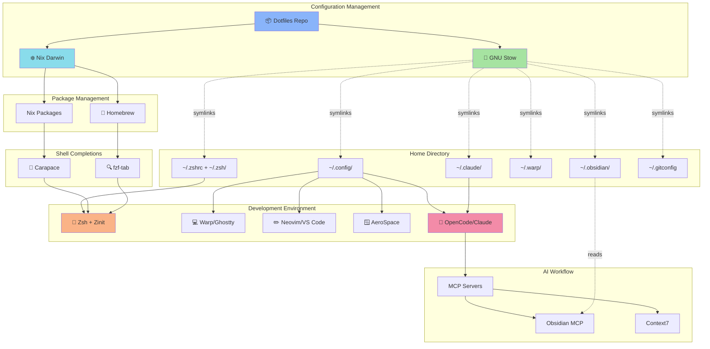

# 🚀 Dotfiles

macOS development environment using Nix Darwin and GNU Stow for reproducible, declarative configuration management.

## 📋 Table of Contents

- [Quick Start](#-quick-start)
- [Overview](#-overview)
- [Architecture](#-architecture)
  - [System Overview](#system-overview)
  - [Directory Structure](#directory-structure)
  - [Configuration Flow](#configuration-flow)
  - [Package Management](#package-management)
- [Features](#-features)
  - [AI Integration](#ai-integration)
  - [Shell Environment](#shell-environment)
  - [Development Tools](#development-tools)
  - [Interface](#interface)
  - [Knowledge Management](#knowledge-management)
- [Installation](#-installation)
  - [Prerequisites](#prerequisites)
  - [Steps](#steps)
  - [Post-Installation](#post-installation)

## ⚡ Quick Start

```bash
git clone <repo-url> ~/dev/dotfiles && cd ~/dev/dotfiles
./setup.sh
cd dot-config/nix-darwin && darwin-rebuild switch --flake .#simple
source ~/.zshrc
```

## 📖 Overview

Personal macOS development environment focused on AI-assisted workflows, keyboard-driven productivity, and reproducible configuration management. Built for software development across multiple projects with extensive terminal integration and automation.

**🎯 Key Design Principles:**
- ❄️ Declarative package management via Nix Darwin
- 🔗 Symlink-based dotfile management via GNU Stow  
- 🤖 AI-first development workflow (OpenCode, Claude, MCP)
- 🎨 Consistent Catppuccin Mocha theming
- 🐚 Shell-centric tools and workflows

## 🏗️ Architecture

### System Overview



### 📁 Directory Structure

```
dotfiles/
├── 📦 bin/                           # Installation scripts
│   ├── install_code_extensions.sh    # VS Code extension installer
│   └── install_nix.sh                # Nix installation script
├── ⚙️ dot-config/                    # ~/.config/ applications
│   ├── ❄️ nix-darwin/                # System package management
│   │   └── flake.nix                 # Nix Darwin configuration
│   ├── ✏️ nvim/                      # Neovim (Kickstart config)
│   ├── 🪟 aerospace/                 # Window manager (Dvorak-optimized)
│   ├── 📊 sketchybar/                # Menu bar customization
│   ├── 💻 ghostty/                   # Terminal emulator config
│   ├── 📂 yazi/                      # File manager config
│   ├── 🌿 lazygit/                   # Git UI config
│   ├── ☸️ k9s/                       # Kubernetes UI config
│   ├── 🤖 opencode/                  # AI development environment
│   ├── ✨ starship.toml              # Shell prompt config
│   └── [30+ more tools]              # See tree for full list
├── 🤖 dot-claude/                    # ~/.claude/ AI integration
│   ├── commands/                     # Custom Claude commands
│   ├── hooks/                        # Tool execution hooks
│   └── plugins/                      # Claude plugins
├── 📚 dot-obsidian/                  # ~/.obsidian/ knowledge base
│   ├── plugins/                      # 50+ Obsidian plugins
│   ├── themes/                       # Custom themes
│   └── snippets/                     # CSS snippets
├── 🚀 dot-warp/                      # ~/.warp/ terminal workflows
│   ├── workflows/                    # 20+ custom workflows
│   └── themes/                       # Custom terminal themes
├── 🐚 dot-zsh/                       # Zsh configuration modules
│   ├── aliases.zsh                   # Command shortcuts
│   ├── functions.zsh                 # Shell functions
│   ├── exports.zsh                   # Environment variables
│   ├── plugins.zsh                   # Zinit plugin config
│   ├── fzf.zsh                       # Fuzzy finder integration
│   └── fzf-tab.zsh                   # Interactive completions
├── 🔧 dot-bin/                        # User scripts (~/.bin/)
│   ├── nix-add                       # Add packages to flake.nix
│   └── brew-compare                  # Compare Nix/system brew deps
├── dot-zshrc                         # ~/.zshrc (sources dot-zsh/)
├── dot-zshenv                        # ~/.zshenv (environment setup)
├── ⚡ setup.sh                       # Main installation script
└── .stowrc                           # Stow configuration
```

### 🔄 Configuration Flow

1. 🔗 **Stow** symlinks `dot-*` directories to `~` (e.g., `dot-config/` → `~/.config/`)
2. ❄️ **Nix Darwin** manages system packages, Homebrew formulas/casks, and system preferences
3. 🐚 **Zsh** sources modular configs from `dot-zsh/` in order: `exports.zsh`, `plugins.zsh`, `completions.zsh`, `tools.zsh`, `aliases.zsh`, `functions.zsh`, `fzf.zsh`, `fzf-tab.zsh`, `keybindings.zsh`, `direnv.zsh`, `local.zsh`
4. 🌿 **Git** uses conditional includes for work/personal configs based on repo path (see `dot-config/git/`)

### 📦 Package Management

**❄️ Nix Darwin** (`dot-config/nix-darwin/flake.nix`):
- System packages (vim, direnv, carapace, etc.)
- Homebrew taps, formulas, and casks
- macOS system preferences (dock, finder, etc.)

**🍺 Homebrew** (managed by Nix):
- 🔧 CLI tools: stow, git, starship, fzf, ripgrep, lazygit, docker, kubernetes-cli, awscli, terraform, etc.
- 🖥️ GUI apps: raycast, aerospace, obsidian, warp, ghostty, claude, vivaldi, etc.
- 🔤 Fonts: JetBrains Mono Nerd Font, SF Pro

**🔍 Utility**: `dot-bin/brew-compare` compares Nix-declared vs system-installed packages

## ✨ Features

### 🤖 AI Integration
- **OpenCode**: MCP server integration (Obsidian, Context7)
- **Claude Desktop**: Native app with custom commands/hooks
- **Gemini CLI**: Terminal-based AI assistant
- **Fabric AI**: AI workflow automation

### 🐚 Shell Environment  
- **Zsh**: Modular config with Zinit plugin manager
- **Starship**: Fast, minimal prompt ✨
- **Carapace + fzf-tab**: Interactive completions for 1000+ commands 🔍
- **Atuin**: Shell history sync and search 📜
- **Zoxide**: Frecency-based directory jumping 🚀
- **FZF**: Fuzzy finder with custom keybindings 🔎

### 🛠️ Development Tools
- **✏️ Editors**: Neovim (Kickstart), VS Code (portable config)
- **🌿 Git**: Delta diff viewer, Lazygit UI, gh/glab CLIs
- **🐳 Containers**: Docker, Colima, Lazydocker, K9s, Helm
- **💻 Languages**: Node, Bun, Go, Rust, Python (uv/pyenv), Java, Lua
- **☁️ Cloud**: AWS CLI, Azure CLI, Terraform, Kubernetes

### 🖥️ Interface
- **🪟 Window Manager**: AeroSpace (Dvorak-optimized tiling)
- **📊 Menu Bar**: SketchyBar (custom plugins)
- **💻 Terminal**: Warp (primary) / Ghostty (backup)
- **📂 File Manager**: Yazi (terminal-based)
- **🚀 Launcher**: Raycast
- **🎨 Theme**: Catppuccin Mocha (system-wide)

### 📚 Knowledge Management
- **Obsidian**: 50+ plugins, custom themes, MCP integration
- **Navi**: Interactive cheatsheets (13 custom sheets in `dot-config/navi/cheats/`)
- **TLDR**: Community-driven man pages 📖

## 📥 Installation

### ✅ Prerequisites
- 🍎 macOS (Apple Silicon recommended)
- 🔨 Xcode Command Line Tools: `xcode-select --install`
- 🌐 Internet connection

### 🔧 Steps

```bash
# 1. Clone repository
git clone <repo-url> ~/dev/dotfiles
cd ~/dev/dotfiles

# 2. Run automated setup (installs Homebrew, Stow, Nix)
./setup.sh

# 3. Apply Nix Darwin configuration
cd dot-config/nix-darwin
darwin-rebuild switch --flake .#simple

# 4. (Optional) Install VS Code extensions
cd ~/dev/dotfiles
./bin/install_code_extensions.sh

# 5. Reload shell
source ~/.zshrc
# or use alias: reload
```

### ✨ Post-Installation

**✅ Verify installation:**
```bash
which stow                    # Should return Homebrew path
nix --version                 # Should show Nix version
darwin-rebuild --version      # Should show nix-darwin version
carapace --version            # Should show carapace version
```

**🧪 Test completions:**
```bash
aws <TAB>                     # Should show interactive fzf menu
kubectl <TAB>                 # Should show interactive fzf menu
```

**🌿 Configure Git:**
Edit `dot-config/git/config` conditional includes to match your work/personal repo paths

**🤖 Set up AI tools:**
- 🔑 Add API keys to environment (see `dot-zsh/local.zsh.example`)
- ⚙️ Configure OpenCode MCP servers in `dot-config/opencode/opencode.json`

