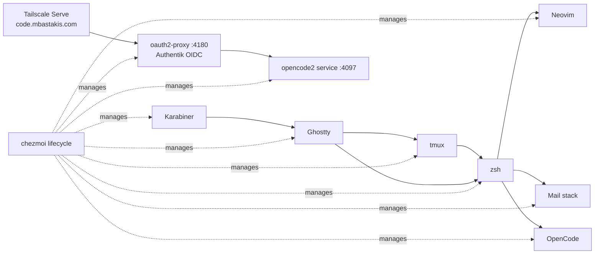
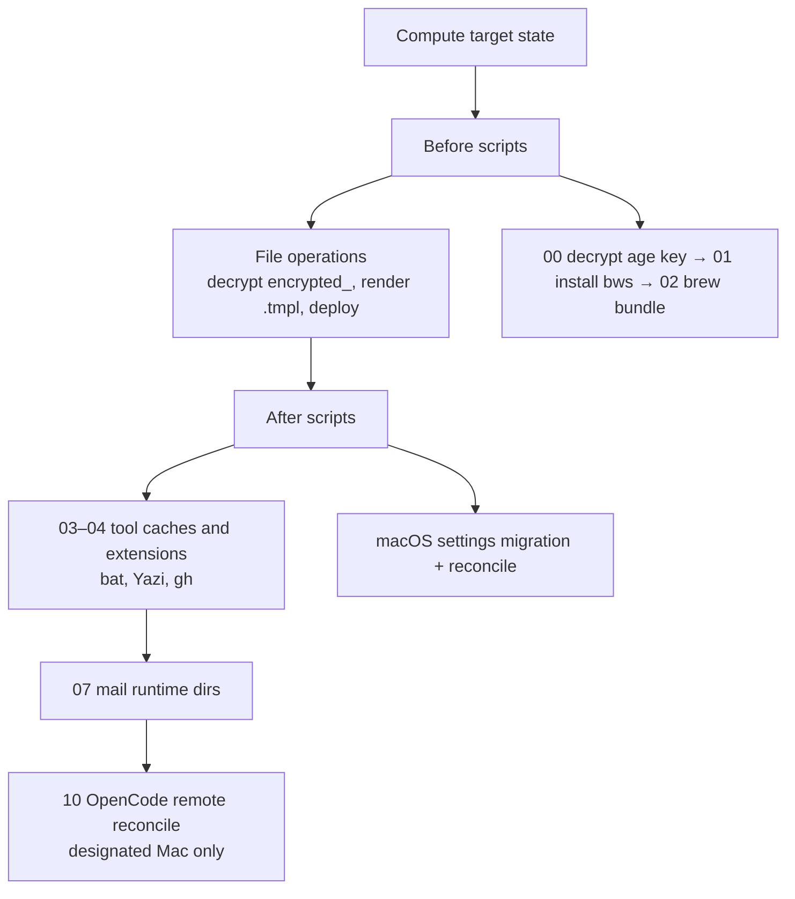
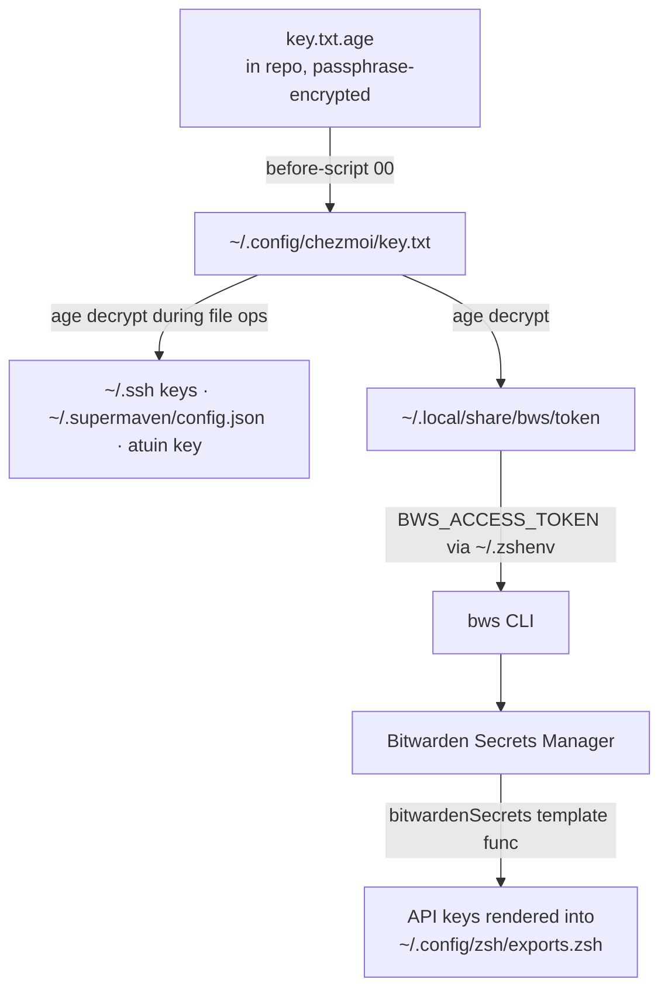

# Architecture

How `chezmoi apply` turns this source tree into a working machine: script ordering, the encryption chain, profiles, and the gotchas that are not obvious from reading any single file. For the file-by-file inventory, read the source tree itself — `chezmoi managed` and `.chezmoiscripts/` are authoritative.

## Component Interaction Model



Keyboard input flows Karabiner → Ghostty → tmux → zsh, and from zsh into Neovim, the mail stack, and OpenCode. Remote access reaches the designated Mac through Tailscale Serve and oauth2-proxy, which fronts the shared OpenCode backend. Chezmoi manages configuration for every layer; authoritative network topology and remote-host runbooks live in the sibling Kavouki repository, not here.

## Apply Phases



Scripts run alphabetically within each phase, so the numeric prefixes are the ordering mechanism. The before phase exists to satisfy file operations: the age identity must exist before `encrypted_` files can decrypt, and the `bws` CLI must exist before `bitwardenSecrets` template calls can render.

Almost everything is `run_onchange`, triggered by `sha256sum` hashes of the inputs each script owns. The OpenCode hook hashes the LaunchAgents, controller, proxy config, and provider environment; the opencode2 service hot-reloads config, agents, commands, and skills itself, so those no longer trigger reconciliation. When writing a new `run_onchange` script, embed only deterministic inputs the operation owns — never dates or unrelated aggregates.

## Fresh-Machine Bootstrap

A fresh machine has a chicken-and-egg problem: templates that call `bitwardenSecrets` need `BWS_ACCESS_TOKEN` in the environment, but that token is itself an age-encrypted managed file exported by `~/.zshenv`. Break the cycle by deploying the token and `.zshenv` first:

```bash
chezmoi apply --force "$HOME/.local/share/bws/token" "$HOME/.zshenv"
exec zsh
chezmoi apply --force
```

The age passphrase is needed exactly once: the `00` before-script decrypts `key.txt.age` into `~/.config/chezmoi/key.txt` via a mode-restricted temp file and atomic rename, so a failed decryption never clobbers a working identity. On a machine without Homebrew, the `02` script installs it, and in non-interactive shells it skips Mac App Store installs by deriving `mas` IDs from the Brewfile itself rather than maintaining a second list.

## Encryption Model

One age keypair protects every secret; everything downstream is derived without further prompts:



The chain spans five files: `key.txt.age`, `.chezmoiscripts/run_onchange_before_00-decrypt-private-key.sh.tmpl`, the encrypted token at `private_dot_local/private_share/private_bws/encrypted_private_token.age`, `dot_zshenv.tmpl` (the export), and `.chezmoi.toml.tmpl` (identity/recipient plus the `bitwardenSecrets` command). Breaking any link breaks template rendering repo-wide.

## Runtime-Owned Files

Some managed files are bootstrap seeds: chezmoi deploys them once, then defers to the CLI that rewrites them at runtime.

- Kubeconfigs (`~/.config/kube/config-*`) — `kubectl`, `aws`, and `kind` rewrite contexts and serialization.
- `~/.local/share/colima/default/colima.yaml` — Colima rewrites generated formatting.
- `~/.config/glab-cli/config.yml` — glab stores auth fields and update timestamps in place.

`textconv` rules in `.chezmoi.toml.tmpl` normalize these so `chezmoi diff` shows semantic changes instead of re-serialization noise. Note that `textconv` patterns match **absolute target paths**, not the relative paths shown in diff headers.

## Profile System

`.chezmoi.toml.tmpl` resolves the profile at `chezmoi init` time: `CHEZMOI_PROFILE` (`dt-work`, `work`, or `personal`) wins if set; otherwise `promptChoiceOnce` asks once and caches. The result is exactly two stored states — `profile` of `personal` or `dt-work`, plus the `dtWork` boolean — which drive conditional ignores and template rendering.

On DT work machines, if Tailscale, Harmony, macOS, or an operator flips DNS or proxy state on the `AX88179A` Ethernet service, run the `reset_work_network` zsh function (defined in `private_dot_config/zsh/functions.zsh`) to disable Tailscale DNS and the HTTP/HTTPS proxies again. This is a manual repair command; the lifecycle no longer applies network policy itself.

## Ignored Artifacts

`.chezmoiignore` matches **target-state paths** (`.config/foo`, never `private_dot_config/foo`) and is rendered as a template. The non-obvious entries:

- Any repo-only directory (`docs/`, `ai-docs/`, `tests/`) must be listed or chezmoi deploys it into `~/`.
- Obsidian: only volatile state (`workspace.json`, caches, auto-downloaded plugin code) is ignored — settings JSONs and plugin `data.json` files stay managed.
- Karabiner: the build system (`build.sh`, `src/`) stays source-only; only the generated `karabiner.json` deploys.
- Conditional blocks scope DT work configs by profile, macOS-only configs by OS, and the OpenCode backend/oauth2-proxy stack by hostname; the remote stack deploys only to the designated Mac.

## Operational Notes

- `~/.zshenv` cannot inject `BWS_ACCESS_TOKEN` into an already-running shell — after deploying the token, `exec zsh` before a template-rendering apply.
- Step `10` pushes provider credentials into the opencode2 service environment, reloads the LaunchAgents, and converges the stack. The service hot-reloads config/agents/commands/skills; `opencode2 service restart` is only needed for binary updates, and clients reconnect and resume their sessions afterward.
- A missing data key in a `.chezmoiignore` template conditional breaks unrelated commands (`add`, `status`, `apply`) — keep templates compatible with existing keys until `chezmoi init` has run everywhere.
- Use `chezmoi apply --dry-run --force` for non-interactive validation; without `--force`, changed files trigger TTY prompts that fail headless.
- macOS-only lifecycle scripts start with an early Darwin guard; the age identity bootstrap is the deliberate platform-neutral exception, since encrypted targets render on any OS.
- Source location is not assumed: templates resolve the checkout through `.chezmoi.sourceDir`, persisted as `sourceDir` in the rendered config.
