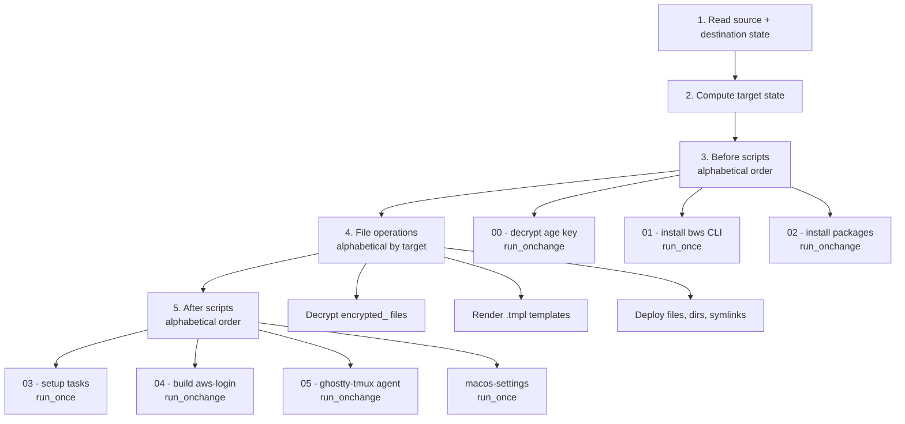

# Chezmoi Lifecycle

How `chezmoi apply` transforms source state into target state, including script execution order, template rendering, and encryption.

## Apply Phases

_Reference: `AGENTS.md:42`_

## Before Scripts

Executed alphabetically before any file operations. All scripts have Darwin-only OS guards.

### 00 - Decrypt Private Key (`run_onchange`)

Decrypts `key.txt.age` to `~/.config/chezmoi/key.txt` using `chezmoi age decrypt --passphrase`. This is the **only passphrase prompt** in the entire workflow. Re-runs when the age file content hash changes.

_Reference: `.chezmoiscripts/run_onchange_before_00-decrypt-private-key.sh.tmpl:1`_

### 01 - Install BWS CLI (`run_once`)

Installs the Bitwarden Secrets Manager CLI if not already present. Runs once, ever. Guards on `command -v bws`.

_Reference: `.chezmoiscripts/run_once_before_01-install-bws.sh.tmpl:1`_

### 02 - Install Packages (`run_onchange`)

Runs `brew bundle` from the Brewfile. Re-runs when Brewfile content hash changes. Self-bootstraps Homebrew if missing. Detects non-interactive shells and skips Mac App Store installs (avoids password prompts in headless sessions).

_Reference: `.chezmoiscripts/run_onchange_before_02-install-packages.sh.tmpl:1`_

## File Operations

After before scripts complete, chezmoi processes files alphabetically by target path:

1. **Decrypt** `encrypted_` prefixed files using the age identity at `~/.config/chezmoi/key.txt`. No further passphrase prompts.
2. **Render** `.tmpl` templates using chezmoi data (`.chezmoi.toml.tmpl` data section, `.chezmoidata.yaml`) and the `bitwardenSecrets` function (which calls `chezmoi-bws` -> `bws` CLI).
3. **Deploy** files, directories, and symlinks to their target paths.

## After Scripts

Executed alphabetically after all file operations complete.

### 03 - Setup (`run_once`)

One-time post-deploy tasks:
- Build bat theme cache (`bat cache --build`)
- Install/upgrade Yazi plugins (`ya pkg upgrade`)
- Sync carapace completions (`carapace-sync`)

All operations use graceful degradation (`|| true`).

_Reference: `.chezmoiscripts/run_once_after_03-setup.sh.tmpl:1`_

### 04 - Build aws-login (`run_onchange`)

Compiles the `aws-login` Go binary from `apps/aws-login/` into `~/bin/_aws-login`. Tracks 8 individual source file hashes for change detection. Injects git short SHA as version. Guards on both source directory and `go` binary presence.

_Reference: `.chezmoiscripts/run_onchange_after_04-build-aws-login.sh.tmpl:1`_

### 05 - Ghostty-tmux LaunchAgent (`run_onchange`)

Manages the macOS LaunchAgent for Ghostty+tmux auto-start. Removes the legacy `Tmux.Start.plist` agent and reloads the new `com.mbastakis.ghostty-tmux` agent via `launchctl bootstrap`. Guards on plist file existence and GUI domain availability.

_Reference: `.chezmoiscripts/run_onchange_after_05-ghostty-tmux-launchagent.sh.tmpl:1`_

### macOS Settings (`run_once`)

Comprehensive macOS `defaults write` configuration replacing nix-darwin `system.defaults`:
- **Dock:** autohide, right orientation, no recents, scale minimize
- **Finder:** show all files/extensions, column view, path/status bars
- **Screenshots:** PNG format, saved to `~/Pictures/screenshots`
- **Keyboard:** fast repeat (KeyRepeat=2, InitialKeyRepeat=15)
- **Trackpad:** tap-to-click enabled
- **Global:** 24h time, disable auto-correct/capitalize/dash/quote substitution
- **Apps:** Stats (menubar monitor), KeyClu (shortcut overlay)

Restarts Dock, Finder, and SystemUIServer after applying.

_Reference: `.chezmoiscripts/run_once_after_macos-settings.sh.tmpl:1`_

## Script Execution Types

| Type | Behavior |
|---|---|
| `run_once` | Executes once, ever (tracked by script name) |
| `run_onchange` | Re-executes when embedded hash comment changes |

Hash comments use the pattern `# hash: {{ include "path" | sha256sum }}` to track content changes in upstream files.

## Template Functions

| Function | Purpose |
|---|---|
| `{{ .chezmoi.os }}` | OS detection (`darwin`/`linux`) |
| `{{ .chezmoi.sourceDir }}` | Chezmoi source directory path |
| `{{ .profile }}` | Active profile (`personal` or `dt-work`) |
| `{{ .dtWork }}` | Boolean toggle for DT work config |
| `{{ .email }}`, `{{ .name }}` | User identity from config |
| `{{ bitwardenSecrets "uuid" }}` | Fetch secret value from BWS |
| `{{ include "file" \| sha256sum }}` | File content hash for change detection |
| `{{ env "VAR" }}` | Read environment variable |
| `{{ promptChoiceOnce ... }}` | Interactive prompt with cached result |
| `{{ value \| quote }}` | Quote value for TOML output |
| `{{ value \| trim }}` | Trim whitespace from secrets |

_Reference: `AGENTS.md:155`_

## Operational Notes

- `.chezmoiignore` is rendered as a template; missing data keys in conditions can break unrelated commands.
- Use `chezmoi apply --dry-run --force` for non-interactive checks; without `--force`, changed files may trigger TTY prompts.
- `chezmoi diff` is most reliable with absolute target paths when diffing a single file.
- OS guards at the top of every `.tmpl` script: `{{- if ne .chezmoi.os "darwin" }} exit 0 {{- end }}`.
- Whitespace control: always use `{{-` and `-}}` to trim surrounding whitespace in template tags.

## References

- Apply order: `AGENTS.md:42`
- Encryption: `AGENTS.md:62`
- Template conventions: `AGENTS.md:155`
- Config template: `.chezmoi.toml.tmpl:1`
- Ignore rules: `.chezmoiignore:1`
- Lifecycle scripts: `.chezmoiscripts/`
