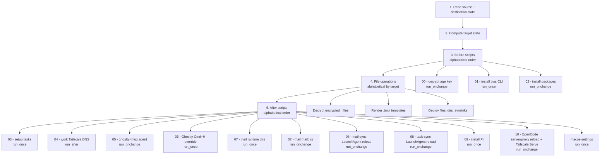

# Chezmoi Lifecycle

How `chezmoi apply` transforms source state into target state, including script execution order, template rendering, and encryption.

## Apply Phases

```mermaid
flowchart TD
  A[1. Read source + destination state] --> B[2. Compute target state]
  B --> C[3. Before scripts<br/>alphabetical order]
  C --> D[4. File operations<br/>alphabetical by target]
  D --> E[5. After scripts<br/>alphabetical order]

  C --> C1[00 - decrypt age key<br/>run_onchange]
  C --> C2[01 - install bws CLI<br/>run_once]
  C --> C3[02 - install packages<br/>run_onchange]

  D --> D1[Decrypt encrypted_ files]
  D --> D2[Render .tmpl templates]
  D --> D3[Deploy files, dirs, symlinks]

  E --> E1[03 - setup tasks<br/>run_once]
  E --> E2[04 - work Tailscale DNS<br/>run_after]
  E --> E3[05 - ghostty-tmux agent<br/>run_onchange]
  E --> E4[06 - Ghostty Cmd+H override<br/>run_once]
  E --> E5[07 - mail runtime dirs<br/>run_once]
  E --> E6[07 - mail maildirs<br/>run_onchange]
  E --> E7[08 - mail-sync LaunchAgent reload<br/>run_onchange]
  E --> E8[08 - task-sync LaunchAgent reload<br/>run_onchange]
  E --> E9[09 - install Pi<br/>run_once]
  E --> E10[10 - OpenCode server/proxy reload + Tailscale Serve<br/>run_onchange]
  E --> E11[macos-settings<br/>run_once]
```

_Reference: `AGENTS.md:42`_

## Before Scripts

Executed alphabetically before any file operations. All scripts have Darwin-only OS guards.

### 00 - Decrypt Private Key (`run_onchange`)

Decrypts `key.txt.age` to `~/.config/chezmoi/key.txt` using `chezmoi age decrypt --passphrase`. This is the **only passphrase prompt** in the entire workflow. Re-runs when the age file content hash changes.

_Reference: `.chezmoiscripts/run_onchange_before_00-decrypt-private-key.sh.tmpl:1`_

### 01 - Install BWS CLI (`run_once`)

Installs the Bitwarden Secrets Manager CLI if not already present. Runs once, ever. Guards on `command -v bws`.

_Reference: `.chezmoiscripts/run_once_before_01-install-bws.sh.tmpl:1`_

### 02 - Install Packages (`run_onchange`)

Stages the formula-level Homebrew trust allowlist, then runs `brew bundle` from the Brewfile. Re-runs when either managed file changes. Self-bootstraps Homebrew if missing. Detects non-interactive shells and skips Mac App Store installs (avoids password prompts in headless sessions).

_Reference: `.chezmoiscripts/run_onchange_before_02-install-packages.sh.tmpl:1`_

## File Operations

After before scripts complete, chezmoi processes files alphabetically by target path:

1. **Decrypt** `encrypted_` prefixed files using the age identity at `~/.config/chezmoi/key.txt`. No further passphrase prompts.
2. **Render** `.tmpl` templates using chezmoi data (`.chezmoi.toml.tmpl` data section, `.chezmoidata.yaml`) and the `bitwardenSecrets` function (which calls `chezmoi-bws` -> `bws` CLI).
3. **Deploy** files, directories, and symlinks to their target paths.

## After Scripts

Executed alphabetically after all file operations complete.

### 03 - Setup (`run_once`)

One-time post-deploy tasks:
- Build bat theme cache (`bat cache --build`)
- Install/upgrade Yazi plugins (`ya pkg upgrade`)
- Sync carapace completions (`carapace-sync`)

All operations use graceful degradation (`|| true`).

_Reference: `.chezmoiscripts/run_once_after_03-setup.sh.tmpl:1`_

### 04 - Work Tailscale DNS (`run_after`)

On macOS DT work profiles, runs `tailscale set --accept-dns=false` after every apply. This leaves Harmony SASE or the local network as the system DNS authority while retaining Tailscale peer routes, avoiding DNS forwarding between the two VPN extensions. It does not start or stop either VPN; if the Tailscale CLI or backend is unavailable, the script leaves the apply successful and retries on the next apply.

Client-side MagicDNS names are unavailable with this setting; Route53-backed `*.mbastakis.com` names and direct Tailscale IPs continue to work. When both VPNs need to be started, connect Tailscale first and Harmony second. If Tailscale cannot reconnect to its control plane while Harmony is active, disconnect Harmony briefly, bring Tailscale online, then reconnect Harmony.

_Reference: `.chezmoiscripts/run_after_04-configure-tailscale-dns.sh.tmpl:1`_

### 05 - Ghostty-tmux LaunchAgent (`run_onchange`)

Manages the macOS LaunchAgent for Ghostty+tmux auto-start. Removes the legacy `Tmux.Start.plist` agent and reloads the new `com.mbastakis.ghostty-tmux` agent via `launchctl bootstrap`. Guards on plist file existence and GUI domain availability.

_Reference: `.chezmoiscripts/run_onchange_after_05-ghostty-tmux-launchagent.sh.tmpl:1`_

### 06 - Ghostty Cmd+H Override (`run_once`)

Removes any legacy global `Hide *` keyboard overrides from `NSGlobalDomain` and sets an app-specific Ghostty shortcut so `Hide Ghostty` uses `Ctrl+Option+Cmd+H`.

This keeps default macOS hide shortcuts in other apps while allowing Ghostty to use `Cmd+H` for tmux navigation. Preferences are refreshed via `cfprefsd`.

_Reference: `.chezmoiscripts/run_once_after_06-ghostty-hide-shortcut.sh.tmpl:1`_

### 07 - Mail Runtime Setup (`run_once`)

Creates local runtime directories for the mail stack:

- `mail.defaults.mail_root` (default: `~/.local/share/mail`)
- `mail.defaults.notmuch_database` (default: `~/.local/share/notmuch/default`)
- `mail.defaults.isync_state_root` (default: `~/.local/state/isync`)
- `mail.defaults.log_root` (default: `~/.local/state/mail/log`)
- `~/.cache/neomutt`
- `~/.abook`
- `mail.defaults.automation_hook_root` (default: `~/.config/mail/hooks/post-sync.d`)

_Reference: `.chezmoiscripts/run_once_after_07-mail-setup.sh.tmpl:1`_

### 07 - Maildir Bootstrap (`run_onchange`)

Creates per-account Maildir roots for enabled accounts and ensures `INBOX/{cur,new,tmp}` exists. Re-runs when `.chezmoidata.yaml` hash changes.

_Reference: `.chezmoiscripts/run_onchange_after_07-mail-maildirs.sh.tmpl:1`_

### 08 - Mail Sync LaunchAgent Reload (`run_onchange`)

Reloads `com.mbastakis.mail-sync` LaunchAgent when plist template content or configured sync interval changes. Guards on plist existence and GUI domain availability, then uses `launchctl bootout` + `launchctl bootstrap`.

_Reference: `.chezmoiscripts/run_onchange_after_08-mail-sync-launchagent.sh.tmpl:1`_

### 08 - Taskwarrior Sync LaunchAgent Reload (`run_onchange`)

Reloads `com.mbastakis.task-sync` LaunchAgent when the plist, wrapper script, or configured sync interval changes. Guards on plist existence and GUI domain availability, then uses `launchctl bootout` + `launchctl bootstrap`.

_Reference: `.chezmoiscripts/run_onchange_after_08-task-sync-launchagent.sh.tmpl:1`_

### 09 - Install Pi (`run_once`)

Installs the Pi coding agent from the official npm package `@earendil-works/pi-coding-agent@latest` once during `chezmoi apply`. The script still checks whether the installed package is up to date before installing, but it runs only once by script type and does not re-run on subsequent applies.

Use `npm install -g --ignore-scripts @earendil-works/pi-coding-agent@latest` manually whenever you want to upgrade Pi.

The install uses `npm install -g --ignore-scripts` to match Pi's documented npm installation path and avoid npm lifecycle scripts. If npm or node are unavailable, or npm's registry cannot be reached, the script logs a warning and leaves the system unchanged.

_Reference: `.chezmoiscripts/run_once_after_09-install-pi.sh.tmpl:1`_

### 10 - OpenCode Remote Control (`run_onchange`)

On the designated Mac only, reloads the OpenCode server and oauth2-proxy LaunchAgents, then persists a Tailscale Serve HTTPS route to the authenticated proxy on loopback port `4180`. Reloading waits for both the old launchd registration and process to finish before bootstrapping the same label, retries registration, and requires the OpenCode and oauth2-proxy health endpoints to pass. This prevents a rapid `bootout`/`bootstrap` race from leaving the proxy loaded without its backend. The Serve endpoint is the verified tailnet backend for Atlas's `code.mbastakis.com` route; the raw OpenCode backend remains loopback-only on port `4096`. Re-runs when either plist, wrapper, proxy template, external URL, or configured proxy port changes.

_Reference: `.chezmoiscripts/run_onchange_after_10-opencode-remote.sh.tmpl:1`_

### macOS Settings (`run_once`)

Comprehensive macOS `defaults write` configuration replacing nix-darwin `system.defaults`:
- **Dock:** autohide, right orientation, no recents, scale minimize
- **Finder:** show all files/extensions, column view, path/status bars
- **Screenshots:** PNG format, saved to `~/Pictures/screenshots`
- **Keyboard:** fast repeat (KeyRepeat=2, InitialKeyRepeat=15)
- **Trackpad:** tap-to-click enabled
- **Global:** 24h time, disable auto-correct/capitalize/dash/quote substitution
- **Apps:** Stats (menubar monitor), KeyClu (shortcut overlay)

Restarts Dock, Finder, and SystemUIServer after applying.

_Reference: `.chezmoiscripts/run_once_after_macos-settings.sh.tmpl:1`_

## Script Execution Types

| Type | Behavior |
|---|---|
| `run_before` / `run_after` | Executes on every apply; scripts must be idempotent |
| `run_once` | Executes once, ever (tracked by script name) |
| `run_onchange` | Re-executes when embedded hash comment changes |

Hash comments use the pattern `# hash: {{ include "path" | sha256sum }}` to track content changes in upstream files.

## Template Functions

| Function | Purpose |
|---|---|
| `{{ .chezmoi.os }}` | OS detection (`darwin`/`linux`) |
| `{{ .chezmoi.sourceDir }}` | Chezmoi source directory path |
| `{{ .profile }}` | Active profile (`personal` or `dt-work`) |
| `{{ .dtWork }}` | Boolean toggle for DT work config |
| `{{ .email }}`, `{{ .name }}` | User identity from config |
| `{{ bitwardenSecrets "uuid" }}` | Fetch secret value from BWS |
| `{{ include "file" \| sha256sum }}` | File content hash for change detection |
| `{{ env "VAR" }}` | Read environment variable |
| `{{ promptChoiceOnce ... }}` | Interactive prompt with cached result |
| `{{ value \| quote }}` | Quote value for TOML output |
| `{{ value \| trim }}` | Trim whitespace from secrets |

_Reference: `AGENTS.md:155`_

## Operational Notes

- `.chezmoiignore` is rendered as a template; missing data keys in conditions can break unrelated commands.
- Use `chezmoi apply --dry-run --force` for non-interactive checks; without `--force`, changed files may trigger TTY prompts.
- `chezmoi diff` is most reliable with absolute target paths when diffing a single file.
- `textconv` patterns also match absolute target paths, not the relative paths printed in diff headers.
- Kubeconfig and Colima files are bootstrap seeds once missing; existing live files are preserved because external CLIs own ongoing runtime state.
- Pi powerline runtime files under `.config/pi/powerline-footer/` and generated vibe files under `.config/pi/vibes/` are ignored; code-managed Pi powerline behavior lives in `private_dot_config/pi/settings.json` and `private_dot_config/pi/extensions/powerline-footer/theme.json`.
- OS guards at the top of every `.tmpl` script: `{{- if ne .chezmoi.os "darwin" }} exit 0 {{- end }}`.
- Whitespace control: always use `{{-` and `-}}` to trim surrounding whitespace in template tags.

## References

- Apply order: `AGENTS.md:42`
- Encryption: `AGENTS.md:62`
- Template conventions: `AGENTS.md:155`
- Config template: `.chezmoi.toml.tmpl:1`
- Ignore rules: `.chezmoiignore:1`
- Lifecycle scripts: `.chezmoiscripts/`
