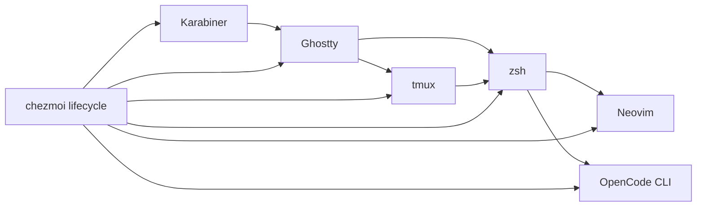
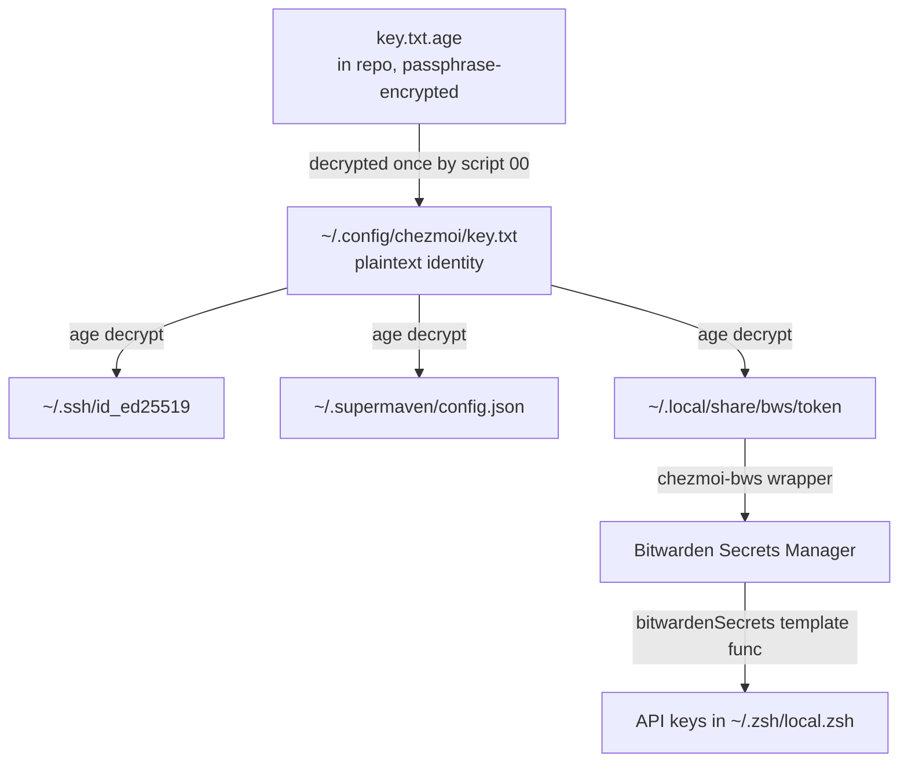

# System Overview

How the chezmoi source tree maps to the target filesystem, what gets deployed, and what stays source-only.

## Component Interaction Model

Input flows from the physical keyboard through Karabiner (home row mods, hyper key), into Ghostty (terminal keybindings), then into tmux (prefix commands) or directly to zsh (shell keybindings). From zsh, input reaches Neovim or OpenCode. Chezmoi manages the configuration for all of these layers.

## Source-to-Target Mapping

Chezmoi translates source-state file names to target paths using naming conventions (`private_`, `dot_`, `encrypted_`, `.tmpl`).

| Source (chezmoi) | Target | Notes |
|---|---|---|
| `.chezmoi.toml.tmpl` | `~/.config/chezmoi/chezmoi.toml` | Config, profile selection, encryption settings |
| `key.txt.age` | _(source-only)_ | Passphrase-encrypted age private key |
| `bin/chezmoi-bws` | _(source-only)_ | BWS token wrapper script |
| `apps/aws-login/` | _(source-only)_ | Go source for aws-login CLI |
| `literal_bin/` | `~/bin/` | Shell utility scripts |
| `private_dot_ssh/` | `~/.ssh/` | SSH keys (encrypted) |
| `private_dot_config/` | `~/.config/` | Application configs |
| `.chezmoiscripts/` | _(lifecycle scripts)_ | Before/after scripts, not deployed |
| `.chezmoidata.yaml` | _(template data)_ | Catppuccin Mocha color palette |
| `dot_zshrc` | `~/.zshrc` | Zsh entry point |
| `dot_zsh/` | `~/.zsh/` | Zsh module files |

_Reference: `AGENTS.md:78`_

## Source-Only Directories

These directories exist in the repo but are never deployed to the target filesystem:

| Directory | Purpose |
|---|---|
| `apps/` | Go source code (compiled by lifecycle scripts) |
| `ai-docs/` | Crawled documentation for AI agents |
| `code-portable-data/` | VS Code portable data |
| `bin/chezmoi-bws` | BWS helper (used during template rendering only) |
| `docs/` | This documentation tree |

_Reference: `.chezmoiignore:11`_

## Ignored Artifacts

The `.chezmoiignore` file uses **target-state paths** (not source-state names) and supports chezmoi template conditionals:

- **Build artifacts:** `node_modules/`, `target/`, `__pycache__/`, lock files
- **Caches:** `.cache/`, `.config/carapace/.versions`, `lazy-lock.json`, yazi plugins
- **Runtime state:** `glab-cli/recover/`, `.obsidian/`, `.DS_Store`
- **Profile-conditional:** DT work configs (glab, git work config, GitLab SSH keys) excluded when profile is not `dt-work`
- **OS-conditional:** macOS-only configs (Aerospace, Karabiner, Finicky, SketchyBar) excluded on Linux

_Reference: `.chezmoiignore:19`, `.chezmoiignore:54`_

## Profile System

The config template (`.chezmoi.toml.tmpl`) determines the active profile at `chezmoi init` time:

1. Check `CHEZMOI_PROFILE` env var (`dt-work`, `work`, or `personal`).
2. If unset, prompt interactively via `promptChoiceOnce`.
3. Profile sets `.profile` and `.dtWork` template variables.
4. These variables control conditional ignores, template rendering, and secret fetching.

_Reference: `.chezmoi.toml.tmpl:1`_

## Encryption Model

A single age keypair protects all sensitive files. The passphrase is only needed once during `chezmoi init`:

_Reference: `AGENTS.md:62`_

## References

- Root AGENTS: `AGENTS.md:78` (key paths table)
- Chezmoi config template: `.chezmoi.toml.tmpl:1`
- Ignore rules: `.chezmoiignore:1`
- Encryption section: `AGENTS.md:62`
