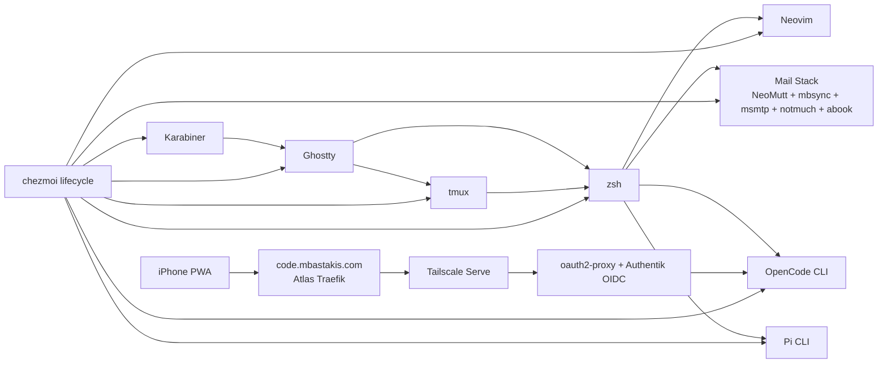
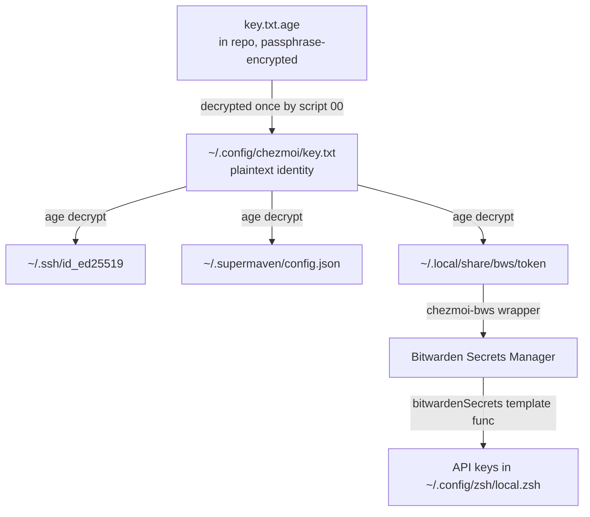

# System Overview

How the chezmoi source tree maps to the target filesystem, what gets deployed, and what stays source-only.

## Component Interaction Model

```mermaid
flowchart LR
  K[Karabiner] --> G[Ghostty]
  G --> T[tmux]
  G --> Z[zsh]
  T --> Z
  Z --> N[Neovim]
  Z --> M[Mail Stack\nNeoMutt + mbsync + msmtp + notmuch + abook]
  Z --> O[OpenCode CLI]
  I[iPhone PWA] --> AT[code.mbastakis.com<br/>Atlas Traefik]
  AT --> TS[Tailscale Serve]
  TS --> A[oauth2-proxy + Authentik OIDC]
  A --> O
  Z --> P[Pi CLI]
  C[chezmoi lifecycle] --> Z
  C --> N
  C --> M
  C --> O
  C --> P
  C --> K
  C --> G
  C --> T
```

Input flows from the physical keyboard through Karabiner (home row mods, hyper key), into Ghostty (terminal keybindings), then into tmux (prefix commands) or directly to zsh (shell keybindings). From zsh, input reaches Neovim, OpenCode, Pi, and NeoMutt. Chezmoi manages configuration for all layers, including the mail stack and its launchd automation.

## Source-to-Target Mapping

Chezmoi translates source-state file names to target paths using naming conventions (`private_`, `dot_`, `encrypted_`, `.tmpl`).

| Source (chezmoi) | Target | Notes |
|---|---|---|
| `.chezmoi.toml.tmpl` | `~/.config/chezmoi/chezmoi.toml` | Config, profile selection, encryption settings |
| `key.txt.age` | _(source-only)_ | Passphrase-encrypted age private key |
| `bin/chezmoi-bws` | _(source-only)_ | BWS token wrapper script |
| `private_dot_agents/skills/` | `~/.agents/skills/` | Harness-agnostic Agent Skills loaded by OpenCode and Pi |
| `private_dot_config/pi/` | `~/.config/pi/` | Pi global config, extensions, keybindings, prompt templates, and Pi-specific skills (`PI_CODING_AGENT_DIR=$HOME/.config/pi`) |
| `.pre-commit-config.yaml`, `.tflint.hcl`, `.terraform-docs.yml` | _(source-only)_ | Repo-local quality gates for hooks, OpenTofu linting, and generated module docs |
| `mise.toml`, `Taskfile.yml`, `renovate.json` | _(source-only)_ | Repo-local tool pins, task runner workflows, and dependency automation |
| `literal_bin/` | `~/bin/` | Shell utility scripts |
| `private_dot_ssh/` | `~/.ssh/` | SSH keys (encrypted) |
| `private_dot_config/` | `~/.config/` | Application configs |
| `private_dot_config/isyncrc.tmpl` | `~/.config/isyncrc` | mbsync/isync config |
| `private_dot_config/msmtp/private_config.tmpl` | `~/.config/msmtp/config` | SMTP account config |
| `private_dot_config/notmuch/default/config.tmpl` | `~/.config/notmuch/default/config` | notmuch profile config |
| `private_dot_config/notmuch/default/hooks/executable_post-new.tmpl` | `~/.config/notmuch/default/hooks/post-new` | post-index account/folder tagging |
| `private_dot_config/neomutt/` | `~/.config/neomutt/` | NeoMutt entrypoint, includes, mailcap |
| `private_dot_config/abook/` | `~/.config/abook/` | Abook config |
| `private_dot_config/terraform/terraform.rc` | `~/.config/terraform/terraform.rc` | Terraform CLI defaults |
| `private_dot_local/private_share/abook/` | `~/.local/share/abook/` | Abook data |
| `private_dot_local/private_share/colima/` | `~/.local/share/colima/` | Colima config and state |
| `private_Library/LaunchAgents/com.mbastakis.mail-sync.plist.tmpl` | `~/Library/LaunchAgents/com.mbastakis.mail-sync.plist` | Mail sync scheduler |
| `private_Library/LaunchAgents/com.mbastakis.task-sync.plist.tmpl` | `~/Library/LaunchAgents/com.mbastakis.task-sync.plist` | Taskwarrior sync scheduler |
| `private_Library/LaunchAgents/com.mbastakis.opencode-*.plist.tmpl` | `~/Library/LaunchAgents/com.mbastakis.opencode-*.plist` | Shared OpenCode server and Authentik OIDC proxy on the designated Mac |
| `private_dot_config/oauth2-proxy/private_oauth2-proxy.cfg.tmpl` | `~/.config/oauth2-proxy/oauth2-proxy.cfg` | Mode-`0600` OIDC reverse-proxy config rendered from BWS |
| `literal_bin/executable_mail-*` | `~/bin/mail-*` | Mail helper scripts (`mail-sync`, `mail-open`) |
| `literal_bin/executable_task-sync.tmpl` | `~/bin/task-sync` | Taskwarrior sync helper |
| `.chezmoiscripts/` | _(lifecycle scripts)_ | Before/after scripts (e.g. package installs, LaunchAgent reload, Pi installer), not deployed |
| `.chezmoidata.yaml` | _(template data)_ | Catppuccin Mocha colors plus mail, Taskwarrior, and OpenCode host data |
| `dot_zshenv.tmpl` | `~/.zshenv` | Zsh bootstrap (exports `ZDOTDIR`) |
| `private_dot_config/zsh/` | `~/.config/zsh/` | Zsh entry point and module files |

_Reference: `AGENTS.md:78`_

## Source-Only Paths

These paths exist in the repo but are never deployed to the target filesystem:

| Path | Purpose |
|---|---|
| `ai-docs/` | Crawled documentation for AI agents |
| `code-portable-data/` | VS Code portable data |
| `infra/` | Source-only infrastructure automation, including Ansible, OpenTofu, and TrueNAS app declarations |
| `bin/chezmoi-bws` | BWS helper (used during template rendering only) |
| `CONTEXT.md` | Repository glossary for agent/user terminology |
| `docs/` | This documentation tree |
| `.pre-commit-config.yaml`, `.tflint.hcl`, `.terraform-docs.yml`, `renovate.json` | Repo-only tooling configuration |

_Reference: `.chezmoiignore:11`_

## Ignored Artifacts

The `.chezmoiignore` file uses **target-state paths** (not source-state names) and supports chezmoi template conditionals:

- **Build artifacts:** `node_modules/`, `target/`, `__pycache__/`, lock files
- **Caches:** `.cache/`, `.config/carapace/.versions`, `lazy-lock.json`, yazi plugins
- **Runtime state:** `.kube/`, `glab-cli/recover/`, `.config/pi/powerline-footer/`, `.config/pi/vibes/`, `.obsidian/`, `.DS_Store`
- **Infrastructure artifacts:** OpenTofu state, plan files, `.terraform/`, and secret variable files are ignored by Git and never committed
- **Obsidian vault generated files:** Plugin binaries (`main.js`, `manifest.json`, `styles.css`), themes, icons, and `workspace.json` under `Documents/notes/.obsidian/` are ignored — only settings JSONs and plugin `data.json` files are managed
- **Profile-conditional:** DT work configs (glab, git work config, GitLab SSH keys) excluded when profile is not `dt-work`
- **OS-conditional:** macOS-only configs (Aerospace, Karabiner, Finicky, Ghostty LaunchAgent, mail LaunchAgent) excluded on Linux
- **Host-conditional:** OpenCode server, oauth2-proxy, and their LaunchAgents deploy only to the configured remote-control Mac

_Reference: `.chezmoiignore:17`, `.chezmoiignore:30`, `.chezmoiignore:54`_

## Runtime-Owned Files

Some files are useful as bootstrap seeds but are owned by CLIs after first use:

- `~/.config/kube/config-*` seeds DT work kubeconfigs, then preserves the live file because `kubectl`, `aws`, and `kind` rewrite contexts and serialization.
- `~/.local/share/colima/default/colima.yaml` seeds Colima defaults, then preserves the live VM config because Colima rewrites generated formatting.
- `~/.config/glab-cli/config.yml` seeds glab settings, then preserves the live file because glab can store auth fields and timestamps there.

`textconv` rules in `.chezmoi.toml.tmpl` normalize formatting-only diffs for YAML files. Chezmoi matches these patterns against absolute target paths.

## Profile System

The config template (`.chezmoi.toml.tmpl`) determines the active profile at `chezmoi init` time:

1. Check `CHEZMOI_PROFILE` env var (`dt-work`, `work`, or `personal`).
2. If unset, prompt interactively via `promptChoiceOnce`.
3. Profile sets `.profile` and `.dtWork` template variables.
4. These variables control conditional ignores, template rendering, and secret fetching.

On macOS DT work profiles, the lifecycle also disables Tailscale DNS on every apply so Harmony SASE remains the system DNS authority while Tailscale continues to provide peer routes.

_Reference: `.chezmoi.toml.tmpl:1`_

## Encryption Model

A single age keypair protects all sensitive files. The passphrase is only needed once during `chezmoi init`:

```mermaid
flowchart TD
  A[key.txt.age<br/>in repo, passphrase-encrypted] -->|decrypted once by script 00| B[~/.config/chezmoi/key.txt<br/>plaintext identity]
  B -->|age decrypt| C[~/.ssh/id_ed25519]
  B -->|age decrypt| D[~/.supermaven/config.json]
  B -->|age decrypt| E[~/.local/share/bws/token]
  E -->|chezmoi-bws wrapper| F[Bitwarden Secrets Manager]
  F -->|bitwardenSecrets template func| G[API keys in ~/.config/zsh/local.zsh]
```

_Reference: `AGENTS.md:62`_

## References

- Root AGENTS: `AGENTS.md:78` (key paths table)
- Chezmoi config template: `.chezmoi.toml.tmpl:1`
- Ignore rules: `.chezmoiignore:1`
- Encryption section: `AGENTS.md:62`
