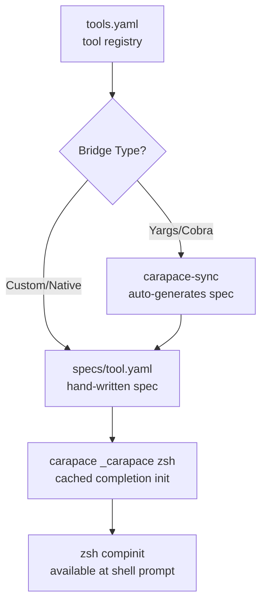

# Carapace Configuration

Shell completion framework with registry-based spec management, bridge types, and sync workflow.

**Source:** `private_dot_config/carapace/` -> `~/.config/carapace/`

## Overview

Carapace provides unified shell completions across zsh, fish, bash, and inshellisense. It uses a registry model where tools are tracked in `tools.yaml` and completion specs are stored in `specs/`.

## File Structure

| File | Purpose |
|---|---|
| `config.yaml` | Catppuccin Mocha theme for completion UI |
| `tools.yaml` | Tool registry (name, bridge type, version tracking) |
| `specs/*.yaml` | Completion spec files (auto-generated or hand-written) |
| `overlays/` | Overlay specs (currently empty) |
| `bridge/zsh/` | Zsh bridge support files |

_Reference: `private_dot_config/carapace/AGENTS.md:5`_

## Spec Types

### Bridge Specs (auto-generated)

Generated by `carapace-sync` based on the tool's native completion system:

| Bridge Type | When to Use | Example |
|---|---|---|
| Yargs | Node.js CLI with `--get-yargs-completions` | opencode |
| Cobra | Go CLI with `completion` subcommand | obsidian-cli, chezmoi |

### Native Specs (hand-written)

Written manually when no bridge type works:

| Tool | Why Native |
|---|---|
| `bw` (Bitwarden CLI) | No standard completion interface |

Native specs follow the carapace YAML spec format with positional args, flags, and subcommands.

_Reference: `private_dot_config/carapace/AGENTS.md:30`_

## Managed Tools

| Tool | Bridge Type | Notes |
|---|---|---|
| `bw` | Custom (native spec) | Hand-written `specs/bw.yaml` |
| `opencode` | Yargs | Auto-generated via bridge |
| `obsidian-cli` | Cobra | Auto-generated via bridge |
| `chezmoi` | Cobra | Auto-generated via bridge |

_Reference: `private_dot_config/carapace/tools.yaml:1`_

## Sync Workflow

The `carapace-sync` script manages spec generation and updates:

| Command | Action |
|---|---|
| `carapace-sync` | Sync all tools (regenerate changed specs) |
| `carapace-sync --force` | Force regenerate all specs |
| `carapace-sync --clean` | Remove specs for unregistered tools |
| `carapace-sync --add <tool>` | Add a new tool to the registry |
| `carapace-sync --list` | List all registered tools |
| `carapace-sync --test` | Test completion generation |

Initial sync runs during the chezmoi `03-setup` after script.

_Reference: `private_dot_config/carapace/AGENTS.md:15`_

## Theme

The `config.yaml` uses Catppuccin Mocha colors for the completion UI:

| Element | Color |
|---|---|
| Foreground/description | `#CDD6F4` (text) |
| Background | `#1E1E2E` (base) |
| Error | `#F38BA8` (red) |
| Flag | `#89B4FA` (blue) |
| Value | `#A6E3A1` (green) |
| Border | `#6C7086` (overlay0) |

_Reference: `private_dot_config/carapace/config.yaml:1`_

## Shell Integration

Carapace is loaded in the zsh startup sequence after `compinit`:

1. `plugins.zsh` runs `compinit`
2. `dot_zshrc` caches `carapace _carapace zsh` output to `~/.cache/carapace-init.zsh`
3. Cache is regenerated only when the carapace binary is newer than the cache

The `CARAPACE_BRIDGES` environment variable is set in `exports.zsh` to `zsh,fish,bash,inshellisense`.

_Reference: `dot_zshrc:37`, `dot_zsh/exports.zsh:8`_

## Gotchas

- Zsh init cache is **not** invalidated by spec changes; run `rm ~/.cache/carapace-init.zsh && exec zsh` after adding specs.
- `carapace export` returns empty output for some tools; use `carapace-sync --test` to verify.
- Built-in carapace completers override custom specs for some commands.
- The `bw.yaml` spec is NOT auto-generated; it must be maintained manually.

_Reference: `private_dot_config/carapace/AGENTS.md:60`_

## References

- AGENTS: `private_dot_config/carapace/AGENTS.md:1`
- Config: `private_dot_config/carapace/config.yaml:1`
- Tools registry: `private_dot_config/carapace/tools.yaml:1`
- Zsh integration: `dot_zshrc:37`
