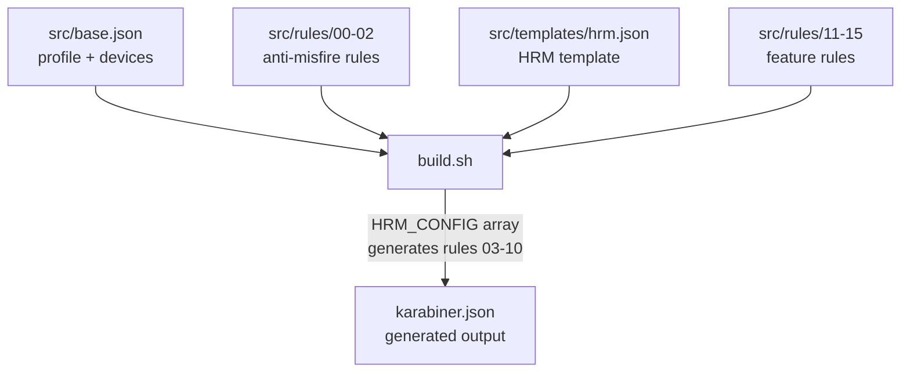
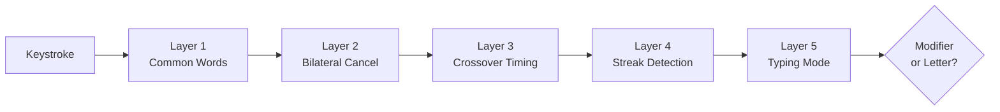

# Karabiner Configuration

Generated build pipeline, home row mods (GASC layout), anti-misfire protection, and rule organization.

**Source:** `private_dot_config/private_karabiner/` -> `~/.config/karabiner/`
**Deployed:** Only `karabiner.json` reaches the target; `build.sh`, `src/`, and `assets/` stay source-only.

## Build Pipeline



**Never edit `karabiner.json` directly.** It is fully generated by `build.sh` from modular source files.

To rebuild:
```bash
cd ~/.local/share/chezmoi/private_dot_config/private_karabiner && ./build.sh
```

_Reference: `private_dot_config/private_karabiner/executable_build.sh:1`_

## Home Row Mods (GASC Layout)

Dual-function keys: tap for letter, hold for modifier. Layout uses GASC (GUI-Alt-Shift-Ctrl mapped to index-middle-ring-pinky):

| Key | Tap | Hold | Finger | Hand |
|---|---|---|---|---|
| `a` | a | Ctrl | pinky | left |
| `s` | s | Option | ring | left |
| `d` | d | Command | middle | left |
| `f` | f | Shift | index | left |
| `j` | j | Shift | index | right |
| `k` | k | Command | middle | right |
| `l` | l | Option | ring | right |
| `;` | ; | Ctrl | pinky | right |

### Per-Finger Timing

Index fingers get shorter streak detection (50ms) because they are faster typists. Other fingers use 160ms.

_Reference: `private_dot_config/private_karabiner/AGENTS.md:24`_

## Anti-Misfire Protection

Five layers prevent accidental modifier activation during normal typing:



| Layer | Rule File | Purpose |
|---|---|---|
| 1. Common Words | `00-common-words.json` | Fast cross-hand word patterns produce letters, not mods |
| 2. Bilateral Cancellation | `01-bilateral-cancellation.json` | Same-hand combos always produce letters |
| 3. Crossover Timing | `02-crossover-timing.json` | Cross-hand timing enforcement |
| 4. Streak Detection | _(generated, rules 03-10)_ | Recent typing disables mod behavior (per-finger timeouts) |
| 5. Typing Mode Toggle | `11-typing-mode-toggle.json` | Manual mod disable toggle |

_Reference: `private_dot_config/private_karabiner/AGENTS.md:40`_

## Rule Organization

Rules are numbered and processed in order. Rules 03-10 are **generated** by `build.sh` from the HRM template.

| Number | File | Type | Purpose |
|---|---|---|---|
| 00 | `00-common-words.json` | Static | Common word anti-misfire |
| 01 | `01-bilateral-cancellation.json` | Static | Same-hand letter output |
| 02 | `02-crossover-timing.json` | Static | Cross-hand timing |
| 03-10 | _(generated)_ | Generated | Per-key HRM rules (8 home row keys) |
| 11 | `11-typing-mode-toggle.json` | Static | Typing mode toggle |
| 12 | `12-typing-activity-tracking.json` | Static | Typing activity tracking |
| 13 | `13-hyper-key.json` | Static | Hyper key setup |
| 14 | `14-double-tap-caps.json` | Static | Double-tap caps lock behavior |
| 15 | `15-hyper-navigation.json` | Static | Hyper+key navigation shortcuts |

_Reference: `private_dot_config/private_karabiner/src/rules/`_

## HRM Template

Each HRM key gets 3 manipulators generated from `src/templates/hrm.json`:

1. **Typing streak** -- outputs letter if recently typed (within streak threshold)
2. **Same-hand stacking** -- instant mod when opposite-hand mod is already active
3. **Default HRM** -- tap for letter, hold for modifier (core dual-function behavior)

The template uses 20+ placeholders (`{{KEY_CODE}}`, `{{MODIFIER}}`, `{{STREAK_MS}}`, etc.) substituted by `sed` during build.

_Reference: `private_dot_config/private_karabiner/src/templates/hrm.json:1`_

## Device Filtering

All rules get a `device_if: built_in_keyboard` condition by default. Rules in the `ALL_DEVICES_RULES` array bypass this filter and apply to all keyboards.

The base config defines 3 device entries:
- Built-in keyboard (active)
- Logitech receiver (ignored)
- External keyboard (F-key passthrough)

A simple modification maps `grave_accent_and_tilde` to `non_us_backslash` for ISO keyboard layout.

_Reference: `private_dot_config/private_karabiner/src/base.json:1`_

## Build Validation

The build script validates output with `jq empty` to ensure valid JSON before writing `karabiner.json`.

## References

- Build script: `private_dot_config/private_karabiner/executable_build.sh:1`
- AGENTS: `private_dot_config/private_karabiner/AGENTS.md:1`
- Base config: `private_dot_config/private_karabiner/src/base.json:1`
- HRM template: `private_dot_config/private_karabiner/src/templates/hrm.json:1`
- Rules: `private_dot_config/private_karabiner/src/rules/`
