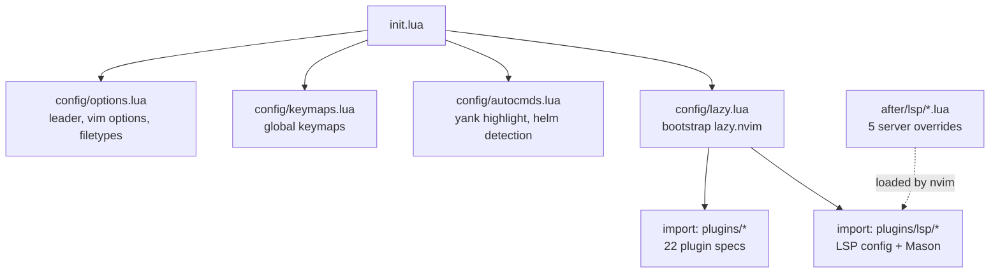
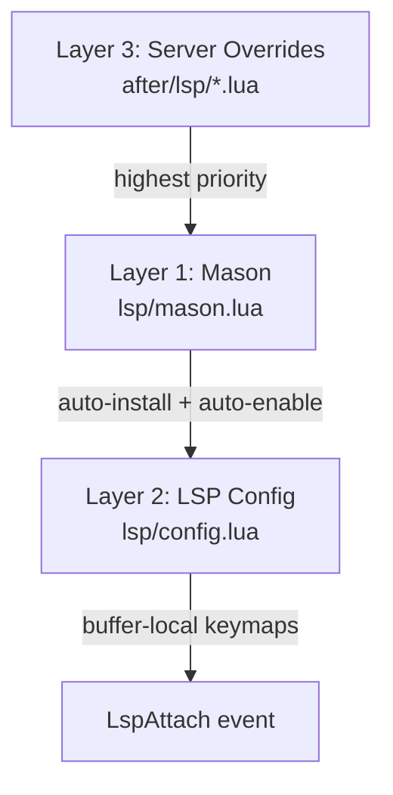

# Neovim Configuration

Bootstrap flow, plugin organization, LSP architecture, and custom keymap locations.

**Source:** `private_dot_config/nvim/` -> `~/.config/nvim/`

## Bootstrap Flow

The entry point (`init.lua`) loads four core modules in strict order. `config/lazy.lua` bootstraps lazy.nvim from git if missing, then imports all plugin specs from two directories.

_Reference: `private_dot_config/nvim/init.lua:1`_

## Core Configuration

### options.lua

- **Leader:** `<Space>` (both leader and localleader)
- **Indentation:** 2-space tabs, expandtab
- **Display:** Relative line numbers, no wrap, custom fold fillchars
- **Folds:** Level 99 (all open by default)
- **Custom filetypes:** `docker-compose.yml` -> `yaml.docker-compose`, `.gitlab-ci.yml` -> `yaml.gitlab`, Helm chart templates -> `helm`
- **Treesitter:** Registers `bash` parser for `zsh` files

_Reference: `private_dot_config/nvim/lua/config/options.lua:1`_

### autocmds.lua

- `TextYankPost` -- highlight yanked text
- `BufRead`/`BufNewFile` -- detect Helm templates (searches for `Chart.yaml` upward)
- `FileType` -- auto-enable treesitter highlight and indentation for all filetypes

_Reference: `private_dot_config/nvim/lua/config/autocmds.lua:1`_

## Plugin Organization

22 plugin spec files in `lua/plugins/`, each returning a lazy.nvim spec table:

| File | Plugin | Category |
|---|---|---|
| `autopairs.lua` | nvim-autopairs | Editing |
| `blink.lua` | blink.cmp | Completion |
| `codecompanion.lua` | codecompanion.nvim | AI |
| `colorscheme.lua` | catppuccin/nvim | Theme |
| `diffview.lua` | diffview.nvim | Git |
| `formatting.lua` | conform.nvim | Formatting |
| `gitsigns.lua` | gitsigns.nvim | Git |
| `linting.lua` | nvim-lint | Linting |
| `lualine.lua` | lualine.nvim | UI/Statusline |
| `noice.lua` | noice.nvim | UI/Cmdline |
| `obsidian.lua` | obsidian.nvim | Notes |
| `oil.lua` | oil.nvim | File explorer |
| `origami.lua` | nvim-origami | Folding |
| `render-markdown.lua` | render-markdown.nvim | Markdown |
| `snacks.lua` | snacks.nvim | Dashboard/utils |
| `supermaven.lua` | supermaven-nvim | AI completion |
| `surround.lua` | nvim-surround | Editing |
| `telescope.lua` | telescope.nvim | Fuzzy finder |
| `todo.lua` | todo-comments.nvim | Highlighting |
| `treesitter.lua` | nvim-treesitter | Syntax |
| `undotree.lua` | undotree | History |
| `which-key.lua` | which-key.nvim | Keymap hints |

Convention: `return { "author/plugin", opts = { ... } }` with lazy.nvim spec format.

_Reference: `private_dot_config/nvim/lua/plugins/`_

## LSP Architecture

Three-layer system where each layer can override the previous:

### Layer 1: Mason (`plugins/lsp/mason.lua`)

Auto-installs and auto-enables servers. `automatic_enable = true` starts all installed servers without explicit setup calls.

**19 LSP servers:** lua_ls, ts_ls, html, cssls, jsonls, bashls, eslint, pyright, gopls, terraformls, rust_analyzer, taplo, nil_ls, gitlab_ci_ls, dockerls, docker_compose_language_service, yamlls, ansiblels, helm_ls

**30+ tools (formatters/linters):** prettier, prettierd, stylua, shfmt, gofumpt, golines, shellcheck, eslint_d, ruff, yamllint, hadolint, golangci-lint, actionlint, trivy, gitleaks, and others.

_Reference: `private_dot_config/nvim/lua/plugins/lsp/mason.lua:1`_

### Layer 2: LSP Config (`plugins/lsp/config.lua`)

Attaches buffer-local keymaps on `LspAttach` and configures diagnostic display (`virtual_text = false`, custom sign icons, rounded float borders, severity sort).

_Reference: `private_dot_config/nvim/lua/plugins/lsp/config.lua:1`_

### Layer 3: Server Overrides (`after/lsp/`)

Highest-priority overrides loaded by Neovim's native `after/lsp/` mechanism:

| File | Override |
|---|---|
| `yamlls.lua` | Detaches from docker-compose files, enables schemaStore, adds GitLab CI schema |
| `jsonls.lua` | Adds `jsonc` filetype, enables validation |
| `dockerls.lua` | Restricts to `dockerfile` filetype only |
| `helm_ls.lua` | Custom values file patterns, embedded yamlls with kubernetes schema |
| `kdl_lsp.lua` | Manual config (not in Mason), only enables if binary exists |

_Reference: `private_dot_config/nvim/after/lsp/`_

## Formatting and Linting

### Formatting (conform.nvim)

Format-on-save enabled (2s timeout, LSP fallback). Key formatter mappings:

| Language | Formatter |
|---|---|
| Lua | stylua |
| Python | ruff_format |
| Web (JS/TS/HTML/CSS) | prettierd -> prettier |
| Shell | shfmt |
| Go | gofumpt + golines |
| Rust | rustfmt / LSP |
| Terraform | terraform_fmt / LSP |
| YAML/JSON/Markdown | prettierd -> prettier |
| Helm | _(none)_ |

_Reference: `private_dot_config/nvim/lua/plugins/formatting.lua:1`_

### Linting (nvim-lint)

Lint triggers: `BufEnter`, `BufWritePost`, `InsertLeave`. Smart Helm detection: YAML files inside Helm charts (detected by `Chart.yaml` upward search) get `helm_lint` instead of `yamllint`.

_Reference: `private_dot_config/nvim/lua/plugins/linting.lua:1`_

## Custom Keymaps

Only custom-defined keymaps are listed here. Plugin-default keymaps (blink.cmp completion defaults, origami fold defaults) are excluded per project convention.

See [shortcuts.md](../shortcuts.md) for the full Neovim keymap table organized alongside keymaps from other layers.

### Which-key Groups

| Prefix | Group |
|---|---|
| `<leader>f` | Find |
| `<leader>e` | Explorer |
| `<leader>o` | Obsidian |
| `<leader>a` | AI |
| `<leader>g` | Git |
| `<leader>u` | Utilities |

_Reference: `private_dot_config/nvim/lua/plugins/which-key.lua:1`_

## Code Style

- 2-space indent, double quotes, trailing commas
- Formatter: stylua. Linter: selene (permissive, `std = "lua51"`)
- Never edit `lazy-lock.json` (auto-generated)
- `after/lsp/` overrides have highest priority

_Reference: `private_dot_config/nvim/AGENTS.md:27`_

## References

- Entry point: `private_dot_config/nvim/init.lua:1`
- AGENTS: `private_dot_config/nvim/AGENTS.md:1`
- Core keymaps: `private_dot_config/nvim/lua/config/keymaps.lua:1`
- Plugin specs: `private_dot_config/nvim/lua/plugins/`
- LSP mason: `private_dot_config/nvim/lua/plugins/lsp/mason.lua:1`
- LSP config: `private_dot_config/nvim/lua/plugins/lsp/config.lua:1`
- Server overrides: `private_dot_config/nvim/after/lsp/`
