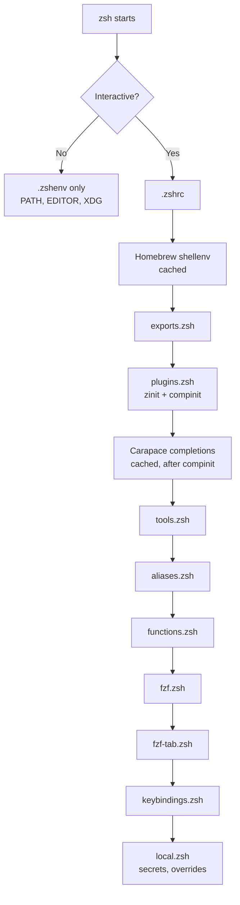

# Zsh Configuration

Shell startup model, load order, module responsibilities, and integrations with tmux and Ghostty.

**Source:** `dot_zshrc` -> `~/.zshrc`, `dot_zsh/` -> `~/.zsh/`

## Startup Model

_Reference: `dot_zshrc:24`_

### Performance Caching

Both `brew shellenv` and `carapace _carapace zsh` are cached to `~/.cache/` and only regenerated when the cache file is missing or the binary is newer than the cache. Optional startup profiling is available via `ZSHRC_PROFILE=1 zsh -i -c exit`.

## Shell Options

| Option | Effect |
|---|---|
| `AUTO_CD` | Change directory without typing `cd` |
| `EXTENDED_HISTORY` | Timestamps in history entries |
| `SHARE_HISTORY` | Share history across sessions |
| `HIST_IGNORE_DUPS` | No duplicate history entries |
| `HIST_IGNORE_SPACE` | Commands starting with space are not recorded |

_Reference: `dot_zshrc:11`_

## Module Responsibilities

### exports.zsh

Interactive-only environment variables. PATH/EDITOR/XDG are set in `~/.zshenv` (loaded by all shell types).

| Variable | Value |
|---|---|
| `PAGER` | `bat` |
| `LESS` | `-R` |
| `CARAPACE_BRIDGES` | `zsh,fish,bash,inshellisense` |
| `_ZO_ECHO` | `1` (show directory after zoxide cd) |

_Reference: `dot_zsh/exports.zsh:1`_

### plugins.zsh

Manages Zinit (auto-installed if missing) and runs `compinit` with 24h cache TTL.

| Plugin | Strategy | Notes |
|---|---|---|
| `Aloxaf/fzf-tab` | Synchronous (`zinit light`) | Must load before compinit |
| `compinit` | Cached (24h TTL) | `-C` for cached, full rebuild otherwise |
| `OMZ::plugins/git` | Snippet | Oh-My-Zsh git aliases |
| `zsh-users/zsh-autosuggestions` | Turbo deferred (`wait lucid`) | Before syntax highlighting |
| `zdharma-continuum/fast-syntax-highlighting` | Turbo deferred | Must be last |

`shift-select-enhancements.zsh` is loaded via zinit `atload` hook on the shift-select plugin, not directly sourced from `.zshrc`.

_Reference: `dot_zsh/plugins.zsh:1`_

### tools.zsh

Tool initialization for interactive shells:

| Tool | Init | Notes |
|---|---|---|
| Zoxide | `zoxide init --cmd cd zsh` | Replaces `cd`; unaliases `zi` to avoid zinit conflict |
| Direnv | `direnv hook zsh` | Per-directory environment variables |
| Starship | `starship init zsh` | Prompt |

Atuin is loaded in `fzf.zsh` (after fzf setup) so it can take over `Ctrl-R`.

_Reference: `dot_zsh/tools.zsh:1`_

### aliases.zsh

| Category | Key Aliases |
|---|---|
| Navigation | `..` = `cd ..` |
| Listing (eza) | `l`, `ls`, `ll`, `la`, `ld`, `lda`, `lgit` |
| Shell | `reload`/`r` = `exec zsh`, `zsh-profile`, `zsh-time` |
| Apps | `v`/`vi`/`vim` = `nvim`, `lg` = `lazygit`, `b` = `bat`, `oc` = `opencode`, `occ` = `opencode --continue` |
| Tmux | `ta` = `tmux attach`, `td` = `tmux detach`, `tls` = `tmux ls` |
| Kubernetes | `k` = `kubectl`, `ctx` = `kubectx`, `ns` = `kubens` |
| Chezmoi | `cz` = `chezmoi` |

_Reference: `dot_zsh/aliases.zsh:1`_

### functions.zsh

| Function | Description |
|---|---|
| `extract <file>` | Universal archive extractor (tar.gz, zip, rar, 7z, etc.) |
| `killname <name>` | Find process by name and kill it |
| `take <dir>` | `mkdir -p` + `cd` in one step |
| `y [args]` | Yazi file manager wrapper (changes cwd on exit) |
| `ftext [query]` | Interactive ripgrep+fzf search; opens result in `$VISUAL` |
| `ftext-widget` | ZLE widget for `Ctrl-F` keybinding (Tab inserts filename, Enter opens editor) |
| `brew_update` | Full Homebrew maintenance cycle |
| `aws-login <profile>` | Wrapper for Go binary; sets env vars and propagates to tmux |
| `reset_internet` | Flush DNS, reset pf, bounce network interface |

_Reference: `dot_zsh/functions.zsh:1`_

### fzf.zsh

Central FZF configuration. `FZF_DEFAULT_OPTS` carries all base settings (Catppuccin Mocha colors, keybindings, UI). Per-tool configs override only what differs.

**Shell keybindings:**
- `Ctrl-T` -- fd-based file picker with bat preview
- `Alt-C` -- disabled (zoxide used instead)
- `Ctrl-R` -- fzf widget loaded then unbound; Atuin takes over

**Tool-specific configs:**
- Zoxide (`_ZO_FZF_OPTS`): eza directory preview, git branch display
- ftext (`_ftext_fzf_opts`): bat syntax-highlighted preview centered on match

Atuin is initialized at the end of this file: `eval "$(atuin init zsh)"`.

_Reference: `dot_zsh/fzf.zsh:1`_

### fzf-tab.zsh

Configures the `fzf-tab` completion plugin with context-sensitive previews:

| Context | Preview |
|---|---|
| `cd` | `eza -1 --color=always` |
| `export`/`unset` | Variable value |
| `kill`/`ps` | Process command line |
| `git add/diff/restore` | `git diff` via delta |
| `git log/show` | Colorized log/commit |
| `git checkout` | Context-dependent (file, commit, branch) |
| `docker`/`kubectl` | Completion description |

Group switching: `<` and `>`. Continuous trigger: `/` (accept and continue into subdirectory).

_Reference: `dot_zsh/fzf-tab.zsh:1`_

### keybindings.zsh

All bindings applied across keymaps: `emacs`, `viins`, `vicmd`, `main`. See [shortcuts.md](../shortcuts.md) for the full keybinding table.

Final settings: `KEYTIMEOUT=80` (for Alt/Option escape-prefix sequences), `bindkey -e` (emacs mode).

_Reference: `dot_zsh/keybindings.zsh:1`_

### local.zsh (templated)

Generated from `local.zsh.tmpl` by chezmoi. Pulls secrets from Bitwarden Secrets Manager. Loaded last to allow overrides.

| Variable | Condition |
|---|---|
| `OPENROUTER_API_KEY` | Always (macOS) |
| `SUPABASE_URL`, `SUPABASE_SERVICE_KEY` | Always (macOS) |
| `GITHUB_TOKEN`, `GITLAB_TOKEN`, `GITLAB_HOST` | DT work profile only |
| Work `PATH` additions | DT work profile only |

Never edit `~/.zsh/local.zsh` directly -- edit the `.tmpl` template in the chezmoi source.

_Reference: `dot_zsh/local.zsh.tmpl:1`_

## Cross-Layer Interactions

### Ghostty -> zsh

Ghostty sends custom CSI sequences for macOS shortcuts that zsh processes:
- `Cmd+C`/`Cmd+X` -> CSI `200~`/`201~` -> shift-select copy/cut widgets
- `Cmd+Left`/`Cmd+Right` -> Home/End escape sequences
- `Shift+Cmd+Left`/`Right` -> select-whole-line widgets

### tmux -> zsh

- `Ctrl+Tab`/`Ctrl+Shift+Tab` pass through tmux (extended keys) for window navigation.
- tmux prefix `Ctrl-a` is consumed by tmux and not forwarded to zsh.

### Zsh shell type note

`.zshenv` is the only file loaded by non-interactive shells (`zsh -c`). PATH additions for background processes must go in `.zshenv`, not `.zshrc`.

## References

- Main zshrc: `dot_zshrc:1`
- Zsh AGENTS: `dot_zsh/AGENTS.md:1`
- Keybindings: `dot_zsh/keybindings.zsh:1`
- Shift-select: `dot_zsh/shift-select-enhancements.zsh:1`
- FZF config: `dot_zsh/fzf.zsh:1`
