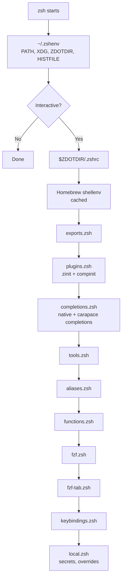

# Zsh Configuration

Shell startup model, load order, module responsibilities, and integrations with tmux and Ghostty.

**Source:** `dot_zshenv.tmpl` -> `~/.zshenv`, `private_dot_config/zsh/` -> `~/.config/zsh/`

## Startup Model

```mermaid
flowchart TD
  A[zsh starts] --> C[~/.zshenv<br/>PATH, XDG, ZDOTDIR, HISTFILE]
  C --> B{Interactive?}
  B -->|No| X[Done]
  B -->|Yes| D[$ZDOTDIR/.zshrc]
  D --> E[Homebrew shellenv<br/>cached]
  E --> F[exports.zsh]
  F --> G[plugins.zsh<br/>zinit + compinit]
  G --> H[completions.zsh<br/>native + carapace completions]
  H --> I[tools.zsh]
  I --> J[aliases.zsh]
  J --> K[functions.zsh]
  K --> L[fzf.zsh]
  L --> M[fzf-tab.zsh]
  M --> N[keybindings.zsh]
  N --> O[local.zsh<br/>secrets, overrides]
```

_Reference: `private_dot_config/zsh/dot_zshrc:22`, `dot_zshenv.tmpl:16`_

### Performance Caching

`brew shellenv`, `carapace _carapace zsh`, and `sesh completion zsh` are cached to `~/.cache/` and only regenerated when the cache file is missing or the binary is newer than the cache. Optional startup profiling is available via `ZSHRC_PROFILE=1 zsh -i -c exit`.

## Shell Options

| Option | Effect |
|---|---|
| `AUTO_CD` | Change directory without typing `cd` |
| `EXTENDED_HISTORY` | Timestamps in history entries |
| `SHARE_HISTORY` | Share history across sessions |
| `HIST_IGNORE_DUPS` | No duplicate history entries |
| `HIST_IGNORE_SPACE` | Commands starting with space are not recorded |

_Reference: `private_dot_config/zsh/dot_zshrc:8`_

## Module Responsibilities

### .zshenv (templated)

`dot_zshenv.tmpl` is the global bootstrap for every shell type. It defines the XDG base dirs, exports `ZDOTDIR`, and relocates tool/runtime state such as Cargo, Bun cache, Colima, CDK, `mcp-remote`, Go, and shell history before interactive config loads.

It intentionally avoids exporting editor-specific init variables like `VIMINIT` and explicitly clears inherited `VIMINIT`; Neovim checks `VIMINIT` before `~/.config/nvim/init.lua`, so leaking it through the shell environment breaks normal `nvim` startup, especially for headless runs.

On macOS it also maps `XDG_RUNTIME_DIR` to `TMPDIR` and disables Apple Terminal shell-session files with `SHELL_SESSIONS_DISABLE=1`.

_Reference: `dot_zshenv.tmpl:1`_

### exports.zsh

Interactive-only environment variables. PATH/EDITOR/XDG are set in `~/.zshenv` (loaded by all shell types).

| Variable | Value |
|---|---|
| `PAGER` | `bat` |
| `LESS` | `-R` |
| `CARAPACE_BRIDGES` | `zsh,fish,bash,inshellisense` |
| `_ZO_ECHO` | `1` (show directory after zoxide cd) |
| `OPENCODE_CONFIG` | `$HOME/.config/opencode/opencode.jsonc` |
| `OPENCODE_EXPERIMENTAL_PLAN_MODE` | `true` |
| `OPENCODE_EXPERIMENTAL_MARKDOWN` | `true` |
| `OPENCODE_CONFIG_DIR` | `$HOME/.config/opencode` |

_Reference: `private_dot_config/zsh/exports.zsh:1`_

### plugins.zsh

Manages Zinit (auto-installed if missing) and runs `compinit` with 24h cache TTL.

| Plugin | Strategy | Notes |
|---|---|---|
| `Aloxaf/fzf-tab` | Synchronous (`zinit light`) | Must load before compinit |
| `compinit` | Cached (24h TTL) | `-C` for cached, full rebuild otherwise |
| `OMZ::plugins/git` | Snippet | Oh-My-Zsh git aliases |
| `zsh-users/zsh-autosuggestions` | Turbo deferred (`wait lucid`) | Before syntax highlighting |
| `zdharma-continuum/fast-syntax-highlighting` | Turbo deferred | Must be last |

`shift-select-enhancements.zsh` is loaded via zinit `atload` hook on the shift-select plugin, not directly sourced from `.zshrc`.

_Reference: `private_dot_config/zsh/plugins.zsh:1`_

### completions.zsh

Completion setup for interactive shells:

| Source | Strategy | Notes |
|---|---|---|
| `carapace.zsh` | Cached, optional | Loads aggregated completions only when `ZSH_ENABLE_CARAPACE=1` |
| `sesh completion zsh` | Cached native script | Works even when Carapace is disabled |

`completions.zsh` is sourced after `compinit` and before `tools.zsh`, so command completions are available before tool init mutates shell state.

_Reference: `private_dot_config/zsh/completions.zsh:1`_

### tools.zsh

Tool initialization for interactive shells:

| Tool | Init | Notes |
|---|---|---|
| Mise | `mise activate zsh` | Activates mise-managed tools in PATH (e.g., `linear-cli`) |
| Zoxide | `zoxide init --cmd cd zsh` | Replaces `cd`; unaliases `zi` to avoid zinit conflict |
| Direnv | `direnv hook zsh` | Per-directory environment variables |
| Starship | `starship init zsh` | Prompt |
| aws-login | `aws-login init zsh` | Defines `aws-login` and `aws-login-exec` shell functions |

Atuin is loaded in `fzf.zsh` (after fzf setup) so it can take over `Ctrl-R`, and Atuin AI shell integration is loaded there too.

_Reference: `private_dot_config/zsh/tools.zsh:1`_

### aliases.zsh

| Category | Key Aliases |
|---|---|
| Navigation | `..` = `cd ..` |
| Listing (eza) | `l`, `ls`, `ll`, `la`, `ld`, `lda`, `lgit` |
| Shell | `reload`/`r` = `exec zsh`, `zsh-profile`, `zsh-time` |
| Apps | `v`/`vi`/`vim` = `nvim`, `lg` = `lazygit`, `b` = `bat`, `oc` = `opencode`, `omo` = isolated OpenCode profile for OMO, `occ` = `opencode --continue` |
| Mail | `nm` = `neomutt`, `msync` = `mail-sync`, `ab` = `abook` with XDG config/data paths |
| Tmux | `ta` = `tmux attach`, `td` = `tmux detach`, `tls` = `tmux ls` |
| Kubernetes | `k` = `kubectl`, `ctx` = `kubectx`, `ns` = `kubens` |
| Chezmoi | `cz` = `chezmoi` |

_Reference: `private_dot_config/zsh/aliases.zsh:1`_

### functions.zsh

| Function | Description |
|---|---|
| `extract <file>` | Universal archive extractor (tar.gz, zip, rar, 7z, etc.) |
| `killname <name>` | Find process by name and kill it |
| `take <dir>` | `mkdir -p` + `cd` in one step |
| `y [args]` | Yazi file manager wrapper (changes cwd on exit) |
| `ftext [query]` | Interactive ripgrep+fzf search; opens result in `$VISUAL` |
| `ftext-widget` | ZLE widget for `Ctrl-F` keybinding (Tab inserts filename, Enter opens editor) |
| `brew_update` | Full Homebrew maintenance cycle |
| `reset_internet` | Flush DNS, reset pf, bounce network interface |

_Reference: `private_dot_config/zsh/functions.zsh:1`_

### fzf.zsh

Central FZF configuration. `FZF_DEFAULT_OPTS` carries all base settings (Catppuccin Mocha colors, keybindings, UI). Per-tool configs override only what differs.

**Shell keybindings:**
- `Ctrl-T` -- fd-based file picker with bat preview
- `Ctrl-Shift-T` -- directory picker (via Ghostty `ESC[202~` passthrough)
- `Alt-C` -- disabled (zoxide used instead)
- `Ctrl-R` -- fzf widget loaded then unbound; Atuin takes over
- `?` on an empty prompt -- Atuin AI natural-language prompt

**Tool-specific configs:**
- Zoxide (`_ZO_FZF_OPTS`): eza directory preview, git branch display
- ftext (`_ftext_fzf_opts`): bat syntax-highlighted preview centered on match

Atuin and Atuin AI are initialized at the end of this file: `eval "$(atuin init zsh)"` and `eval "$(atuin ai init zsh)"`.

_Reference: `private_dot_config/zsh/fzf.zsh:1`_

### fzf-tab.zsh

Configures the `fzf-tab` completion plugin with context-sensitive previews:

| Context | Preview |
|---|---|
| `cd` | `eza -1 --color=always` |
| `export`/`unset` | Variable value |
| `kill`/`ps` | Process command line |
| `git add/diff/restore` | `git diff` via delta (colorizer) |
| `git log/show` | Colorized log/commit |
| `git checkout` | Context-dependent (file, commit, branch) |
| `docker`/`kubectl` | Completion description |

Group switching: `<` and `>`. Continuous trigger: `/` (accept and continue into subdirectory).

_Reference: `private_dot_config/zsh/fzf-tab.zsh:1`_

### keybindings.zsh

All bindings applied across keymaps: `emacs`, `viins`, `vicmd`, `main`. See [shortcuts.md](../shortcuts.md) for the full keybinding table.

Notable custom bindings include `Ctrl-F` for `ftext-widget`, `Ctrl-G` for `navi`, and `Ctrl-Z` for zoxide.

Final settings: `KEYTIMEOUT=80` (for Alt/Option escape-prefix sequences), `bindkey -e` (emacs mode).

_Reference: `private_dot_config/zsh/keybindings.zsh:1`_

### local.zsh (templated)

Generated from `local.zsh.tmpl` by chezmoi. Pulls secrets from Bitwarden Secrets Manager. Loaded last to allow overrides.

| Variable | Condition |
|---|---|
| `OPENROUTER_API_KEY` | Always (macOS) |
| `LINEAR_API_KEY` | Always (macOS) |
| `SUPABASE_URL`, `SUPABASE_SERVICE_KEY` | Always (macOS) |
| `GITHUB_TOKEN`, `GITLAB_TOKEN`, `GITLAB_HOST` | DT work profile only |
| Work `PATH` additions | DT work profile only |

Never edit `~/.config/zsh/local.zsh` directly -- edit the `.tmpl` template in the chezmoi source.

_Reference: `private_dot_config/zsh/local.zsh.tmpl:1`_

## Cross-Layer Interactions

### Ghostty -> zsh

Ghostty sends custom CSI sequences for macOS shortcuts that zsh processes:
- `Cmd+C`/`Cmd+X` -> CSI `200~`/`201~` -> shift-select copy/cut widgets
- `Cmd+Left`/`Cmd+Right` -> Home/End escape sequences
- `Shift+Cmd+Left`/`Right` -> select-whole-line widgets
- `Ctrl+Shift+T` -> `ESC[202~` -> fzf directory picker widget

### tmux -> zsh

- `Ctrl+Tab`/`Ctrl+Shift+Tab` pass through tmux (extended keys) for window navigation.
- tmux prefix `Ctrl-a` is consumed by tmux and not forwarded to zsh.

### Zsh shell type note

`~/.zshenv` is the primary bootstrap for non-interactive shells (`zsh -c`). It exports `ZDOTDIR=~/.config/zsh`, and `~/.config/zsh/.zshenv` delegates back to `~/.zshenv` for child shells that inherit `ZDOTDIR`, so PATH additions for background processes still belong in `.zshenv`, not `$ZDOTDIR/.zshrc`.

The mail LaunchAgent calls `~/bin/mail-sync --quiet` directly, and `mail-sync` sets its own `PATH` + XDG variables internally. Mail background sync does not depend on `.zshrc` load order or shell aliases.

## References

- `.zshenv` template: `dot_zshenv.tmpl:1`
- Main zshrc: `private_dot_config/zsh/dot_zshrc:1`
- Completions: `private_dot_config/zsh/completions.zsh:1`
- Zsh AGENTS: `private_dot_config/zsh/AGENTS.md:1`
- Keybindings: `private_dot_config/zsh/keybindings.zsh:1`
- Shift-select: `private_dot_config/zsh/shift-select-enhancements.zsh:1`
- FZF config: `private_dot_config/zsh/fzf.zsh:1`
