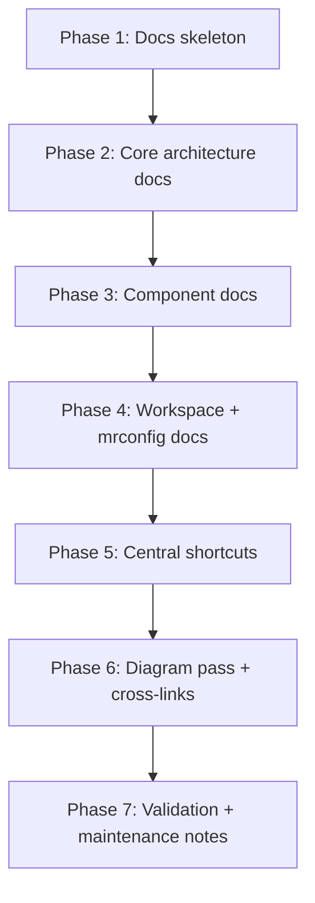
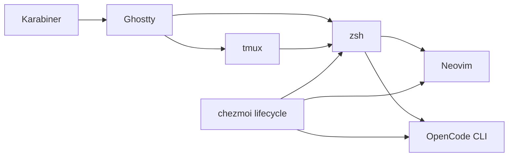

# Dotfiles Documentation Implementation Plan

## Overview

This plan defines how to build a maintainable `docs/` tree for the current dotfiles codebase, with clear sectioning by component, embedded Mermaid diagrams, and a central shortcuts reference. Scope includes zsh, major `~/.config/*` areas (with dedicated docs for Neovim and OpenCode), workspace/mrconfig explanations, and custom shortcuts only (excluding plugin-default mappings such as blink/origami defaults).

## Current State Analysis

The repository already contains rich operational documentation in `README.md`, root/module `AGENTS.md` files, and command-specific markdown under OpenCode, but there is no centralized `docs/` tree yet.

### Key Discoveries

- Chezmoi lifecycle and deployment model are already documented with explicit apply order and key paths (`AGENTS.md:42`, `AGENTS.md:78`).
- Zsh is modular with an explicit load order and discrete files for keybindings, aliases, functions, and tool init (`dot_zshrc:24`, `dot_zsh/AGENTS.md:22`).
- Neovim is structured as core config + plugin specs + LSP overrides, and keymap conventions are documented (`private_dot_config/nvim/init.lua:1`, `private_dot_config/nvim/AGENTS.md:5`).
- OpenCode has a full config/agent/command hierarchy with local docs patterns that can be mirrored in `docs/` (`private_dot_config/opencode/README.md:5`, `private_dot_config/opencode/AGENTS.md:45`).
- Karabiner uses a generated build pipeline from modular source files (`private_dot_config/private_karabiner/executable_build.sh:1`, `private_dot_config/private_karabiner/AGENTS.md:24`).
- Workspace management is encoded in `dot_mrconfig` with static sections and dynamic `glab` + `jq` includes (`dev/work/workspaces/magenta-apprentice/dot_mrconfig:10`, `dev/work/workspaces/magenta-apprentice/dot_mrconfig:30`).
- Blink and Origami currently rely on default/preset keymap behavior, so they should not be documented as custom shortcuts (`private_dot_config/nvim/lua/plugins/blink.lua:9`, `private_dot_config/nvim/lua/plugins/origami.lua:25`).

## Desired End State

A versioned `docs/` tree exists at repo root with:

1. Clear component-based docs sections.
2. Embedded Mermaid diagrams for architecture and flows.
3. A single `docs/shortcuts.md` for custom shortcuts and keymaps.
4. Cross-references to source files using `path:line` citations.
5. A lightweight maintenance model so docs stay aligned with config changes.

Verification of end state:

- `docs/` exists with all planned files.
- Every major doc contains a references section with clickable source paths.
- Mermaid blocks render in markdown viewers that support Mermaid.
- `docs/shortcuts.md` includes only custom-defined mappings (not plugin defaults).

## What We Are Not Doing

- Documenting third-party default keymaps when no custom mapping is defined (explicitly includes blink/origami default mappings).
- Rewriting existing operational docs in `AGENTS.md`/`README.md`; instead, `docs/` links and consolidates.
- Generating docs from code automatically in this phase.
- Changing runtime configuration behavior as part of this docs effort.

## Implementation Approach

Build `docs/` in phases: establish structure and conventions first, then author component docs from existing source-of-truth files, then produce a central shortcuts index and cross-component diagrams, and finally add a maintenance workflow.





## Documentation File Map

Proposed initial docs tree:

```text
docs/
  README.md
  architecture/
    overview.md
    chezmoi-lifecycle.md
  components/
    zsh.md
    config-overview.md
    nvim.md
    opencode.md
    carapace.md
    karabiner.md
  workspaces/
    mrconfig.md
  shortcuts.md
  maintenance.md
```

## Phase 1: Foundation and Conventions

### Overview

Create the docs skeleton, define writing conventions, and establish citation/link style before writing component content.

### Changes Required

#### 1. Create docs entrypoint and navigation

**Files**:

- `docs/README.md`
- `docs/architecture/overview.md`

**Changes**:

- Add a high-level index with links to each component doc.
- Define conventions for citations (`path:line`), headings, and Mermaid usage.
- Add a short “source of truth” note pointing back to config files.

#### 2. Define citation and diagram conventions

**Files**:

- `docs/maintenance.md`

**Changes**:

- Add a repeatable update checklist.
- Define when to update docs after config/script changes.

### Success Criteria

#### Automated Verification

- [ ] `docs/` tree exists with top-level files and section directories.
- [ ] `docs/README.md` links resolve to local files.

#### Manual Verification

- [ ] Docs entrypoint is easy to navigate in one pass.
- [ ] Citation format is consistent and readable.

**Implementation Note**: Pause after this phase for review of structure and naming.

---

## Phase 2: Core Architecture Documentation

### Overview

Document the global system behavior: chezmoi apply lifecycle, template/data model, encryption/secrets flow, and deployment boundaries.

### Changes Required

#### 1. Capture lifecycle and apply order

**File**: `docs/architecture/chezmoi-lifecycle.md`

**Changes**:

- Document before/file/after phases with references and a Mermaid flowchart.
- Include key scripts and ordering behavior.

**Primary references**:

- `AGENTS.md:42`
- `AGENTS.md:45`
- `.chezmoi.toml.tmpl:16`
- `.chezmoiignore:11`

#### 2. Capture source-to-target mapping and scope boundaries

**File**: `docs/architecture/overview.md`

**Changes**:

- Document which source directories map to target paths.
- Explain source-only directories and ignored artifacts.

**Primary references**:

- `AGENTS.md:78`
- `.chezmoiignore:19`
- `.chezmoiignore:54`

### Success Criteria

#### Automated Verification

- [ ] Mermaid blocks exist and are syntactically valid markdown fences.
- [ ] All architecture sections include at least one source reference.

#### Manual Verification

- [ ] Reader can trace how a source file reaches target state.
- [ ] Encryption/secrets flow is understandable end-to-end.

**Implementation Note**: Pause for validation that architecture diagrams match current behavior.

---

## Phase 3: Component Documentation (`zsh` + major `.config/*`)

### Overview

Document each major component in separate files, with larger sections for Neovim and OpenCode.

### Changes Required

#### 1. zsh documentation

**File**: `docs/components/zsh.md`

**Changes**:

- Cover load order, module responsibilities, and shell startup model.
- Include zsh/tmux/Ghostty interaction notes where relevant.

**Primary references**:

- `dot_zshrc:24`
- `dot_zsh/AGENTS.md:22`
- `dot_zsh/keybindings.zsh:8`

#### 2. `.config` overview doc

**File**: `docs/components/config-overview.md`

**Changes**:

- Summarize all notable `private_dot_config/` areas.
- Link out to dedicated docs for large components.

**Primary references**:

- `AGENTS.md:86`
- `private_dot_config/nvim/AGENTS.md:5`
- `private_dot_config/opencode/README.md:5`

#### 3. Neovim dedicated doc

**File**: `docs/components/nvim.md`

**Changes**:

- Cover bootstrap flow, plugin organization, LSP layering, and custom keymap locations.
- Keep plugin defaults out of custom-shortcut sections.

**Primary references**:

- `private_dot_config/nvim/init.lua:1`
- `private_dot_config/nvim/AGENTS.md:27`
- `private_dot_config/nvim/lua/config/keymaps.lua:5`
- `private_dot_config/nvim/lua/plugins/blink.lua:9`
- `private_dot_config/nvim/lua/plugins/origami.lua:25`

#### 4. OpenCode dedicated doc

**File**: `docs/components/opencode.md`

**Changes**:

- Cover config model, MCP setup, agent definitions, and custom command layout.

**Primary references**:

- `private_dot_config/opencode/opencode.jsonc:11`
- `private_dot_config/opencode/README.md:23`
- `private_dot_config/opencode/AGENTS.md:45`

#### 5. Carapace and Karabiner docs

**Files**:

- `docs/components/carapace.md`
- `docs/components/karabiner.md`

**Changes**:

- Carapace: registry/spec/bridge model and sync workflow.
- Karabiner: generated build pipeline and rule source organization.

**Primary references**:

- `private_dot_config/carapace/AGENTS.md:5`
- `private_dot_config/private_karabiner/executable_build.sh:147`
- `private_dot_config/private_karabiner/AGENTS.md:24`

### Success Criteria

#### Automated Verification

- [ ] All component docs exist and are linked from `docs/README.md`.
- [ ] Each component doc has a “References” section.

#### Manual Verification

- [ ] Large components (Neovim/OpenCode) are clearly separate and complete.
- [ ] Readers can jump from docs to source files quickly.

**Implementation Note**: Pause after Neovim/OpenCode docs before smaller component docs if needed.

---

## Phase 4: Workspace and mrconfig Documentation

### Overview

Document the `dev/` workspace layout and explain both static and dynamic `mrconfig` behavior.

### Changes Required

#### 1. Workspace structure and usage

**File**: `docs/workspaces/mrconfig.md`

**Changes**:

- Explain `dev/personal` vs `dev/work/workspaces` structure.
- Explain static checkout sections and dynamic include blocks.
- Include a Mermaid flowchart for how includes expand.

**Primary references**:

- `dev/work/workspaces/magenta-apprentice/dot_mrconfig:10`
- `dev/work/workspaces/magenta-apprentice/dot_mrconfig:30`
- `dev/personal/whocares/dot_mrconfig:2`
- `dev/work/workspaces/magenta-apprentice/AGENTS.md:10`

### Success Criteria

#### Automated Verification

- [ ] `docs/workspaces/mrconfig.md` includes static + dynamic include sections.

#### Manual Verification

- [ ] Reader can understand how workspace repos are discovered and checked out.

**Implementation Note**: Pause for confirmation that workspace docs match intended day-to-day usage.

---

## Phase 5: Central Shortcuts Documentation

### Overview

Create `docs/shortcuts.md` as the single index for custom shortcuts/keymaps across shell, terminal, editor, and keyboard layers.

### Changes Required

#### 1. Create unified shortcuts index

**File**: `docs/shortcuts.md`

**Changes**:

- Group by source: zsh, tmux, Ghostty, Neovim, Karabiner.
- Add columns: key/alias, action, source file.
- Add explicit scope note: custom mappings only; exclude plugin defaults.

**Primary references**:

- `dot_zsh/keybindings.zsh:14`
- `dot_zsh/shift-select-enhancements.zsh:71`
- `private_dot_config/tmux/tmux.conf:11`
- `private_dot_config/ghostty/config:61`
- `private_dot_config/nvim/lua/config/keymaps.lua:5`
- `private_dot_config/private_karabiner/src/rules/15-hyper-navigation.json:13`
- `private_dot_config/nvim/lua/plugins/blink.lua:9`
- `private_dot_config/nvim/lua/plugins/origami.lua:25`

#### 2. Add cross-layer shortcut diagram

**File**: `docs/shortcuts.md`

**Changes**:

- Add Mermaid diagram showing input path and where mappings are interpreted.

### Success Criteria

#### Automated Verification

- [ ] Every shortcut row has a source path reference.
- [ ] No entries are added for default-only plugin mappings.

#### Manual Verification

- [ ] Shortcut index is fast to scan and searchable.
- [ ] Cross-layer interactions (Karabiner -> Ghostty -> tmux/zsh/nvim) are understandable.

**Implementation Note**: Pause for review specifically on shortcut completeness and exclusions.

---

## Phase 6: Diagram and Cross-Link Pass

### Overview

Add/normalize Mermaid diagrams across docs and ensure internal links/citations are consistent.

### Changes Required

#### 1. Diagram coverage pass

**Files**:

- `docs/architecture/overview.md`
- `docs/architecture/chezmoi-lifecycle.md`
- `docs/workspaces/mrconfig.md`
- `docs/shortcuts.md`

**Changes**:

- Ensure each file has at least one relevant Mermaid diagram.
- Keep diagram nodes aligned to existing terminology in source files.

#### 2. Link/citation consistency pass

**Files**:

- All markdown files under `docs/`

**Changes**:

- Normalize citations and section links.
- Verify no orphan docs.

### Success Criteria

#### Automated Verification

- [ ] `docs/README.md` links to every docs page.
- [ ] All Mermaid code fences are correctly closed.

#### Manual Verification

- [ ] Diagrams visually match actual component boundaries.
- [ ] Navigation from top-level docs to component docs is frictionless.

**Implementation Note**: Pause before finalization for one end-to-end docs navigation review.

---

## Phase 7: Final Validation and Maintenance Handoff

### Overview

Perform a final consistency check and capture how docs stay current after future config changes.

### Changes Required

#### 1. Final quality pass

**Files**:

- All markdown files under `docs/`

**Changes**:

- Resolve terminology drift.
- Ensure no unresolved TODO markers remain.

#### 2. Maintenance checklist

**File**: `docs/maintenance.md`

**Changes**:

- Add update triggers (e.g., keymap changes, new component directories, lifecycle script changes).
- Add expected review order for quick updates.

### Success Criteria

#### Automated Verification

- [ ] No broken local markdown links.
- [ ] No missing docs files from planned map.

#### Manual Verification

- [ ] A new contributor can identify where to edit docs for each subsystem.
- [ ] Shortcut and architecture docs stay aligned with current configs.

**Implementation Note**: This is the completion gate for the documentation initiative.

---

## Testing Strategy

### Unit-like Content Checks

- Verify each doc has: Overview, component details, references.
- Verify each shortcut entry maps to an explicit custom definition in source.
- Verify blink/origami are treated as default-keymap exclusions only.

### Integration-like Docs Checks

- Start from `docs/README.md` and navigate every linked page.
- From each diagram, follow references to source files and verify claim/source alignment.
- Verify component docs cross-link to `docs/shortcuts.md` and architecture docs where needed.

### Manual Verification Steps

1. Open `docs/README.md` and traverse every section.
2. Spot-check 10+ citations against source files.
3. Validate one shortcut per layer (zsh/tmux/Ghostty/Neovim/Karabiner).
4. Confirm workspace/mrconfig includes are explained with both static and dynamic examples.

## Performance and Maintainability Considerations

- Keep one-topic-per-file to reduce merge conflicts and simplify updates.
- Prefer concise tables for quick scanning and explicit source citations for trust.
- Keep large subsystems (`nvim`, `opencode`) isolated in dedicated docs so changes are localized.

## Task Checklist (Execution Order)

- [ ] Create `docs/` skeleton and navigation index.
- [ ] Author architecture docs and lifecycle diagram.
- [ ] Author `zsh.md` and `config-overview.md`.
- [ ] Author dedicated `nvim.md` and `opencode.md`.
- [ ] Author `carapace.md` and `karabiner.md`.
- [ ] Author workspace `mrconfig.md`.
- [ ] Author `shortcuts.md` (custom mappings only, exclude default-only plugin maps).
- [ ] Add Mermaid diagrams and cross-link all docs.
- [ ] Run final docs consistency pass and finish maintenance guide.

## References

- Root documentation baseline: `README.md:1`, `AGENTS.md:1`
- Chezmoi data/config: `.chezmoi.toml.tmpl:1`, `.chezmoiignore:1`
- Zsh architecture and keymaps: `dot_zshrc:24`, `dot_zsh/AGENTS.md:22`, `dot_zsh/keybindings.zsh:8`
- Terminal/keymap layers: `private_dot_config/ghostty/config:57`, `private_dot_config/tmux/tmux.conf:5`
- Neovim structure and maps: `private_dot_config/nvim/init.lua:1`, `private_dot_config/nvim/lua/config/keymaps.lua:1`
- OpenCode structure: `private_dot_config/opencode/README.md:5`, `private_dot_config/opencode/opencode.jsonc:11`
- Workspace/mrconfig: `dev/work/workspaces/magenta-apprentice/dot_mrconfig:1`, `dev/personal/whocares/dot_mrconfig:1`
- Karabiner build pipeline: `private_dot_config/private_karabiner/executable_build.sh:1`, `private_dot_config/private_karabiner/AGENTS.md:24`
