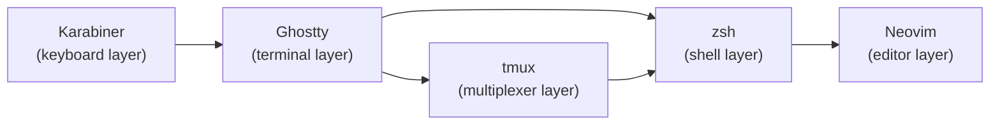

# Shortcuts

Unified index of custom keymaps and shortcuts across all input layers. **Custom mappings only** -- plugin-default keymaps (e.g., blink.cmp completion defaults, origami fold defaults) are excluded.

## Input Flow

A keystroke passes through each layer in sequence. Karabiner processes physical key events first (home row mods, hyper key), Ghostty handles terminal-level bindings, tmux intercepts its prefix and pass-through sequences, zsh processes shell keybindings, and finally Neovim handles editor keymaps.

## Karabiner (Keyboard Layer)

### Home Row Mods (GASC)

| Key | Tap | Hold    |
| --- | --- | ------- |
| `a` | a   | Ctrl    |
| `s` | s   | Option  |
| `d` | d   | Command |
| `f` | f   | Shift   |
| `j` | j   | Shift   |
| `k` | k   | Command |
| `l` | l   | Option  |
| `;` | ;   | Ctrl    |

_Reference: `private_dot_config/private_karabiner/executable_build.sh:47`_

### Hyper Key Navigation

See rule file for hyper+key combinations (navigation, window management).

_Reference: `private_dot_config/private_karabiner/src/rules/15-hyper-navigation.json:1`_

## Ghostty (Terminal Layer)

| Key              | Action                         | Source                                 |
| ---------------- | ------------------------------ | -------------------------------------- |
| `Cmd+D`          | Split right                    | `private_dot_config/ghostty/config:61` |
| `Cmd+Shift+D`    | Split down                     | `private_dot_config/ghostty/config:62` |
| `Cmd+T`          | New tab                        | `private_dot_config/ghostty/config:63` |
| `Cmd+W`          | Close surface                  | `private_dot_config/ghostty/config:64` |
| `Ctrl+Shift+H`   | Goto split left (Dvorak)       | `private_dot_config/ghostty/config:67` |
| `Ctrl+Shift+T`   | Goto split bottom (Dvorak)     | `private_dot_config/ghostty/config:68` |
| `Ctrl+Shift+N`   | Goto split top (Dvorak)        | `private_dot_config/ghostty/config:69` |
| `Ctrl+Shift+S`   | Goto split right (Dvorak)      | `private_dot_config/ghostty/config:70` |
| `Ctrl+Tab`       | _(pass-through to tmux)_       | `private_dot_config/ghostty/config:73` |
| `Ctrl+Shift+Tab` | _(pass-through to tmux)_       | `private_dot_config/ghostty/config:74` |
| `Cmd+Left`       | Home (line start)              | `private_dot_config/ghostty/config:77` |
| `Cmd+Right`      | End (line end)                 | `private_dot_config/ghostty/config:78` |
| `Cmd+Ctrl+T`     | Quick terminal (global)        | `private_dot_config/ghostty/config:81` |
| `Cmd+Shift+E`    | Write screen to file + open    | `private_dot_config/ghostty/config:86` |
| `Shift+Enter`    | CSI 13;2u                      | `private_dot_config/ghostty/config:89` |
| `Super+0`        | Reset font size                | `private_dot_config/ghostty/config:92` |
| `Super+Shift+]`  | Increase font size             | `private_dot_config/ghostty/config:93` |
| `Super+-`        | Decrease font size             | `private_dot_config/ghostty/config:94` |
| `Cmd+C`          | CSI 200~ (copy via zsh widget) | `private_dot_config/ghostty/config:97` |
| `Cmd+X`          | CSI 201~ (cut via zsh widget)  | `private_dot_config/ghostty/config:98` |

## tmux (Multiplexer Layer)

Prefix: **`Ctrl-a`**

| Key                  | Action           | Source                                 |
| -------------------- | ---------------- | -------------------------------------- |
| `prefix + h`         | Split horizontal | `private_dot_config/tmux/tmux.conf:22` |
| `prefix + v`         | Split vertical   | `private_dot_config/tmux/tmux.conf:23` |
| `prefix + c`         | New window       | `private_dot_config/tmux/tmux.conf:24` |
| `Ctrl+Tab`           | Next window      | `private_dot_config/tmux/tmux.conf:16` |
| `Ctrl+Shift+Tab`     | Previous window  | `private_dot_config/tmux/tmux.conf:17` |
| `v` (copy mode)      | Begin selection  | `private_dot_config/tmux/tmux.conf:29` |
| `y` (copy mode)      | Copy selection   | `private_dot_config/tmux/tmux.conf:30` |
| `Escape` (copy mode) | Cancel           | `private_dot_config/tmux/tmux.conf:31` |
| Arrow keys           | Resize pane      | `private_dot_config/tmux/tmux.conf:26` |

### Harpoon (tmux-harpoon)

| Key                | Action              | Source                                 |
| ------------------ | ------------------- | -------------------------------------- |
| `Ctrl+Cmd+a`       | Jump to slot 1      | `private_dot_config/tmux/tmux.conf:60` |
| `Ctrl+Cmd+o`       | Jump to slot 2      | `private_dot_config/tmux/tmux.conf:61` |
| `Ctrl+Cmd+e`       | Jump to slot 3      | `private_dot_config/tmux/tmux.conf:62` |
| `Ctrl+Cmd+u`       | Jump to slot 4      | `private_dot_config/tmux/tmux.conf:63` |
| `Ctrl+Cmd+Shift+a` | Overwrite slot 1    | `private_dot_config/tmux/tmux.conf:65` |
| `Ctrl+Cmd+Shift+o` | Overwrite slot 2    | `private_dot_config/tmux/tmux.conf:66` |
| `Ctrl+Cmd+Shift+e` | Overwrite slot 3    | `private_dot_config/tmux/tmux.conf:67` |
| `Ctrl+Cmd+Shift+u` | Overwrite slot 4    | `private_dot_config/tmux/tmux.conf:68` |
| `prefix + A`       | Add pane to harpoon | `private_dot_config/tmux/tmux.conf:70` |
| `prefix + D`       | Delete from harpoon | `private_dot_config/tmux/tmux.conf:71` |
| `prefix + g`       | List harpoon slots  | `private_dot_config/tmux/tmux.conf:72` |
| `prefix + e`       | Edit harpoon        | `private_dot_config/tmux/tmux.conf:73` |

### Plugins

| Key          | Action                         |
| ------------ | ------------------------------ |
| `prefix + s` | Session picker (tmux-sessionx) |

## Zsh (Shell Layer)

### Custom Widget Keybindings

| Key      | Action                                     | Source                       |
| -------- | ------------------------------------------ | ---------------------------- |
| `Ctrl+F` | Interactive ripgrep search (ftext-widget)  | `dot_zsh/keybindings.zsh:18` |
| `Ctrl+G` | Navi cheatsheet browser                    | `dot_zsh/keybindings.zsh:29` |
| `Ctrl+J` | Insert literal newline (multiline editing) | `dot_zsh/keybindings.zsh:14` |
| `Ctrl+Z` | Zoxide interactive directory jump          | `dot_zsh/keybindings.zsh:40` |
| `Ctrl+R` | Atuin history search (replaces fzf)        | `dot_zsh/fzf.zsh:130`        |
| `Ctrl+T` | FZF file picker (fd-based, bat preview)    | `dot_zsh/fzf.zsh:80`         |

### Shift-Select (Ghostty CSI Integration)

| Key                    | Action                      | Source                                     |
| ---------------------- | --------------------------- | ------------------------------------------ |
| `Cmd+C` (via CSI)      | Copy selection to clipboard | `dot_zsh/shift-select-enhancements.zsh:15` |
| `Cmd+X` (via CSI)      | Cut selection to clipboard  | `dot_zsh/shift-select-enhancements.zsh:35` |
| `Shift+Cmd+Left/Right` | Select entire line          | `dot_zsh/shift-select-enhancements.zsh:71` |

### Word Movement

| Key                    | Action            | Source                       |
| ---------------------- | ----------------- | ---------------------------- |
| `Alt+F` / `Ctrl+Right` | Forward word      | `dot_zsh/keybindings.zsh:48` |
| `Alt+B` / `Ctrl+Left`  | Backward word     | `dot_zsh/keybindings.zsh:58` |
| `Home`                 | Beginning of line | `dot_zsh/keybindings.zsh:70` |
| `End`                  | End of line       | `dot_zsh/keybindings.zsh:80` |

### FZF Internal Keybindings (inside fzf)

| Key      | Action                     | Source               |
| -------- | -------------------------- | -------------------- |
| `Ctrl+/` | Toggle preview             | `dot_zsh/fzf.zsh:20` |
| `Ctrl+D` | Preview page down          | `dot_zsh/fzf.zsh:21` |
| `Ctrl+U` | Preview page up            | `dot_zsh/fzf.zsh:22` |
| `Ctrl+Y` | Copy to clipboard (pbcopy) | `dot_zsh/fzf.zsh:23` |
| `Ctrl+A` | Toggle all selections      | `dot_zsh/fzf.zsh:24` |
| `Ctrl+S` | Toggle sort                | `dot_zsh/fzf.zsh:25` |

### FZF-Tab (inside completion menu)

| Key              | Action                                | Source                     |
| ---------------- | ------------------------------------- | -------------------------- |
| `<` / `>`        | Switch completion group               | `dot_zsh/fzf-tab.zsh:8`    |
| `/`              | Accept and continue into subdirectory | `dot_zsh/fzf-tab.zsh:12`   |
| `Tab` (in ftext) | Insert filename (instead of opening)  | `dot_zsh/functions.zsh:80` |

## Neovim (Editor Layer)

### Global Keymaps

| Key            | Mode | Action                         | Source                                              |
| -------------- | ---- | ------------------------------ | --------------------------------------------------- |
| `Ctrl+H/J/K/L` | n    | Window navigation              | `private_dot_config/nvim/lua/config/keymaps.lua:5`  |
| `Ctrl+S`       | n, i | Save file                      | `private_dot_config/nvim/lua/config/keymaps.lua:10` |
| `<leader>fm`   | n    | Format buffer (conform, async) | `private_dot_config/nvim/lua/config/keymaps.lua:13` |

### Diffview

| Key          | Mode | Action                            | Source                                              |
| ------------ | ---- | --------------------------------- | --------------------------------------------------- |
| `<leader>gd` | n    | Diff branch vs base               | `private_dot_config/nvim/lua/config/keymaps.lua:18` |
| `<leader>gD` | n    | Diff pick branch (Telescope)      | `private_dot_config/nvim/lua/config/keymaps.lua:30` |
| `<leader>gm` | n    | Open index/merge                  | `private_dot_config/nvim/lua/config/keymaps.lua:45` |
| `<leader>gq` | n    | Close Diffview                    | `private_dot_config/nvim/lua/config/keymaps.lua:46` |
| `Ctrl+/`     | n    | Toggle files panel (diffview buf) | `private_dot_config/nvim/lua/config/keymaps.lua:49` |

### LSP (buffer-local on LspAttach)

| Key          | Action                | Source                                                  |
| ------------ | --------------------- | ------------------------------------------------------- |
| `gd`         | Go to definition      | `private_dot_config/nvim/lua/plugins/lsp/config.lua:10` |
| `gD`         | Go to declaration     | `private_dot_config/nvim/lua/plugins/lsp/config.lua:11` |
| `gr`         | Go to references      | `private_dot_config/nvim/lua/plugins/lsp/config.lua:12` |
| `gI`         | Go to implementation  | `private_dot_config/nvim/lua/plugins/lsp/config.lua:13` |
| `gy`         | Go to type definition | `private_dot_config/nvim/lua/plugins/lsp/config.lua:14` |
| `K`          | Hover documentation   | `private_dot_config/nvim/lua/plugins/lsp/config.lua:15` |
| `<leader>ca` | Code action           | `private_dot_config/nvim/lua/plugins/lsp/config.lua:16` |
| `<leader>rn` | Rename symbol         | `private_dot_config/nvim/lua/plugins/lsp/config.lua:17` |
| `<leader>d`  | Show line diagnostics | `private_dot_config/nvim/lua/plugins/lsp/config.lua:18` |
| `<leader>q`  | Open diagnostics list | `private_dot_config/nvim/lua/plugins/lsp/config.lua:19` |

### Telescope

| Key          | Action                         | Source                                                 |
| ------------ | ------------------------------ | ------------------------------------------------------ |
| `<leader>ff` | Find files (filtered, hidden)  | `private_dot_config/nvim/lua/plugins/telescope.lua:20` |
| `<leader>fF` | Find files (show all)          | `private_dot_config/nvim/lua/plugins/telescope.lua:21` |
| `<leader>fg` | Live grep (filtered)           | `private_dot_config/nvim/lua/plugins/telescope.lua:22` |
| `<leader>fG` | Live grep (show all)           | `private_dot_config/nvim/lua/plugins/telescope.lua:23` |
| `<leader>fh` | Help tags                      | `private_dot_config/nvim/lua/plugins/telescope.lua:24` |
| `<leader>fp` | Zoxide projects (cd on select) | `private_dot_config/nvim/lua/plugins/telescope.lua:25` |

### Oil (File Explorer)

| Key         | Action   | Source                                          |
| ----------- | -------- | ----------------------------------------------- |
| `<leader>e` | Open Oil | `private_dot_config/nvim/lua/plugins/oil.lua:5` |

### Snacks

| Key          | Mode | Action                       | Source                                              |
| ------------ | ---- | ---------------------------- | --------------------------------------------------- |
| `<leader>h`  | n    | Dashboard                    | `private_dot_config/nvim/lua/plugins/snacks.lua:10` |
| `<leader>n`  | n    | Notification history         | `private_dot_config/nvim/lua/plugins/snacks.lua:11` |
| `<leader>gB` | n    | Git browse                   | `private_dot_config/nvim/lua/plugins/snacks.lua:12` |
| `<leader>gb` | n    | Git blame line               | `private_dot_config/nvim/lua/plugins/snacks.lua:13` |
| `<leader>gf` | n    | Lazygit current file history | `private_dot_config/nvim/lua/plugins/snacks.lua:14` |
| `<leader>gg` | n    | Lazygit                      | `private_dot_config/nvim/lua/plugins/snacks.lua:15` |
| `<leader>gl` | n    | Lazygit log (cwd)            | `private_dot_config/nvim/lua/plugins/snacks.lua:16` |
| `<leader>un` | n    | Dismiss all notifications    | `private_dot_config/nvim/lua/plugins/snacks.lua:17` |
| `Ctrl+/`     | n, t | Toggle terminal              | `private_dot_config/nvim/lua/plugins/snacks.lua:18` |

### Snacks Toggles

| Key          | Toggle                  | Source                                              |
| ------------ | ----------------------- | --------------------------------------------------- |
| `<leader>uL` | Relative number         | `private_dot_config/nvim/lua/plugins/snacks.lua:25` |
| `<leader>ul` | Line number             | `private_dot_config/nvim/lua/plugins/snacks.lua:26` |
| `<leader>uc` | Conceal level           | `private_dot_config/nvim/lua/plugins/snacks.lua:27` |
| `<leader>uT` | Treesitter              | `private_dot_config/nvim/lua/plugins/snacks.lua:28` |
| `<leader>ub` | Dark background         | `private_dot_config/nvim/lua/plugins/snacks.lua:29` |
| `<leader>uh` | Inlay hints             | `private_dot_config/nvim/lua/plugins/snacks.lua:30` |
| `<leader>ug` | Indent guides           | `private_dot_config/nvim/lua/plugins/snacks.lua:31` |
| `<leader>uD` | Dim mode                | `private_dot_config/nvim/lua/plugins/snacks.lua:32` |
| `<leader>uw` | Wrap + linebreak        | `private_dot_config/nvim/lua/plugins/snacks.lua:33` |
| `<leader>uv` | Diagnostics             | `private_dot_config/nvim/lua/plugins/snacks.lua:34` |
| `<leader>uV` | Diagnostic virtual text | `private_dot_config/nvim/lua/plugins/snacks.lua:35` |
| `<leader>ux` | Diagnostic underlines   | `private_dot_config/nvim/lua/plugins/snacks.lua:36` |
| `<leader>ua` | Supermaven on/off       | `private_dot_config/nvim/lua/plugins/snacks.lua:37` |

### AI

| Key          | Mode | Action                | Source                                                     |
| ------------ | ---- | --------------------- | ---------------------------------------------------------- |
| `<leader>ap` | n, v | CodeCompanion actions | `private_dot_config/nvim/lua/plugins/codecompanion.lua:10` |
| `<leader>ac` | n, v | Toggle AI chat        | `private_dot_config/nvim/lua/plugins/codecompanion.lua:11` |

### Supermaven (Insert Mode)

| Key      | Action            | Source                                                  |
| -------- | ----------------- | ------------------------------------------------------- |
| `Tab`    | Accept suggestion | `private_dot_config/nvim/lua/plugins/supermaven.lua:10` |
| `Ctrl+]` | Clear suggestion  | `private_dot_config/nvim/lua/plugins/supermaven.lua:11` |
| `Ctrl+J` | Accept word       | `private_dot_config/nvim/lua/plugins/supermaven.lua:12` |

### Obsidian

| Key          | Action            | Source                                                |
| ------------ | ----------------- | ----------------------------------------------------- |
| `<leader>on` | New note          | `private_dot_config/nvim/lua/plugins/obsidian.lua:10` |
| `<leader>os` | Search notes      | `private_dot_config/nvim/lua/plugins/obsidian.lua:11` |
| `<leader>ot` | Open today's note | `private_dot_config/nvim/lua/plugins/obsidian.lua:12` |

### Other

| Key          | Action                               | Source                                               |
| ------------ | ------------------------------------ | ---------------------------------------------------- |
| `<leader>uu` | Toggle undotree                      | `private_dot_config/nvim/lua/plugins/undotree.lua:5` |
| `Escape`     | Clear search + dismiss notifications | `private_dot_config/nvim/lua/plugins/noice.lua:10`   |

## Excluded Mappings

The following use plugin-default keymaps and are intentionally excluded from this index:

- **blink.cmp** -- default completion keymaps (preset: `default`). See `private_dot_config/nvim/lua/plugins/blink.lua:9`.
- **origami** -- default fold keymaps (fold setup enabled). See `private_dot_config/nvim/lua/plugins/origami.lua:25`.
- **Oil buffer-local** -- standard oil navigation keymaps (help, select, parent, etc.).
- **vim-tmux-navigator** -- standard Ctrl+H/J/K/L cross-pane navigation.

## References

- Zsh keybindings: `dot_zsh/keybindings.zsh:1`
- Zsh shift-select: `dot_zsh/shift-select-enhancements.zsh:1`
- FZF config: `dot_zsh/fzf.zsh:1`
- tmux config: `private_dot_config/tmux/tmux.conf:1`
- Ghostty config: `private_dot_config/ghostty/config:57`
- Neovim keymaps: `private_dot_config/nvim/lua/config/keymaps.lua:1`
- Karabiner rules: `private_dot_config/private_karabiner/src/rules/`
