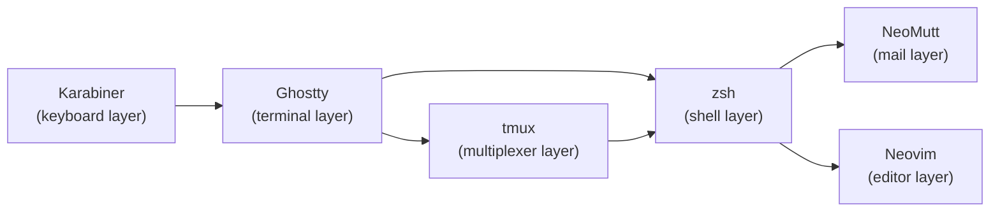

# Shortcuts

Unified index of custom keymaps and shortcuts across all input layers. **Custom mappings only** -- plugin-default keymaps (e.g., blink.cmp completion defaults, origami fold defaults) are excluded.

## Input Flow

```mermaid
flowchart LR
  K["Karabiner<br/>(keyboard layer)"] --> G["Ghostty<br/>(terminal layer)"]
  G --> T["tmux<br/>(multiplexer layer)"]
  G --> Z["zsh<br/>(shell layer)"]
  T --> Z
  Z --> M["NeoMutt<br/>(mail layer)"]
  Z --> N["Neovim<br/>(editor layer)"]
```

A keystroke passes through each layer in sequence. Karabiner processes physical key events first (home row mods, hyper key), Ghostty handles terminal-level bindings, tmux intercepts its prefix and pass-through sequences, zsh processes shell keybindings, and then app-level bindings apply in NeoMutt or Neovim.

## Karabiner (Keyboard Layer)

### Home Row Mods (GASC)

| Key | Tap | Hold    |
| --- | --- | ------- |
| `a` | a   | Ctrl    |
| `s` | s   | Option  |
| `d` | d   | Command |
| `f` | f   | Shift   |
| `j` | j   | Shift   |
| `k` | k   | Command |
| `l` | l   | Option  |
| `;` | ;   | Ctrl    |

_Reference: `private_dot_config/private_karabiner/executable_build.sh:20`_

### Hyper Key Navigation

See rule file for hyper+key combinations (navigation, window management).

_Reference: `private_dot_config/private_karabiner/src/rules/15-hyper-navigation.json:1`_

## Ghostty (Terminal Layer)

| Key              | Action                               | Source                                  |
| ---------------- | ------------------------------------ | --------------------------------------- |
| `Cmd+T`          | New tmux window (`prefix`, `c`)      | `private_dot_config/ghostty/config:70`  |
| `Cmd+W`          | Kill tmux pane (`prefix`, `x`)       | `private_dot_config/ghostty/config:71`  |
| `Cmd+D`          | Split horizontal (`prefix`, `h`)     | `private_dot_config/ghostty/config:72`  |
| `Cmd+Shift+D`    | Split vertical (`prefix`, `v`)       | `private_dot_config/ghostty/config:73`  |
| `Cmd+P`          | Floax/floating window (`prefix`, `P`) | `private_dot_config/ghostty/config:74` |
| `Cmd+S`          | Tmux sessionx (`prefix`, `s`)        | `private_dot_config/ghostty/config:75`  |
| `Cmd+H`          | Previous tmux window (`prefix`, `p`) | `private_dot_config/ghostty/config:76` |
| `Cmd+L`          | Next tmux window (`prefix`, `n`)     | `private_dot_config/ghostty/config:77`  |
| `Cmd+O`          | OpenCode split (`prefix`, `o`)       | `private_dot_config/ghostty/config:80`  |
| `Cmd+G`          | Lazygit popup (`prefix`, `G`)        | `private_dot_config/ghostty/config:81`  |
| `Cmd+Shift+T`    | New Ghostty OS window                | `private_dot_config/ghostty/config:84`  |
| `Cmd+Shift+W`    | Close Ghostty OS window              | `private_dot_config/ghostty/config:85`  |
| `Cmd+Backspace`  | Delete to start of line (Ctrl+U)     | `private_dot_config/ghostty/config:88`  |
| `Ctrl+Shift+T`   | Send `ESC[202~` to zsh               | `private_dot_config/ghostty/config:91`  |
| `Ctrl+Tab`       | _(pass-through to tmux)_             | `private_dot_config/ghostty/config:94`  |
| `Ctrl+Shift+Tab` | _(pass-through to tmux)_             | `private_dot_config/ghostty/config:95`  |
| `Cmd+Left`       | Home (line start)                    | `private_dot_config/ghostty/config:98`  |
| `Cmd+Right`      | End (line end)                       | `private_dot_config/ghostty/config:99`  |
| `Cmd+Shift+E`    | Write screen to file + open          | `private_dot_config/ghostty/config:102` |
| `Shift+Enter`    | CSI 13;2u                            | `private_dot_config/ghostty/config:105` |
| `Super+0`        | Reset font size                      | `private_dot_config/ghostty/config:108` |
| `Super+Shift+]`  | Increase font size                   | `private_dot_config/ghostty/config:109` |
| `Super+-`        | Decrease font size                   | `private_dot_config/ghostty/config:110` |

Ghostty remaps `Hide Ghostty` to `Ctrl+Option+Cmd+H` via `.chezmoiscripts/run_once_after_06-ghostty-hide-shortcut.sh.tmpl` so `Cmd+H` reaches tmux navigation while other apps keep the macOS default hide shortcut.

## tmux (Multiplexer Layer)

Prefix: **`Ctrl-a`**

| Key                  | Action                 | Source                                 |
| -------------------- | ---------------------- | -------------------------------------- |
| `prefix + h`         | Split horizontal       | `private_dot_config/tmux/tmux.conf:24` |
| `prefix + v`         | Split vertical         | `private_dot_config/tmux/tmux.conf:25` |
| `prefix + c`         | New window             | `private_dot_config/tmux/tmux.conf:26` |
| `prefix + x`         | Kill pane (no confirm) | `private_dot_config/tmux/tmux.conf:27` |
| `prefix + p`         | Previous window        | `private_dot_config/tmux/tmux.conf:28` |
| `prefix + o`         | OpenCode split (aws-login + opencode) | `private_dot_config/tmux/tmux.conf:29` |
| `prefix + G`         | Lazygit popup (90% overlay) | `private_dot_config/tmux/tmux.conf:30` |
| `Ctrl+Tab`           | Next window            | `private_dot_config/tmux/tmux.conf:11` |
| `Ctrl+Shift+Tab`     | Previous window        | `private_dot_config/tmux/tmux.conf:12` |
| `v` (copy mode)      | Begin selection  | `private_dot_config/tmux/tmux.conf:30` |
| `y` (copy mode)      | Copy selection   | `private_dot_config/tmux/tmux.conf:32` |
| `Escape` (copy mode) | Cancel           | `private_dot_config/tmux/tmux.conf:29` |
| Arrow keys           | Resize pane      | `private_dot_config/tmux/tmux.conf:38` |

### Harpoon (tmux-harpoon)

| Key                | Action              | Source                                  |
| ------------------ | ------------------- | --------------------------------------- |
| `Ctrl+Cmd+a`       | Jump to slot 1      | `private_dot_config/tmux/tmux.conf:113` |
| `Ctrl+Cmd+o`       | Jump to slot 2      | `private_dot_config/tmux/tmux.conf:114` |
| `Ctrl+Cmd+e`       | Jump to slot 3      | `private_dot_config/tmux/tmux.conf:115` |
| `Ctrl+Cmd+u`       | Jump to slot 4      | `private_dot_config/tmux/tmux.conf:116` |
| `Ctrl+Cmd+Shift+a` | Overwrite slot 1    | `private_dot_config/tmux/tmux.conf:119` |
| `Ctrl+Cmd+Shift+o` | Overwrite slot 2    | `private_dot_config/tmux/tmux.conf:120` |
| `Ctrl+Cmd+Shift+e` | Overwrite slot 3    | `private_dot_config/tmux/tmux.conf:121` |
| `Ctrl+Cmd+Shift+u` | Overwrite slot 4    | `private_dot_config/tmux/tmux.conf:122` |
| `prefix + A`       | Add pane to harpoon | `private_dot_config/tmux/tmux.conf:132` |
| `prefix + D`       | Delete from harpoon | `private_dot_config/tmux/tmux.conf:133` |
| `prefix + g`       | List harpoon slots  | `private_dot_config/tmux/tmux.conf:134` |
| `prefix + e`       | Edit harpoon        | `private_dot_config/tmux/tmux.conf:135` |

### Plugins

| Key          | Action                         |
| ------------ | ------------------------------ |
| `prefix + s` | Session picker (tmux-sessionx) |

## Zsh (Shell Layer)

### Custom Widget Keybindings

| Key            | Action                                                | Source                       |
| -------------- | ----------------------------------------------------- | ---------------------------- |
| `Ctrl+F`       | Interactive ripgrep search (ftext-widget)             | `private_dot_config/zsh/keybindings.zsh:33` |
| `Ctrl+G`       | Navi cheatsheet browser                               | `private_dot_config/zsh/keybindings.zsh:17` |
| `Ctrl+J`       | Insert literal newline (multiline editing)            | `private_dot_config/zsh/keybindings.zsh:8`  |
| `Ctrl+Shift+T` | FZF directory picker (Ghostty `ESC[202~` passthrough) | `private_dot_config/zsh/keybindings.zsh:40` |
| `Ctrl+Z`       | Zoxide interactive directory jump                     | `private_dot_config/zsh/keybindings.zsh:57` |
| `Ctrl+R`       | Atuin history search (replaces fzf)                   | `private_dot_config/zsh/fzf.zsh:154`       |
| `Ctrl+T`       | FZF file picker (fd-based, bat preview)               | `private_dot_config/zsh/fzf.zsh:66`        |

### Shift-Select (Ghostty CSI Integration)

| Key                    | Action                      | Source                                     |
| ---------------------- | --------------------------- | ------------------------------------------ |
| `Cmd+C` (via CSI)      | Copy selection to clipboard | `private_dot_config/zsh/shift-select-enhancements.zsh:71` |
| `Cmd+X` (via CSI)      | Cut selection to clipboard  | `private_dot_config/zsh/shift-select-enhancements.zsh:72` |
| `Shift+Cmd+Left/Right` | Select entire line          | `private_dot_config/zsh/shift-select-enhancements.zsh:79` |

### Word Movement

| Key                    | Action            | Source                       |
| ---------------------- | ----------------- | ---------------------------- |
| `Alt+F` / `Ctrl+Right` | Forward word      | `private_dot_config/zsh/keybindings.zsh:75` |
| `Alt+B` / `Ctrl+Left`  | Backward word     | `private_dot_config/zsh/keybindings.zsh:76` |
| `Home`                 | Beginning of line | `private_dot_config/zsh/keybindings.zsh:79` |
| `End`                  | End of line       | `private_dot_config/zsh/keybindings.zsh:80` |

### FZF Internal Keybindings (inside fzf)

| Key      | Action                     | Source               |
| -------- | -------------------------- | -------------------- |
| `Ctrl+/` | Toggle preview             | `private_dot_config/zsh/fzf.zsh:21` |
| `Ctrl+D` | Preview page down          | `private_dot_config/zsh/fzf.zsh:22` |
| `Ctrl+U` | Preview page up            | `private_dot_config/zsh/fzf.zsh:23` |
| `Ctrl+Y` | Copy to clipboard (pbcopy) | `private_dot_config/zsh/fzf.zsh:24` |
| `Ctrl+A` | Toggle all selections      | `private_dot_config/zsh/fzf.zsh:25` |
| `Ctrl+S` | Toggle sort                | `private_dot_config/zsh/fzf.zsh:26` |

### FZF-Tab (inside completion menu)

| Key              | Action                                | Source                      |
| ---------------- | ------------------------------------- | --------------------------- |
| `<` / `>`        | Switch completion group               | `private_dot_config/zsh/fzf-tab.zsh:20`   |
| `/`              | Accept and continue into subdirectory | `private_dot_config/zsh/fzf-tab.zsh:53`   |
| `Tab` (in ftext) | Insert filename (instead of opening)  | `private_dot_config/zsh/functions.zsh:81`  |

## NeoMutt (Mail Layer)

Custom NeoMutt bindings are defined in the template layer and rendered for enabled mail accounts.

| Key | Action | Source |
| --- | --- | --- |
| `u` | Open unified inbox virtual mailbox | `private_dot_config/neomutt/bindings.muttrc.tmpl:15` |
| `gg` | Jump to top of index; in pager, jump to top of current mail | `private_dot_config/neomutt/bindings.muttrc.tmpl:16` |
| `G` | Jump to bottom of index; in pager, jump to bottom of current mail | `private_dot_config/neomutt/bindings.muttrc.tmpl:6` |
| `gT` | Limit the index to the current thread (`l all` restores full view) | `private_dot_config/neomutt/bindings.muttrc.tmpl:18` |
| `j` / `k` | In pager, scroll the current mail down/up by one line | `private_dot_config/neomutt/bindings.muttrc.tmpl:8` |
| `Up` / `Down` | In pager, jump to previous/next undeleted mail | `private_dot_config/neomutt/bindings.muttrc.tmpl:10` |
| `i1`..`i9` | Open per-account inbox by account `order` (enabled accounts with `order` 1..9) | `private_dot_config/neomutt/bindings.muttrc.tmpl:22` |
| `gb` | Toggle sidebar visibility | `private_dot_config/neomutt/bindings.muttrc.tmpl:32` |
| `gf` | Search sidebar mailboxes | `private_dot_config/neomutt/bindings.muttrc.tmpl:33` |
| `gj` | Highlight next sidebar mailbox | `private_dot_config/neomutt/bindings.muttrc.tmpl:34` |
| `gk` | Highlight previous sidebar mailbox | `private_dot_config/neomutt/bindings.muttrc.tmpl:35` |
| `gl` | Edit notmuch labels on the current message | `private_dot_config/neomutt/bindings.muttrc.tmpl:36` |
| `gL` | Edit notmuch labels, then hide/requery if needed | `private_dot_config/neomutt/bindings.muttrc.tmpl:37` |
| `gn` | Highlight next sidebar mailbox with new mail | `private_dot_config/neomutt/bindings.muttrc.tmpl:38` |
| `gN` | Highlight previous sidebar mailbox with new mail | `private_dot_config/neomutt/bindings.muttrc.tmpl:39` |
| `go` | Open highlighted sidebar mailbox | `private_dot_config/neomutt/bindings.muttrc.tmpl:40` |
| `gi` | Open current-account inbox | `private_dot_config/neomutt/bindings.muttrc.tmpl:27` |
| `gs` | Open current-account sent | `private_dot_config/neomutt/bindings.muttrc.tmpl:28` |
| `gd` | Open current-account drafts | `private_dot_config/neomutt/bindings.muttrc.tmpl:29` |
| `gp` | Open current-account spam | `private_dot_config/neomutt/bindings.muttrc.tmpl:30` |
| `gt` | Open current-account trash | `private_dot_config/neomutt/bindings.muttrc.tmpl:31` |
| `gU` | Use the message's `List-Unsubscribe` header when available | `private_dot_config/neomutt/bindings.muttrc.tmpl:41` |
| `gr` | Sync current account and reopen current mailbox | `private_dot_config/neomutt/bindings.muttrc.tmpl:42` |
| `gq` | Prompt for notmuch query virtual folder | `private_dot_config/neomutt/bindings.muttrc.tmpl:43` |
| `gu` | Open message URLs via compact `urlscan` view | `private_dot_config/neomutt/bindings.muttrc.tmpl:44` |

## Neovim (Editor Layer)

### Global Keymaps

| Key            | Mode | Action                         | Source                                              |
| -------------- | ---- | ------------------------------ | --------------------------------------------------- |
| `Ctrl+H/J/K/L` | n    | Window navigation              | `private_dot_config/nvim/lua/config/keymaps.lua:5`  |
| `Ctrl+S`       | n, i | Save file                      | `private_dot_config/nvim/lua/config/keymaps.lua:15` |
| `<leader>fm`   | n    | Format buffer (conform, async) | `private_dot_config/nvim/lua/config/keymaps.lua:19` |

### Diffview

| Key          | Mode | Action                            | Source                                               |
| ------------ | ---- | --------------------------------- | ---------------------------------------------------- |
| `<leader>gd` | n    | Diff branch vs base               | `private_dot_config/nvim/lua/config/keymaps.lua:121` |
| `<leader>gD` | n    | Diff pick branch (Telescope)      | `private_dot_config/nvim/lua/config/keymaps.lua:122` |
| `<leader>gm` | n    | Open index/merge                  | `private_dot_config/nvim/lua/config/keymaps.lua:123` |
| `<leader>gq` | n    | Close Diffview                    | `private_dot_config/nvim/lua/config/keymaps.lua:126` |
| `Ctrl+/`     | n    | Toggle files panel (diffview buf) | `private_dot_config/nvim/lua/config/keymaps.lua:130` |

### LSP (buffer-local on LspAttach)

| Key          | Action                | Source                                                  |
| ------------ | --------------------- | ------------------------------------------------------- |
| `gd`         | Go to definition      | `private_dot_config/nvim/lua/plugins/lsp/config.lua:16` |
| `gD`         | Go to declaration     | `private_dot_config/nvim/lua/plugins/lsp/config.lua:17` |
| `gr`         | Go to references      | `private_dot_config/nvim/lua/plugins/lsp/config.lua:18` |
| `gI`         | Go to implementation  | `private_dot_config/nvim/lua/plugins/lsp/config.lua:19` |
| `gy`         | Go to type definition | `private_dot_config/nvim/lua/plugins/lsp/config.lua:20` |
| `K`          | Hover documentation   | `private_dot_config/nvim/lua/plugins/lsp/config.lua:23` |
| `<leader>ca` | Code action           | `private_dot_config/nvim/lua/plugins/lsp/config.lua:28` |
| `<leader>rn` | Rename symbol         | `private_dot_config/nvim/lua/plugins/lsp/config.lua:29` |
| `<leader>d`  | Show line diagnostics | `private_dot_config/nvim/lua/plugins/lsp/config.lua:32` |
| `<leader>q`  | Open diagnostics list | `private_dot_config/nvim/lua/plugins/lsp/config.lua:33` |

### Telescope

| Key          | Action                         | Source                                                  |
| ------------ | ------------------------------ | ------------------------------------------------------- |
| `<leader>ff` | Find files (filtered, hidden)  | `private_dot_config/nvim/lua/plugins/telescope.lua:110` |
| `<leader>fF` | Find files (show all)          | `private_dot_config/nvim/lua/plugins/telescope.lua:120` |
| `<leader>fg` | Live grep (filtered)           | `private_dot_config/nvim/lua/plugins/telescope.lua:129` |
| `<leader>fG` | Live grep (show all)           | `private_dot_config/nvim/lua/plugins/telescope.lua:138` |
| `<leader>fh` | Help tags                      | `private_dot_config/nvim/lua/plugins/telescope.lua:146` |
| `<leader>fp` | Zoxide projects (cd on select) | `private_dot_config/nvim/lua/plugins/telescope.lua:149` |

### Oil (File Explorer)

| Key         | Action   | Source                                            |
| ----------- | -------- | ------------------------------------------------- |
| `<leader>e` | Open Oil | `private_dot_config/nvim/lua/plugins/oil.lua:208` |

### Snacks

| Key          | Mode | Action                       | Source                                               |
| ------------ | ---- | ---------------------------- | ---------------------------------------------------- |
| `<leader>h`  | n    | Dashboard                    | `private_dot_config/nvim/lua/plugins/snacks.lua:79`  |
| `<leader>n`  | n    | Notification history         | `private_dot_config/nvim/lua/plugins/snacks.lua:86`  |
| `<leader>gB` | n    | Git browse                   | `private_dot_config/nvim/lua/plugins/snacks.lua:93`  |
| `<leader>gb` | n    | Git blame line               | `private_dot_config/nvim/lua/plugins/snacks.lua:100` |
| `<leader>gf` | n    | Lazygit current file history | `private_dot_config/nvim/lua/plugins/snacks.lua:107` |
| `<leader>gg` | n    | Lazygit                      | `private_dot_config/nvim/lua/plugins/snacks.lua:114` |
| `<leader>gl` | n    | Lazygit log (cwd)            | `private_dot_config/nvim/lua/plugins/snacks.lua:121` |
| `Ctrl+/`     | n, t | Toggle terminal              | `private_dot_config/nvim/lua/plugins/snacks.lua:128` |

### Snacks Toggles

| Key          | Toggle                  | Source                                               |
| ------------ | ----------------------- | ---------------------------------------------------- |
| `<leader>uL` | Relative number         | `private_dot_config/nvim/lua/plugins/snacks.lua:142` |
| `<leader>ul` | Line number             | `private_dot_config/nvim/lua/plugins/snacks.lua:143` |
| `<leader>uc` | Conceal level           | `private_dot_config/nvim/lua/plugins/snacks.lua:144` |
| `<leader>uh` | Inlay hints             | `private_dot_config/nvim/lua/plugins/snacks.lua:147` |
| `<leader>ug` | Indent guides           | `private_dot_config/nvim/lua/plugins/snacks.lua:148` |
| `<leader>uD` | Dim mode                | `private_dot_config/nvim/lua/plugins/snacks.lua:149` |
| `<leader>uw` | Wrap + linebreak        | `private_dot_config/nvim/lua/plugins/snacks.lua:150` |
| `<leader>uv` | Diagnostics             | `private_dot_config/nvim/lua/plugins/snacks.lua:162` |
| `<leader>uV` | Diagnostic virtual text | `private_dot_config/nvim/lua/plugins/snacks.lua:163` |
| `<leader>ux` | Diagnostic underlines   | `private_dot_config/nvim/lua/plugins/snacks.lua:174` |
| `<leader>ua` | Supermaven on/off       | `private_dot_config/nvim/lua/plugins/snacks.lua:185` |
| `<leader>ub` | Bufferline              | `private_dot_config/nvim/lua/plugins/snacks.lua:201` |

### AI

| Key          | Mode | Action                | Source                                                      |
| ------------ | ---- | --------------------- | ----------------------------------------------------------- |
| `<leader>ap` | n, v | CodeCompanion actions | `private_dot_config/nvim/lua/plugins/codecompanion.lua:100` |
| `<leader>ac` | n, v | Toggle AI chat        | `private_dot_config/nvim/lua/plugins/codecompanion.lua:101` |

### Obsidian

| Key          | Action            | Source                                                |
| ------------ | ----------------- | ----------------------------------------------------- |
| `<leader>on` | New note          | `private_dot_config/nvim/lua/plugins/obsidian.lua:17` |
| `<leader>os` | Search notes      | `private_dot_config/nvim/lua/plugins/obsidian.lua:18` |
| `<leader>ot` | Open today's note | `private_dot_config/nvim/lua/plugins/obsidian.lua:19` |

### Other

| Key          | Action                               | Source                                               |
| ------------ | ------------------------------------ | ---------------------------------------------------- |
| `<leader>uu` | Toggle undotree                      | `private_dot_config/nvim/lua/plugins/undotree.lua:4` |
| `Escape`     | Clear search + dismiss notifications | `private_dot_config/nvim/lua/plugins/noice.lua:34`   |

## Excluded Mappings

The following use plugin-default keymaps and are intentionally excluded from this index:

- **blink.cmp** -- default completion keymaps (preset: `default`). See `private_dot_config/nvim/lua/plugins/blink.lua:16`.
- **origami** -- default fold keymaps (fold setup enabled). See `private_dot_config/nvim/lua/plugins/origami.lua:27`.
- **supermaven** -- keymaps disabled (`disable_keymaps = true`); completions handled via blink.cmp source. See `private_dot_config/nvim/lua/plugins/supermaven.lua:11`.
- **Oil buffer-local** -- standard oil navigation keymaps (help, select, parent, etc.).
- **vim-tmux-navigator** -- standard Ctrl+H/J/K/L cross-pane navigation.

## References

- Zsh keybindings: `private_dot_config/zsh/keybindings.zsh:1`
- Zsh shift-select: `private_dot_config/zsh/shift-select-enhancements.zsh:1`
- FZF config: `private_dot_config/zsh/fzf.zsh:1`
- tmux config: `private_dot_config/tmux/tmux.conf:1`
- Ghostty config: `private_dot_config/ghostty/config:65`
- NeoMutt bindings: `private_dot_config/neomutt/bindings.muttrc.tmpl:1`
- Neovim keymaps: `private_dot_config/nvim/lua/config/keymaps.lua:1`
- Karabiner rules: `private_dot_config/private_karabiner/src/rules/`
