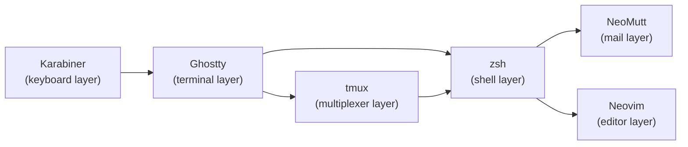
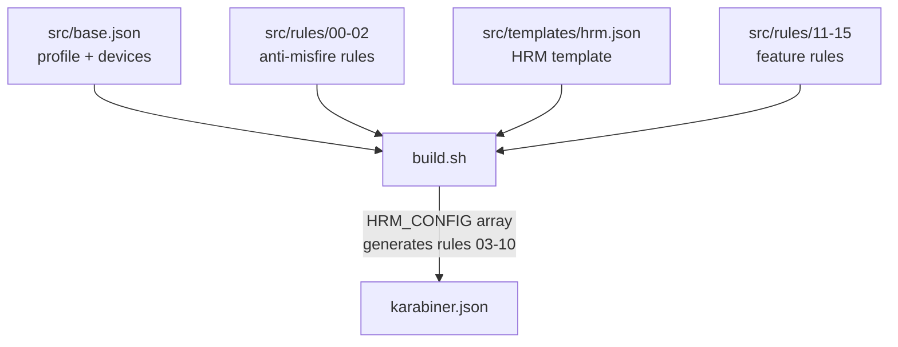
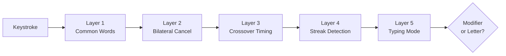

# Shortcuts

Every custom keybinding, layer by layer. Plugin defaults are excluded (see [Excluded Mappings](#excluded-mappings)).

## Input Flow


```mermaid
flowchart LR
  K["Karabiner<br/>(keyboard layer)"] --> G["Ghostty<br/>(terminal layer)"]
  G --> T["tmux<br/>(multiplexer layer)"]
  G --> Z["zsh<br/>(shell layer)"]
  T --> Z
  Z --> M["NeoMutt<br/>(mail layer)"]
  Z --> N["Neovim<br/>(editor layer)"]
```

Each layer consumes its own bindings and passes everything else down.

## Vicinae

Source: `private_dot_config/vicinae/settings.json`. Spotlight's matching shortcuts are disabled by `literal_bin/executable_macos-settings.tmpl` so Vicinae owns the launcher chord.

| Key | Action |
| --- | --- |
| `Cmd+Space` | Toggle Vicinae |
| `Cmd+Shift+V` | Open Clipboard History |
| `Cmd+Shift+S` | Capture a selected region, equivalent to `Cmd+Shift+4` |
| `Cmd+Option+Space` | Cycle Qwerty, Dvorak, and Greek Dvorak input sources |

## AeroSpace

Source: `private_dot_config/aerospace/aerospace.toml`. Workspace bindings intentionally expose only workspaces `1`, `a`, `o`, `e`, `u`, and `j`.

| Key | Action |
| --- | --- |
| `Alt+1/A/O/E/U/J` | Switch to the corresponding workspace |
| `Alt+Shift+1/A/O/E/U/J` | Move the focused window to the corresponding workspace and follow it |

Vicinae is matched by bundle ID and forced to floating layout.

## Karabiner

### Build Pipeline

`karabiner.json` is **fully generated** — never edit it directly. `build.sh` assembles it from modular sources and validates the output with `jq` before writing:


```mermaid
flowchart TD
  A[src/base.json<br/>profile + devices] --> E[build.sh]
  B["src/rules/00-02<br/>anti-misfire rules"] --> E
  C["src/templates/hrm.json<br/>HRM template"] --> E
  D["src/rules/11-15<br/>feature rules"] --> E
  E -->|"HRM_CONFIG array<br/>generates rules 03-10"| F[karabiner.json]
```

To rebuild after editing any source file:

```bash
"$(chezmoi source-path)"/private_dot_config/private_karabiner/build.sh
```

### Home Row Mods (GASC)

Dual-function keys: tap for the letter, hold for a modifier. Timing lives in the `HRM_CONFIG` array in `private_dot_config/private_karabiner/executable_build.sh`.

| Key | Tap | Hold    | Finger | Streak window |
| --- | --- | ------- | ------ | ------------- |
| `a` | a   | Ctrl    | left pinky   | 160ms |
| `s` | s   | Option  | left ring    | 160ms |
| `d` | d   | Command | left middle  | 160ms |
| `f` | f   | Shift   | left index   | 50ms  |
| `j` | j   | Shift   | right index  | 50ms  |
| `k` | k   | Command | right middle | 160ms |
| `l` | l   | Option  | right ring   | 160ms |
| `;` | ;   | Ctrl    | right pinky  | 160ms |

The streak window is how recently you must have typed for the key to output a letter instead of arming a modifier. Index fingers get a much shorter window (50ms, with shorter hold/alone thresholds too) because they are the fastest typists — a longer window would swallow deliberate Shift holds.

### Anti-Misfire Protection

Five layers prevent accidental modifier activation during normal typing:


```mermaid
flowchart LR
  A[Keystroke] --> B[Layer 1<br/>Common Words]
  B --> C[Layer 2<br/>Bilateral Cancel]
  C --> D[Layer 3<br/>Crossover Timing]
  D --> E[Layer 4<br/>Streak Detection]
  E --> F[Layer 5<br/>Typing Mode]
  F --> G{Modifier<br/>or Letter?}
```

| Layer | Rule file (under `private_dot_config/private_karabiner/src/rules/`) | Purpose |
| --- | --- | --- |
| 1. Common Words | `00-common-words.json` | Fast cross-hand word patterns produce letters, not mods |
| 2. Bilateral Cancellation | `01-bilateral-cancellation.json` | Same-hand combos always produce letters |
| 3. Crossover Timing | `02-crossover-timing.json` | Cross-hand timing enforcement |
| 4. Streak Detection | _(generated rules 03-10)_ | Recent typing disables mod behavior, per-finger timeouts |
| 5. Typing Mode Toggle | `11-typing-mode-toggle.json` | `Right Cmd + Space` manually toggles all HRM off/on (with on-screen notification) |

### Hyper Key

| Key | Action | Source |
| --- | --- | --- |
| `Caps Lock` (hold) | Hyper mode (sets `hyper_caps_lock` while held) | `private_dot_config/private_karabiner/src/rules/13-hyper-key.json` |
| `Caps Lock` (tap) | Escape | `private_dot_config/private_karabiner/src/rules/13-hyper-key.json` |
| `Right Shift` (double-tap) | Caps Lock toggle | `private_dot_config/private_karabiner/src/rules/14-double-tap-caps.json` |
| `Ctrl+Option+Space` | Cycle Qwerty, Dvorak, and Greek Dvorak input sources | `private_dot_config/private_karabiner/src/rules/16-input-source-cycle.json` |

### Hyper Navigation (hold Caps Lock)

Source: `private_dot_config/private_karabiner/src/rules/15-hyper-navigation.json`

| Hyper + | Action |
| --- | --- |
| `j` / `;` | Left / Right arrow |
| `k` / `l` | Down / Up arrow |
| `h` | Escape |
| `d` / `f` | Cmd+Left / Cmd+Right (line start / end) |
| `y` / `o` | Home / End |
| `u` / `.` | Page Up |
| `n` / `,` | Page Down |
| `m` | Backspace |
| `a` | Left Option (combine with arrows for word movement) |

## Ghostty

Source: `private_dot_config/ghostty/config`. Most `Cmd` bindings inject tmux prefix sequences (`Ctrl+a` + key), so window management feels native while tmux does the work.

| Key | Action |
| --- | --- |
| `Cmd+T` | New tmux window (`prefix c`) |
| `Cmd+W` | Kill tmux pane (`prefix x`) |
| `Cmd+D` | Split horizontal (`prefix h`) |
| `Cmd+Shift+D` | Split vertical (`prefix v`) |
| `Cmd+P` | FloaX floating window (`prefix P`) |
| `Cmd+S` | Sesh session picker (`prefix s`) |
| `Cmd+H` | Previous tmux window (`prefix p`) |
| `Cmd+L` | Next tmux window (`prefix n`) |
| `Cmd+R` | Rename tmux window (`prefix ,`) |
| `Cmd+Shift+R` | Rename tmux session (`prefix R`) |
| `Cmd+Z` | Toggle tmux pane zoom (`prefix z`) |
| `Cmd+G` | Lazygit popup (`prefix G`) |
| `Cmd+Shift+T` | New Ghostty OS window |
| `Cmd+Shift+W` | Close Ghostty OS window |
| `Cmd+Backspace` | Delete to start of line (sends Ctrl+U) |
| `Ctrl+Shift+T` | Send `ESC[202~` to zsh (directory picker) |
| `Cmd+B` | Send `ESC[203~` to zsh (Worktrunk worktree picker) |
| `Ctrl+Tab` / `Ctrl+Shift+Tab` | Pass through to tmux (next/previous window) |
| `Cmd+Left` / `Cmd+Right` | Home / End |
| `Cmd+Shift+E` | Write screen to file and open it |
| `Shift+Enter` | CSI `13;2u` (literal newline for TUIs) |
| `Super+0` | Reset font size |
| `Super+Shift+]` / `Super+-` | Increase / decrease font size |

Ghostty's macOS `Hide Ghostty` menu shortcut is remapped to `Ctrl+Option+Cmd+H` via `~/bin/macos-settings`, so `Cmd+H` reaches tmux window navigation while other apps keep the default hide shortcut.

## tmux

Source: `private_dot_config/tmux/tmux.conf`. Prefix: **`Ctrl-a`** everywhere. In a local pane attached to remote tmux over SSH, `Ctrl-a a` forwards one prefix to the remote tmux: `Ctrl-a h` splits locally, `Ctrl-a a h` splits the remote.

| Key | Action |
| --- | --- |
| `prefix h` / `prefix v` | Split horizontal / vertical (keeps current path) |
| `prefix H` / `prefix V` / `prefix T` | Arrange panes side-by-side / stacked / tiled grid |
| `prefix c` | New window (keeps current path) |
| `prefix x` | Kill pane (no confirm) |
| `prefix p` | Previous window |
| `prefix G` | Lazygit popup (90% overlay) |
| `prefix s` | Native Sesh session picker popup |
| `prefix ,` / `prefix R` | Rename window / session |
| `prefix P` | FloaX floating window (`Alt+Shift+P` opens the FloaX menu) |
| `prefix r` | Reload tmux.conf |
| `prefix d` | Detach client |
| `prefix Arrow` | Resize pane (repeatable, 5 cells) |
| `Ctrl+Tab` / `Ctrl+Shift+Tab` | Next / previous window (no prefix) |
| `Ctrl+Shift+Arrow` | Resize pane (no prefix) |
| `PageUp` / `PageDown` | Half-page scrollback in shell panes; forwarded to fullscreen apps |
| `v` / `Ctrl+V` (copy mode) | Begin selection / rectangle toggle |
| `y` (copy mode) | Copy selection and cancel |
| `Escape` (copy mode) | Cancel |

## Zsh

Workstation configuration; server-side terminal configuration is owned by Kavouki.

### Custom Widgets

Sources: `private_dot_config/zsh/keybindings.zsh`, `private_dot_config/zsh/fzf.zsh`, `private_dot_config/zsh/functions.zsh`.

| Key | Action |
| --- | --- |
| `Ctrl+F` | Interactive ripgrep search (`ftext`); `Enter` opens in editor, `Tab` inserts the filename |
| `Ctrl+J` | Insert literal newline (multiline editing) |
| `Ctrl+T` | FZF file picker (fd-based, bat preview) |
| `Ctrl+Shift+T` | FZF directory picker (via Ghostty `ESC[202~` passthrough) |
| `Ctrl+Z` | Zoxide interactive directory jump (`cdi`) |
| `Cmd+B` | Worktrunk worktree picker (`wt switch`, via Ghostty `ESC[203~` passthrough) |
| `Ctrl+R` | Atuin history search (fzf's binding is removed) |
| `?` | Atuin AI widget; `Tab` inserts the generated command |

### Word and Line Movement

Source: `private_dot_config/zsh/keybindings.zsh`. Multiple escape sequences are bound so Alt, Ctrl, and Cmd arrow variants all work.

| Key | Action |
| --- | --- |
| `Alt+F` / `Ctrl+Right` | Forward word (also accepts one autosuggestion word) |
| `Alt+B` / `Ctrl+Left` | Backward word |
| `Home` / `Cmd+Left` | Beginning of line |
| `End` / `Cmd+Right` | End of line |

### Shift-Select

Source: `private_dot_config/zsh/shift-select-enhancements.zsh` (extends the zsh-shift-select plugin).

| Key | Action |
| --- | --- |
| `Shift+Cmd+Left/Right` | Select entire line |
| `ESC[200~` / `ESC[201~` | Copy / cut active selection to clipboard (custom CSI sequences; the Ghostty config does not currently emit them) |

### FZF Internal Bindings (inside any fzf)

Source: `private_dot_config/zsh/fzf.zsh` (`FZF_DEFAULT_OPTS`).

| Key | Action |
| --- | --- |
| `Ctrl+/` | Toggle preview |
| `Ctrl+D` / `Ctrl+U` | Preview page down / up |
| `Ctrl+Y` | Copy entry to clipboard |
| `Ctrl+A` | Toggle all selections |
| `Ctrl+S` | Toggle sort |

### FZF-Tab (inside completion menu)

Source: `private_dot_config/zsh/fzf-tab.zsh`.

| Key | Action |
| --- | --- |
| `<` / `>` | Switch completion group |
| `/` | Accept and continue into subdirectory |

### Command Aliases

Source: `private_dot_config/zsh/aliases.zsh` (selection; see the file for listing/eza variants).

| Alias | Expands to |
| --- | --- |
| `v`, `vi`, `vim` | `nvim` |
| `lg` | `lazygit` |
| `nm` / `msync` | `neomutt` / `mail-sync` |
| `oc` / `ocm` / `occ` / `ocserve` | `opencode2` / `opencode2 mini` / `opencode2 --continue` / `opencode-server` |
| `cz` | `chezmoi` |
| `ta` / `td` / `tls` | `tmux attach` / `tmux detach` / `tmux ls` |
| `tmux-restart` | Save Resurrect state, then stop all user-owned tmux servers; reopen Ghostty to restore |
| `k` / `ctx` / `ns` | `kubectl` / `kubectx` / `kubens` |
| `grt` | `cd` to git repo root |
| `r`, `reload` | Replace shell with fresh instance |
| `lssh` | `lazyssh` |

## NeoMutt

Source: `private_dot_config/neomutt/bindings.muttrc.tmpl` (the only bindings file; rendered per enabled mail account). `i` and `g` are unbound (`noop`) so they act purely as prefixes.

| Key | Action |
| --- | --- |
| `u` | Open unified inbox virtual mailbox |
| `gg` | Top of index; in pager, top of current mail |
| `G` | Bottom of index; in pager, bottom of current mail |
| `gT` | Limit index to current thread (`l all` restores full view) |
| `j` / `k` (pager) | Scroll current mail down / up one line |
| `Up` / `Down` (pager) | Previous / next undeleted mail |
| `Left` / `Right` (pager) | Previous / next undeleted mail |
| `i1`..`i9` | Open per-account inbox by account `order` (enabled accounts, order 1-9) |
| `gi` / `gs` / `gd` / `gp` / `gt` | Open current-account inbox / sent / drafts / spam / trash |
| `gb` | Toggle sidebar visibility |
| `gf` | Search sidebar mailboxes |
| `gj` / `gk` | Highlight next / previous sidebar mailbox |
| `gn` / `gN` | Highlight next / previous sidebar mailbox with new mail |
| `go` | Open highlighted sidebar mailbox |
| `gl` | Edit notmuch labels on current message |
| `gL` | Edit notmuch labels, then hide/requery if needed |
| `gU` | Unsubscribe via `List-Unsubscribe` header |
| `gr` | Sync current account (`mail-sync`) and reopen current mailbox |
| `gq` | Prompt for notmuch query virtual folder |
| `gu` | Open message URLs via `urlscan` |

## Neovim

Sources: `private_dot_config/nvim/lua/config/keymaps.lua`, `private_dot_config/nvim/lua/config/lsp.lua`, and plugin setup under `private_dot_config/nvim/lua/`.

Leader is `Space`.

### Navigation And Files

| Key | Action |
| --- | --- |
| `Ctrl+H/J/K/L` | Navigate across Neovim windows and tmux panes |
| `Ctrl+W h` / `Ctrl+W v` | Split side-by-side / stacked |
| `-` / `<leader>e` | Open the current file\x27s parent directory with Oil |
| `<leader>uw` | Toggle line wrapping in the current window |
| `<leader>ff` | Find files with mini.pick |
| `<leader>fg` | Find text with mini.pick and ripgrep |
| `<leader>uu` | Toggle the native undotree |

### LSP And Formatting

The LSP mappings are buffer-local and appear after a language server attaches.

| Key | Action |
| --- | --- |
| `gd` / `gD` | Go to definition / declaration |
| `gr` / `gI` / `gy` | Go to references / implementation / type definition |
| `K` | Hover documentation |
| `<leader>ca` | Code action |
| `<leader>rn` | Rename symbol |
| `<leader>d` | Show line diagnostics |
| `<leader>q` | Open diagnostics list |
| `<leader>fm` | Format with Conform, falling back to LSP |
| `Ctrl+Space` / `Ctrl+Y` | Trigger / accept Blink completion |

### Git

| Key | Action |
| --- | --- |
| `[h` / `]h` | Previous / next Git hunk |
| `<leader>gp` | Preview Git hunk |
| `<leader>gb` | Show full blame for the current line |
| `<leader>gB` | Toggle current-line blame |

### Supermaven

| Key | Mode | Action |
| --- | --- | --- |
| `Tab` | i | Accept suggestion |
| `Ctrl+G` | i | Accept suggestion word |
| `Ctrl+]` | i | Clear suggestion |
| `<leader>ua` | n | Toggle Supermaven |

### Surround

| Key | Action |
| --- | --- |
| `ys{motion}{char}` | Add surroundings |
| `ds{char}` | Delete surroundings |
| `cs{target}{replacement}` | Change surroundings |

### Oil

Oil keeps its default buffer-local mappings. Custom additions are:

| Key | Action |
| --- | --- |
| `Ctrl+P` | Preview entry |
| `gx` | Open entry externally |

## Excluded Mappings

The following use plugin-default keymaps and are intentionally excluded from this index:

- **blink.cmp** - default completion keymaps (`keymap = { preset = "default" }`).
- **Oil** - default file-explorer mappings beyond the custom additions listed above.
- **vim-tmux-navigator** - standard `Ctrl+H/J/K/L` cross-pane navigation.
- **fzf defaults** - stock fzf/fzf-tab behavior beyond the overrides listed above.
