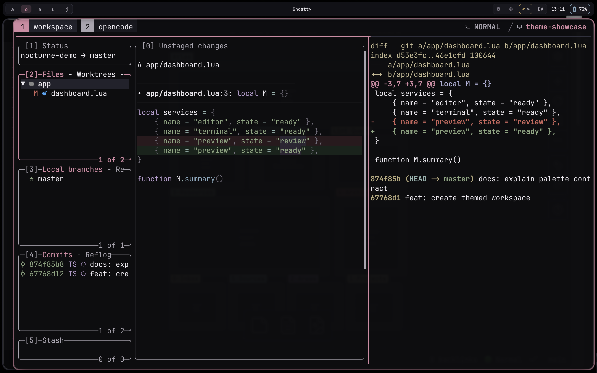
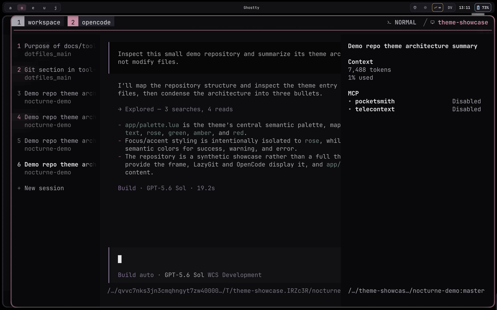

# Nocturne Rose

The shared workstation palette. This page and its stylesheet are ready-made native outputs from the Nocturne Rose theme repository, copied into dotfiles alongside the application themes.

## Layers

Six dark steps, black to high overlay. The bottom three are backgrounds; the top three are borders and inactive UI.

  
<strong>Black</strong>#09090b

  
<strong>Base</strong>#0d0d10

  
<strong>Mantle</strong>#121217

  
<strong>Surface</strong>#18181f

  
<strong>Overlay</strong>#22222c

  
<strong>High overlay</strong>#30303d

## Accents

Rose marks focus and identity. Orchid, blue, and aqua distinguish without competing with it.

  
<strong>Rose</strong>#d48aa4

  
<strong>Bright rose</strong>#e3a0b8

  
<strong>Dim rose</strong>#7c4659

  
<strong>Orchid</strong>#b69acb

  
<strong>Blue</strong>#88a8bd

  
<strong>Aqua</strong>#94b3ae

## Signals

  
<strong>Success</strong>#8aa47f

  
<strong>Info</strong>#88a8bd

  
<strong>Warning</strong>#d3b069

  
<strong>Error</strong>#cc655c

## In Use

Live captures of the installed tools, including SketchyBar. Refresh with `mise exec -- task docs:capture-theme`.

<figure class="theme-shot">
  
  <figcaption>Ghostty, tmux, and LazyGit.</figcaption>
</figure>

<figure class="theme-shot">
  
  <figcaption>OpenCode with the session sidebar open.</figcaption>
</figure>
