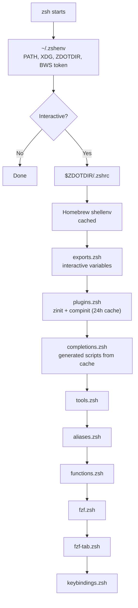
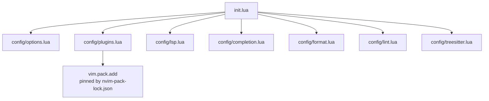
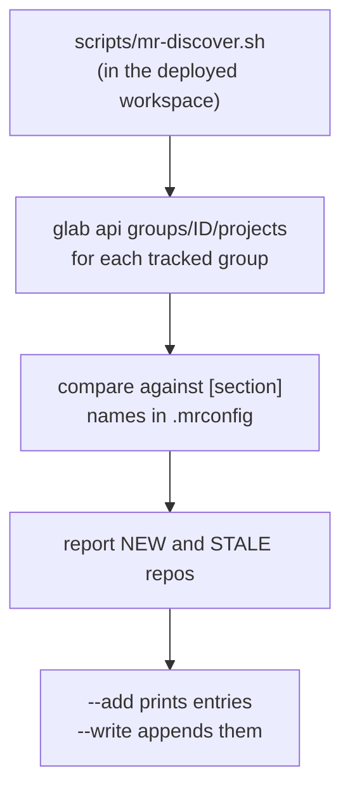

# Tool Notes

Per-tool design rationale that the config files cannot express: load-order constraints, cross-tool interactions, and name collisions. For inventories (aliases, plugins, packages, keybindings), the config file is the list; keybindings live in [shortcuts.md](shortcuts.md).

## Zsh

The order encodes hard constraints, not preference. Homebrew and other package-managed completion directories are available before `plugins.zsh` runs `compinit`. `fzf-tab` loads before compinit. Syntax highlighting loads last among plugins.

**Performance caching.** `brew shellenv` output is cached to a file (`private_dot_config/zsh/dot_zshrc`). Completion scripts for opencode, sesh, mise, and go-task are cached and regenerated only when the corresponding binary is newer than the cache. compinit itself uses a 24-hour dump: `compinit -C` when the dump is fresh, full rebuild otherwise. Profile startup with `ZSHRC_PROFILE=1 zsh -i -c exit`.

**Why completions.zsh exists separately from the compinit cache.** Native completion definitions are owned and installed by their packages, including `aws-login` through Homebrew. `private_dot_config/zsh/completions.zsh` centralizes completion scripts that tools generate at runtime; those files live only under `$ZSH_COMPLETION_CACHE_DIR` and are refreshed when the corresponding binary changes.

**VIMINIT.** `dot_zshenv.tmpl` deliberately never exports `VIMINIT` and explicitly `unset`s any inherited value. Neovim evaluates `VIMINIT` *before* `~/.config/nvim/init.lua`, so a leaked value silently bypasses the entire Neovim config — especially in headless/agent runs.

**Fresh-machine BWS ordering.** Chezmoi configures `scripts/bws-auth` as its `bitwardenSecrets` command. The wrapper reads the age-decrypted `~/.local/share/bws/token` only for the `bws` process, avoiding a globally inherited `BWS_ACCESS_TOKEN`. On a new machine, apply the token file before the first full template-rendering apply.

**.zshenv delegation.** `~/.zshenv` is the only bootstrap non-interactive shells (`zsh -c`, cron, LaunchAgents) get. It exports `ZDOTDIR=~/.config/zsh`, and `$ZDOTDIR/.zshenv` delegates straight back to `~/.zshenv` for child shells that inherit `ZDOTDIR`. Consequence: PATH additions for background processes belong in `~/.zshenv`, never in `.zshrc`. Background jobs must not assume interactive config at all — the mail LaunchAgent's `mail-sync` sets its own PATH and XDG variables internally.

### Cross-layer interactions

**Ghostty → zsh.** Ghostty owns the macOS-chord-to-escape-sequence translation; zsh owns the widgets. Most `Cmd` shortcuts are rewritten into tmux prefix sequences (`text:\x01…` in `private_dot_config/ghostty/config`). `Ctrl+Shift+T` becomes the custom `ESC[202~`, which `keybindings.zsh` binds to the fzf directory-picker widget. `Cmd+Left`/`Cmd+Right` become Home/End sequences. `private_dot_config/zsh/shift-select-enhancements.zsh` — loaded via a zinit `atload` hook on the shift-select plugin, not sourced from `.zshrc` — provides copy/cut widgets on custom CSI `200~`/`201~` and whole-line selection on `Shift+Cmd+Arrow` sequences.

**tmux → zsh.** `Ctrl+Tab`/`Ctrl+Shift+Tab` arrive from Ghostty as xterm extended-key CSI sequences that tmux binds to window navigation, so those chords never reach zsh. The tmux prefix `Ctrl-a` is likewise consumed by tmux.

## Neovim

This relies on Neovim's native config discovery at `~/.config/nvim/init.lua`. The shell config deliberately keeps `VIMINIT` unset (see the Zsh section) because Neovim checks `VIMINIT` before `init.lua` and would otherwise skip this config entirely.

The profile is native-first: `vim.pack.add()` owns plugins, `nvim-pack-lock.json` pins revisions, and `vim.lsp.config()` defines server behavior. Language servers, formatters, and linters are installed through the managed Homebrew toolchain; each LSP is enabled only when its executable exists. Neovim itself installs only Tree-sitter parsers, which are editor runtime artifacts rather than general-purpose CLIs.

## Git

`git diff` and `git show` page through `smart-diffnav` (`literal_bin/executable_smart-diffnav`), a TTY-aware wrapper: interactive terminals get the diffnav TUI; non-TTY contexts (pipes, CI, agents — detected via the `OPENCODE` env var or stdout not being a terminal) get plain `cat`, so agents see raw diffs instead of a hung TUI. Delta stays as `core.pager` for everything else (log, blame) and as the interactive `diffFilter`. The same wrapper is chezmoi's diff pager (`.chezmoi.toml.tmpl`), so `chezmoi diff` behaves identically.

## Taskwarrior

Two unrelated tools both ship a binary named `task`: go-task (the repo's Taskfile runner, installed globally via mise) and Taskwarrior (Homebrew's `task` formula). The global `task` name is owned by go-task; Taskwarrior is reached as `tw` via `literal_bin/executable_tw`, which execs Homebrew's stable `opt` symlink path directly so mise's `task` shim can never shadow it.

`taskwarrior-tui` shells out to `task` internally, so `literal_bin/executable_taskwarrior-tui` prepends Taskwarrior's `opt` bin dir to PATH before exec'ing the real TUI. Subtlety: `~/bin` is *not* reliably ahead of Homebrew's bin dir — `.zshrc` re-runs `brew shellenv`, re-prepending `/opt/homebrew/bin` after `.zshenv` placed `~/bin` — so the wrapper cannot shadow the Homebrew binary by name alone and is instead reached through a full-path alias in `private_dot_config/zsh/aliases.zsh`.

## Homebrew

Third-party package trust is declared in the Brewfile itself (`private_dot_config/brew/Brewfile`) with narrow formula- and cask-level `trusted:` entries; `brew bundle` persists them to Homebrew's trust store before installing. `aws-login` is installed from the private tap `mbastakis/tap` (tapped over SSH from `git@github.com:mbastakis/homebrew-tap.git`) rather than compiled from dotfiles source.

## SketchyBar

SketchyBar replaces the native menu bar rather than layering another set of status items beside it: `literal_bin/executable_macos-settings.tmpl` keeps the macOS menu bar hidden, and the retired Stats and Hidden Bar packages are absent from `private_dot_config/brew/Brewfile`. Homebrew owns SketchyBar's login service; AeroSpace only publishes workspace-change events through `private_dot_config/aerospace/aerospace.toml`, so neither process is responsible for restarting the other.

The bar uses checked-in shell plugins under `private_dot_config/sketchybar/`. `sketchybar-system-stats` supplies CPU, RAM, and network updates as one event stream, while `macmon` supplies Apple Silicon GPU utilization through a small local event-forwarding process. This keeps all visual and integration logic in chezmoi while third-party binaries remain package-managed.

## Vicinae

Dotfiles fully own `~/.config/vicinae/settings.json`. Vicinae may rewrite it after GUI changes, creating local drift; retain an intentional GUI change by updating the chezmoi source, or discard it with a targeted apply. Themes, script commands, and future source-managed extensions live under `~/.local/share/vicinae`; history databases, extension support data, snippets, logs, and onboarding state remain runtime-owned and ignored.

Vicinae's native macOS login item owns startup, so no custom LaunchAgent or restart hook is needed. Vicinae watches `settings.json` and reloads changes after chezmoi applies it. AeroSpace matches Vicinae by bundle ID and keeps its launcher window floating.

## Myrepos (mr)

Workspace `.mrconfig` files live under `dev/` in the chezmoi source and deploy to the matching `~/dev/...` paths. Each repository keeps a container directory, while every checkout basename includes its repository so zoxide searches remain unambiguous: the primary checkout is `<repo>/<repo>_main` and worktrunk places linked worktrees beside it as `<repo>/<repo>_<branch>`. Branches whose names require sanitization receive Worktrunk's short `sanitize_hash` suffix, keeping the resulting paths unique. The home workspace therefore keeps this source at `~/dev/personal/workspaces/home-workspace/dotfiles/dotfiles_main`, matching its own `[dotfiles/dotfiles_main]` section. The shared rule is managed at `private_dot_config/worktrunk/config.toml`.

Worktrunk commit generation changes to `$HOME`, then calls the dedicated `worktrunk-commit` agent through the shared OpenCode background service with an explicit low-reasoning model and fixed title. The neutral directory excludes repository-local OpenCode agents, instructions, and plugins; the fixed title avoids a second model call; and the agent denies all tools. This explicit command also avoids Worktrunk's misleading Claude-first auto-detection and a standalone process without the service's credential environment. `wt merge` commits or squashes the source before pushing to the target; if a dirty target blocks the push, the source commit remains in its worktree and must be reconciled before that worktree is removed.

The work workspace (`dev/work/workspaces/ma-proj/dot_mrconfig`) tracks a GitOps/Terraform platform stack; per-repo context lives in that workspace's `AGENTS.md`. Its `.mrconfig` is fully static — every repo is a pinned `[section]`, with `[DEFAULT]` setting parallel jobs and a `git pull --rebase --autostash` update. GitLab discovery is a *reconciliation step*, not a runtime include:

The script tracks four GitLab groups by ID — fiber (`631096`), infrastructure/argocd (`631103`), infrastructure/iac (`620010`), the-forge (`1103302`) — and diffs their project lists against the static sections. Rationale for the split: `mr` stays fast and offline-capable against a plain static file, the API is consulted only when deliberately reconciling, and stale (deleted/moved) repos are surfaced instead of silently re-cloned. The script lives in the deployed workspace, not in chezmoi; the `.mrconfig` header points at it.

## tmux / sesh

`~/bin/tmux-restore` works around tmux-continuum's unreliable startup detection on macOS. It restores only on a fresh tmux server, validates the Resurrect save, and falls back to a recent valid backup when `last` is corrupt or empty.
