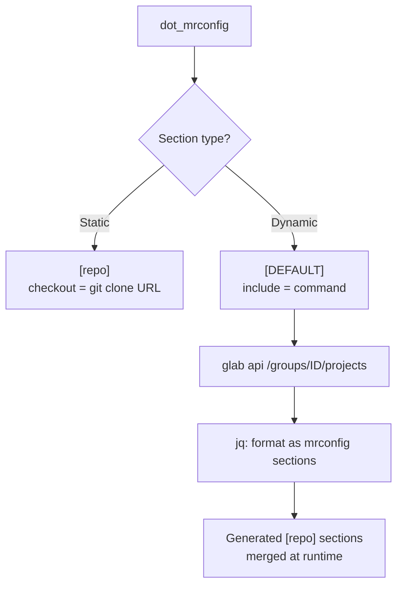

# Workspace and mrconfig

Multi-repo workspace layout with static checkout definitions and dynamic GitLab group discovery.

**Source:** `dev/` directory within the chezmoi repo (not deployed to target)

## Directory Structure

```
dev/
  personal/
    whocares/
      dot_mrconfig        # Simple static checkouts
  work/
    workspaces/
      magenta-apprentice/
        AGENTS.md         # Platform engineering context
        dot_mrconfig      # Static + dynamic repo discovery
```

Each workspace has a `dot_mrconfig` that gets deployed by chezmoi to `~/.mrconfig` (or included from it).

## mrconfig Format

[myrepo](https://myrepo.net/) uses INI-style sections where each `[section]` defines a repo checkout:

```ini
[reponame]
checkout = git clone <url> reponame
```

## Static Checkouts

Repos explicitly listed in the mrconfig. Example from personal workspace:

```ini
[whocaressoftware]
checkout = git clone git@github.com:WhoCaresSoftware/whocaressoftware.git whocaressoftware
```

Work workspace has 3 static repos (magenta-apprentice, anonymization-service, trigger-service) with explicit GitLab URLs.

_Reference: `dev/personal/whocares/dot_mrconfig:1`, `dev/work/workspaces/magenta-apprentice/dot_mrconfig:10`_

## Dynamic Discovery



Work workspaces use `mr`'s `include` directive to dynamically discover repos from GitLab groups via the `glab` API:

```ini
[DEFAULT]
include = glab api '/groups/GROUP_ID/projects?per_page=100&simple=true' | jq -r '...'
```

The `jq` pipeline transforms the GitLab API response into mrconfig `[section]` format with `checkout = git clone <ssh_url> <name>`.

### Dynamic Groups (magenta-apprentice)

| Group | GitLab Group ID | Filter |
|---|---|---|
| Fiber ArgoCD | 631097 | All projects |
| Infrastructure ArgoCD | 631103 | Filtered (app-of-apps + selected helm charts, excludes `/digital/`) |
| IAC | 620010 | All projects |

_Reference: `dev/work/workspaces/magenta-apprentice/dot_mrconfig:30`_

## mr Commands

Common operations with the configured workspaces:

| Command | Action |
|---|---|
| `mr checkout` | Clone all repos (static + dynamically discovered) |
| `mr update` | Pull all repos |
| `mr status` | Show status of all repos |
| `mr run <cmd>` | Run a command in each repo |

Default configuration sets `jobs = 5` for parallel operations.

## Workspace Context

### Magenta Apprentice (work)

Platform engineering workspace for a GitOps + Terraform stack:

- **Scope:** ArgoCD application management, Helm charts, IAC (Terraform)
- **3 AWS accounts:** Dev, Playground, Prod
- **ArgoCD topology:** root-app-of-apps -> fiber app-of-apps -> app-level Applications
- **Key dependencies:** PostgreSQL, Keycloak OIDC, S3, Langfuse, agent-gateway with MCP servers

Validation commands per repo type:
- Helm charts: `helm lint .`, `helm template .`
- Terraform: `terraform plan` per account

_Reference: `dev/work/workspaces/magenta-apprentice/AGENTS.md:1`_

## References

- Work mrconfig: `dev/work/workspaces/magenta-apprentice/dot_mrconfig:1`
- Work AGENTS: `dev/work/workspaces/magenta-apprentice/AGENTS.md:1`
- Personal mrconfig: `dev/personal/whocares/dot_mrconfig:1`
