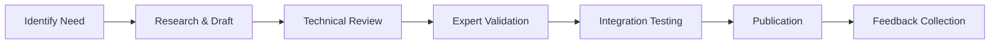
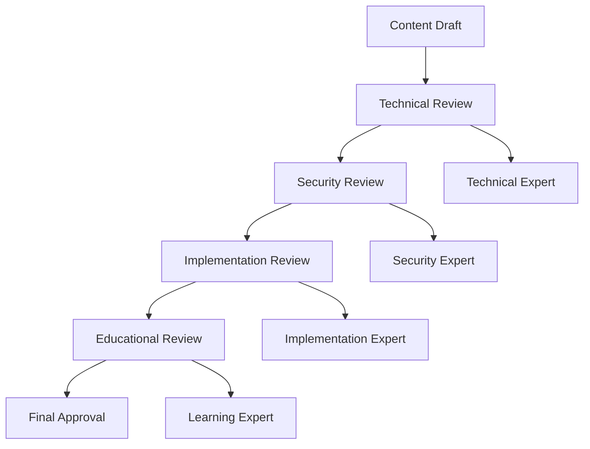
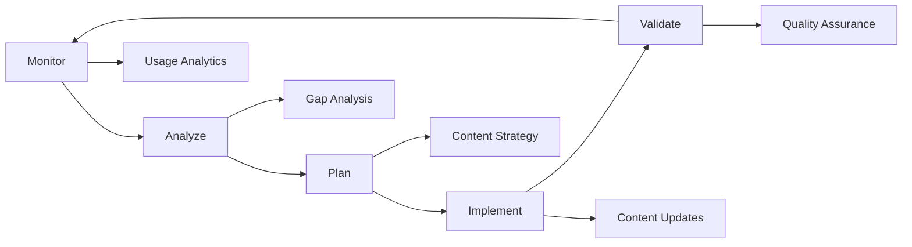

# OAuth2 Knowledge Curation Guide

## Overview

This guide provides systematic procedures for maintaining, updating, and evolving the OAuth2 knowledge base to ensure it remains current, accurate, and valuable for institutional learning.

## Knowledge Curation Framework

### 1. Content Lifecycle Management

#### 1.1 Content Creation Standards

**New Content Requirements:**
- Must align with established taxonomy structure
- Requires technical accuracy validation
- Must include practical examples
- Should reference authoritative sources (RFCs, security advisories)

**Content Creation Process:**


#### 1.2 Content Update Triggers

**Immediate Updates Required:**
- Critical security vulnerabilities discovered
- New RFC publications affecting OAuth2
- Breaking changes in major implementations

**Scheduled Updates:**
- Monthly: Security advisory reviews
- Quarterly: Comprehensive content audit
- Annually: Learning effectiveness assessment

#### 1.3 Content Retirement Criteria

**Content should be retired when:**
- Superseded by newer standards
- No longer considered secure practice
- Implementation patterns become obsolete
- Learner feedback indicates confusion or errors

### 2. Quality Assurance Process

#### 2.1 Technical Accuracy Validation

**Validation Checklist:**
- [ ] All code examples tested in current environments
- [ ] RFC references current and accurate
- [ ] Security recommendations align with latest best practices
- [ ] Implementation patterns verified with real-world usage

**Validation Tools:**
```bash
# Automated validation script example
#!/bin/bash

# Validate OAuth2 code examples
echo "Validating OAuth2 implementations..."

# Check for deprecated patterns
grep -r "implicit.*flow" knowledge/ && echo "WARNING: Implicit flow detected"

# Validate PKCE implementations
grep -r "code_challenge" knowledge/ || echo "ERROR: PKCE examples missing"

# Check for security best practices
grep -r "localStorage.*token" knowledge/ && echo "WARNING: Insecure token storage"

echo "Validation complete"
```

#### 2.2 Learning Effectiveness Metrics

**Key Performance Indicators:**
- **Completion Rate**: Percentage of learners completing each level
- **Assessment Scores**: Average scores on knowledge assessments
- **Implementation Success**: Success rate of real-world implementations
- **Time to Competency**: Average time to achieve proficiency

**Measurement Framework:**
```yaml
metrics_collection:
  learning_analytics:
    completion_tracking: true
    assessment_scoring: true
    time_tracking: true
    feedback_collection: true
  
  implementation_tracking:
    success_rate_monitoring: true
    error_pattern_analysis: true
    security_incident_correlation: true
  
  content_effectiveness:
    engagement_metrics: true
    comprehension_assessment: true
    practical_application_success: true
```

### 3. Knowledge Organization and Discoverability

#### 3.1 Taxonomy Maintenance

**Taxonomy Evolution Process:**
1. **Quarterly Review**: Assess current taxonomy effectiveness
2. **Gap Analysis**: Identify missing or poorly organized concepts
3. **Restructuring**: Reorganize content for better learning flow
4. **Cross-Reference Updates**: Maintain accurate concept relationships

**Taxonomy Quality Indicators:**
- Clear hierarchical structure
- Logical concept dependencies
- Comprehensive coverage of domain
- Intuitive navigation paths

#### 3.2 Search and Discovery Optimization

**Metadata Standards:**
```yaml
content_metadata:
  title: "Clear, descriptive title"
  level: "beginner|intermediate|advanced"
  topics: ["list", "of", "key", "topics"]
  prerequisites: ["required", "knowledge"]
  duration: "estimated learning time"
  last_updated: "YYYY-MM-DD"
  version: "semantic version"
  author: "content creator"
  reviewer: "technical reviewer"
```

**Tagging Strategy:**
- **Functional Tags**: authentication, authorization, security
- **Technical Tags**: pkce, mtls, dpop, jwt
- **Implementation Tags**: spa, mobile, server-side, enterprise
- **Security Tags**: vulnerability, mitigation, best-practice

### 4. Community and Expert Engagement

#### 4.1 Expert Review Network

**Expert Reviewer Qualifications:**
- OAuth2 implementation experience (3+ years)
- Security expertise in identity and access management
- Current with latest RFCs and security advisories
- Active in OAuth2/security community

**Review Process:**


#### 4.2 Community Feedback Integration

**Feedback Channels:**
- Direct content comments and suggestions
- Learning experience surveys
- Implementation challenge reports
- Security incident learnings

**Feedback Processing:**
1. **Categorization**: Technical, educational, organizational
2. **Prioritization**: Critical, important, enhancement
3. **Implementation**: Content updates, structural changes
4. **Validation**: Expert review of changes
5. **Communication**: Feedback to contributors

### 5. Integration with Development Workflows

#### 5.1 BMad Methodology Integration

**Knowledge Integration Points:**
- **Requirements Gathering**: OAuth2 security requirements
- **Architecture Design**: OAuth2 implementation patterns
- **Implementation**: Secure coding practices
- **Quality Assurance**: Security validation checklists

**Workflow Integration:**
```yaml
bmad_integration:
  requirements_phase:
    - oauth2_requirements_checklist
    - security_requirements_template
  
  architecture_phase:
    - oauth2_architecture_patterns
    - security_architecture_guidelines
  
  implementation_phase:
    - oauth2_implementation_standards
    - secure_coding_practices
  
  validation_phase:
    - oauth2_security_checklist
    - penetration_testing_guidelines
```

#### 5.2 Automated Knowledge Validation

**CI/CD Integration:**
```yaml
# .github/workflows/knowledge-validation.yml
name: OAuth2 Knowledge Validation

on:
  push:
    paths: ['knowledge/oauth2-*']
  schedule:
    - cron: '0 0 * * 0'  # Weekly validation

jobs:
  validate-content:
    runs-on: ubuntu-latest
    steps:
      - uses: actions/checkout@v2
      
      - name: Validate OAuth2 Examples
        run: |
          # Check for deprecated patterns
          ./scripts/validate-oauth2-content.sh
      
      - name: Check RFC References
        run: |
          # Validate RFC links and references
          ./scripts/validate-rfc-references.sh
      
      - name: Security Pattern Validation
        run: |
          # Ensure security best practices
          ./scripts/validate-security-patterns.sh
```

### 6. Knowledge Evolution Strategy

#### 6.1 Emerging Technology Integration

**Technology Monitoring:**
- OAuth 2.1 specification development
- New security extensions and RFCs
- Industry implementation patterns
- Threat landscape evolution

**Integration Process:**
1. **Early Assessment**: Evaluate new technologies for relevance
2. **Pilot Integration**: Create experimental content
3. **Expert Validation**: Review with security experts
4. **Gradual Rollout**: Integrate into learning paths
5. **Feedback Collection**: Monitor adoption and effectiveness

#### 6.2 Continuous Improvement Framework

**Improvement Cycle:**


**Key Improvement Areas:**
- Learning path optimization
- Content clarity and accessibility
- Practical example relevance
- Assessment effectiveness

### 7. Maintenance Procedures

#### 7.1 Regular Maintenance Tasks

**Monthly Tasks:**
- [ ] Review security advisories and updates
- [ ] Check RFC publication announcements
- [ ] Validate external links and references
- [ ] Review learner feedback and questions

**Quarterly Tasks:**
- [ ] Comprehensive content accuracy review
- [ ] Learning analytics analysis
- [ ] Expert reviewer feedback integration
- [ ] Taxonomy structure assessment

**Annual Tasks:**
- [ ] Complete learning path effectiveness evaluation
- [ ] Strategic content roadmap planning
- [ ] Expert reviewer network assessment
- [ ] Technology trend integration planning

#### 7.2 Emergency Update Procedures

**Critical Security Updates:**
1. **Immediate Assessment**: Evaluate impact on existing content
2. **Rapid Response**: Update affected content within 24 hours
3. **Expert Validation**: Emergency expert review process
4. **Communication**: Notify learners and implementers
5. **Follow-up**: Comprehensive review and improvement

**Emergency Contact Protocol:**
- Security expert on-call rotation
- Rapid response team activation
- Stakeholder notification procedures
- Communication channel management

### 8. Success Metrics and KPIs

#### 8.1 Knowledge Quality Metrics

**Content Quality:**
- Technical accuracy rate (target: 99%+)
- Content freshness (target: <6 months old)
- Expert review coverage (target: 100%)
- Learner satisfaction (target: 4.5/5)

**Learning Effectiveness:**
- Course completion rate (target: 80%+)
- Assessment pass rate (target: 85%+)
- Implementation success rate (target: 90%+)
- Time to competency (target: <8 weeks)

#### 8.2 Organizational Impact

**Knowledge Utilization:**
- Active learner count
- Content access frequency
- Implementation adoption rate
- Security incident reduction

**Business Value:**
- Reduced security vulnerabilities
- Faster implementation timelines
- Improved compliance rates
- Enhanced team capabilities

## Conclusion

This curation guide ensures the OAuth2 knowledge base remains a valuable, current, and effective institutional resource. Through systematic maintenance, quality assurance, and continuous improvement, the knowledge base will evolve with the OAuth2 ecosystem while maintaining high standards for accuracy and educational effectiveness.

The framework supports both immediate tactical needs and long-term strategic knowledge management goals, ensuring sustainable value for the organization's OAuth2 implementation and security capabilities.