# OAuth2 Fundamentals - Your Foundation for Secure Authorization

## 🎯 Learning Objectives

By the end of this document, you will:
- [ ] Understand what OAuth2 is and why it exists
- [ ] Identify the four OAuth2 roles and their responsibilities
- [ ] Explain the difference between authentication and authorization
- [ ] Recognize when to use OAuth2 vs other security methods
- [ ] Understand the basic OAuth2 terminology

**Estimated Time**: 2-3 hours  
**Prerequisites**: Basic understanding of HTTP and web applications

---

## 🤔 What is OAuth2?

### The Simple Explanation

Imagine you want to use a photo printing service to print photos from your Google Photos. You don't want to give the printing service your Google password, but you do want to let them access your photos. OAuth2 solves this problem.

**OAuth2 is like a valet key for your car** - it gives limited access to specific resources without sharing your master credentials.

### The Technical Definition

**OAuth2 (Open Authorization 2.0)** is an authorization framework that enables applications to obtain limited access to user accounts on an HTTP service. It works by delegating user authentication to the service that hosts the user account and authorizing third-party applications to access that user account.

### 🔑 Key Principle: Authorization, Not Authentication

This is crucial to understand:

| Concept | What it answers | Example |
|---------|----------------|---------|
| **Authentication** | "Who are you?" | Proving you are John Smith with a password |
| **Authorization** | "What can you do?" | John Smith can read files but not delete them |

**OAuth2 is primarily about authorization** - determining what a user or application can access, not proving who they are.

---

## 👥 The Four OAuth2 Roles

Every OAuth2 interaction involves four key players:

### 1. 🧑‍💻 Resource Owner
**Who**: The entity that can grant access to a protected resource  
**Usually**: The end user (you!)  
**Example**: You, wanting to let a photo printing app access your Google Photos

### 2. 📱 Client
**Who**: The application requesting access to protected resources  
**Usually**: The app or website you're using  
**Example**: The photo printing website that wants to access your photos

### 3. 🔐 Authorization Server
**Who**: The server that authenticates the resource owner and issues access tokens  
**Usually**: The identity provider (Google, Auth0, etc.)  
**Example**: Google's OAuth2 server that asks "Do you want to let PhotoPrint access your photos?"

### 4. 🗄️ Resource Server
**Who**: The server hosting the protected resources  
**Usually**: The API server with your data  
**Example**: Google Photos API server that actually serves your photo data

### Visual Example: Photo Printing Scenario

```mermaid
graph LR
    A[👤 You<br/>Resource Owner] --> B[📱 PhotoPrint App<br/>Client]
    B --> C[🔐 Google OAuth<br/>Authorization Server]
    C --> D[🗄️ Google Photos API<br/>Resource Server]
    
    A -.->|"I want to print photos"| B
    B -.->|"Can I access photos?"| C
    C -.->|"User says yes, here's a token"| B
    B -.->|"Here's my token, give me photos"| D
```

---

## 📚 Essential OAuth2 Terminology

### Core Concepts

#### 🎫 Access Token
- **What**: A credential used to access protected resources
- **Like**: A temporary badge that gets you into specific rooms
- **Lifespan**: Usually short (15 minutes to 1 hour)
- **Example**: `eyJhbGciOiJIUzI1NiIsInR5cCI6IkpXVCJ9...`

#### 🔄 Refresh Token
- **What**: A credential used to obtain new access tokens
- **Like**: A way to renew your temporary badge without going through security again
- **Lifespan**: Usually longer (days to months)
- **Security**: More sensitive than access tokens

#### 🎟️ Authorization Code
- **What**: A temporary code exchanged for tokens
- **Like**: A claim ticket you exchange for your actual items
- **Lifespan**: Very short (usually 10 minutes)
- **Usage**: One-time use only

#### 🎯 Scope
- **What**: Defines the level of access requested/granted
- **Like**: Specific permissions on your badge
- **Examples**: `read:photos`, `write:calendar`, `admin:users`

#### 🔗 Redirect URI
- **What**: Where the authorization server sends the user after authorization
- **Like**: The return address on a package
- **Security**: Must be exactly registered (no wildcards!)

#### 🆔 Client ID
- **What**: Public identifier for the client application
- **Like**: Your app's public username
- **Security**: Not secret, can be seen by users

#### 🔑 Client Secret
- **What**: Confidential credential known only to the client and authorization server
- **Like**: Your app's password
- **Security**: Must be kept secret, only for server-side apps

---

## 🔄 Basic OAuth2 Flow Overview

Here's the most common OAuth2 flow (Authorization Code Flow) in simple terms:

### The Dance of OAuth2

```mermaid
sequenceDiagram
    participant User as 👤 User
    participant App as 📱 Your App
    participant Auth as 🔐 Auth Server
    participant API as 🗄️ API Server
    
    User->>App: 1. "I want to use this feature"
    App->>Auth: 2. "Can this user give me access?"
    Auth->>User: 3. "Do you want to give YourApp access?"
    User->>Auth: 4. "Yes, I authorize this"
    Auth->>App: 5. "Here's an authorization code"
    App->>Auth: 6. "Trade this code for tokens"
    Auth->>App: 7. "Here are your tokens"
    App->>API: 8. "Give me data (with token)"
    API->>App: 9. "Here's the data"
```

### Step-by-Step Breakdown

1. **User Initiates**: User clicks "Login with Google" or similar
2. **App Redirects**: App sends user to authorization server
3. **User Authorizes**: User logs in and grants permission
4. **Code Returned**: Authorization server redirects back with a code
5. **Token Exchange**: App exchanges code for tokens (behind the scenes)
6. **Access Granted**: App can now access user's data with the token

---

## 🤷‍♂️ When Should You Use OAuth2?

### ✅ Perfect for OAuth2

- **Third-party integrations**: "Login with Google", "Connect to Spotify"
- **API access delegation**: Letting apps access your data
- **Microservices**: Service-to-service communication
- **Mobile apps**: Secure token-based authentication

### ❌ Not ideal for OAuth2

- **Simple username/password login**: Use session-based auth instead
- **Internal company apps**: May be overkill
- **No third-party access needed**: Traditional auth might be simpler

### Real-World Examples

| Scenario | OAuth2 Fit | Why |
|----------|------------|-----|
| "Login with Facebook" button | ✅ Perfect | Delegating authentication to Facebook |
| Company internal dashboard | ❌ Overkill | No third-party access needed |
| Mobile app accessing your API | ✅ Great | Secure token-based access |
| Zapier connecting to your app | ✅ Perfect | Third-party needs limited access |

---

## 🧪 Hands-On Exercise: Identify the Roles

Let's practice identifying OAuth2 roles in real scenarios:

### Scenario 1: Spotify on Your Smart TV
You want to play Spotify on your smart TV. The TV shows a code and asks you to visit spotify.com/pair on your phone.

**Question**: Identify the four OAuth2 roles in this scenario.

Click to see the answer

- **Resource Owner**: You (the Spotify user)
- **Client**: Your Smart TV (requesting access to your Spotify)
- **Authorization Server**: Spotify's OAuth2 server
- **Resource Server**: Spotify's music streaming API

### Scenario 2: GitHub Integration with Slack
Your team wants Slack to notify you when someone pushes code to GitHub.

**Question**: What are the four roles here?

Click to see the answer

- **Resource Owner**: You/your team (GitHub account owners)
- **Client**: Slack (requesting access to GitHub notifications)
- **Authorization Server**: GitHub's OAuth2 server
- **Resource Server**: GitHub's API (webhooks, repository data)

---

## 🔍 Common Misconceptions

### ❌ "OAuth2 is for login"
**Reality**: OAuth2 is for authorization. OpenID Connect (built on OAuth2) handles login/authentication.

### ❌ "OAuth2 tokens are always JWT"
**Reality**: OAuth2 doesn't specify token format. Tokens can be JWT, opaque strings, or other formats.

### ❌ "OAuth2 is secure by default"
**Reality**: OAuth2 requires careful implementation. Many security features are optional and must be explicitly implemented.

### ❌ "All OAuth2 flows are the same"
**Reality**: Different flows exist for different client types and security requirements.

---

## 🎯 Knowledge Check

Before moving to the next document, ensure you can:

- [ ] Explain OAuth2 in simple terms to a non-technical person
- [ ] Identify the four OAuth2 roles in any given scenario
- [ ] Distinguish between authentication and authorization
- [ ] Recognize when OAuth2 is appropriate vs. overkill
- [ ] Define key OAuth2 terms without looking them up

### Quick Quiz

1. **What's the main purpose of OAuth2?**
   - a) User authentication
   - b) Password management
   - c) Authorization delegation
   - d) Data encryption

2. **Which role issues access tokens?**
   - a) Resource Owner
   - b) Client
   - c) Authorization Server
   - d) Resource Server

3. **What should you never put in localStorage?**
   - a) Client ID
   - b) Access tokens
   - c) Redirect URI
   - d) Scope values

Answers

1. c) Authorization delegation
2. c) Authorization Server  
3. b) Access tokens (security risk!)

---

## 🚀 What's Next?

Now that you understand the fundamentals, you're ready to dive into:

**Next Document**: [Basic OAuth2 Flows](./02-basic-flows.md)
- Learn the different OAuth2 flows
- Understand when to use each flow
- See detailed flow diagrams and examples

**Related Reading**:
- [OAuth2 Quick Reference](../06-quick-reference/oauth2-cheat-sheet.md) - For quick lookups
- [Flow Decision Tree](../06-quick-reference/flow-decision-tree.md) - Choose the right flow

---

## 📚 Additional Resources

### Official Specifications
- [RFC 6749: OAuth 2.0 Authorization Framework](https://tools.ietf.org/html/rfc6749)
- [OAuth2 Security Best Practices](https://tools.ietf.org/html/draft-ietf-oauth-security-topics)

### Beginner-Friendly Resources
- [OAuth2 Simplified](https://aaronparecki.com/oauth-2-simplified/) by Aaron Parecki
- [An Introduction to OAuth 2](https://www.digitalocean.com/community/tutorials/an-introduction-to-oauth-2) by DigitalOcean

---

*Remember: OAuth2 is a powerful tool, but like any tool, it's only as good as your understanding of when and how to use it. Take your time with these fundamentals - they're the foundation for everything that follows.*
