# OAuth2 Basic Flows - Understanding the Authorization Dance

## 🎯 Learning Objectives

By the end of this document, you will:
- [ ] Understand the Authorization Code Flow in detail
- [ ] Know why the Implicit Flow is deprecated
- [ ] Implement the Client Credentials Flow
- [ ] Choose the appropriate flow for different application types
- [ ] Understand the security implications of each flow

**Estimated Time**: 3-4 hours  
**Prerequisites**: [OAuth2 Fundamentals](./01-oauth2-fundamentals.md)

---

## 🗺️ OAuth2 Flow Landscape

OAuth2 defines several "flows" (also called "grant types") for different scenarios. Think of flows as different dance routines - each one is choreographed for specific partners and situations.

### Flow Overview

| Flow | Status | Use Case | Security Level |
|------|--------|----------|----------------|
| **Authorization Code** | ✅ Recommended | Server-side web apps | 🔒🔒🔒 High |
| **Authorization Code + PKCE** | ✅ Required for SPAs/Mobile | Public clients | 🔒🔒🔒 High |
| **Client Credentials** | ✅ Standard | Machine-to-machine | 🔒🔒 Medium |
| **Implicit** | ❌ Deprecated | Legacy SPAs | 🔒 Low |
| **Resource Owner Password** | ❌ Discouraged | Legacy systems | 🔒 Low |

---

## 🏆 Authorization Code Flow - The Gold Standard

This is the most secure and commonly used OAuth2 flow. It's designed for applications that can securely store client secrets.

### When to Use
- ✅ Server-side web applications
- ✅ Applications that can keep secrets secure
- ✅ When you need the highest security

### The Complete Flow

```mermaid
sequenceDiagram
    participant User as 👤 User
    participant Browser as 🌐 Browser
    participant Client as 📱 Your App
    participant Auth as 🔐 Auth Server
    participant API as 🗄️ Resource Server
    
    User->>Browser: 1. Click "Login with OAuth"
    Browser->>Client: 2. Request login
    Client->>Browser: 3. Redirect to auth server
    Browser->>Auth: 4. Authorization request
    Auth->>User: 5. Show login/consent form
    User->>Auth: 6. Authenticate & consent
    Auth->>Browser: 7. Redirect with auth code
    Browser->>Client: 8. Send auth code
    Client->>Auth: 9. Exchange code for tokens
    Auth->>Client: 10. Return access token
    Client->>API: 11. API request with token
    API->>Client: 12. Return protected data
    Client->>Browser: 13. Show user data
```



### Step-by-Step Breakdown

#### Step 1-3: Initiate Authorization
```javascript
// Your app redirects user to authorization server
const authUrl = new URL('https://auth.example.com/authorize');
authUrl.searchParams.set('response_type', 'code');
authUrl.searchParams.set('client_id', 'your-client-id');
authUrl.searchParams.set('redirect_uri', 'https://yourapp.com/callback');
authUrl.searchParams.set('scope', 'read:profile read:email');
authUrl.searchParams.set('state', 'random-state-value'); // CSRF protection

// Redirect user
window.location.href = authUrl.toString();
```

#### Step 4-7: User Authorization
The authorization server:
1. Authenticates the user (login form)
2. Shows consent screen ("YourApp wants to access your profile")
3. User approves or denies
4. Redirects back to your app with authorization code

#### Step 8-10: Token Exchange
```javascript
// Your server receives the callback
app.get('/callback', async (req, res) => {
  const { code, state } = req.query;
  
  // Verify state parameter (CSRF protection)
  if (state !== expectedState) {
    throw new Error('Invalid state parameter');
  }
  
  // Exchange code for tokens
  const tokenResponse = await fetch('https://auth.example.com/token', {
    method: 'POST',
    headers: {
      'Content-Type': 'application/x-www-form-urlencoded',
      'Authorization': `Basic ${Buffer.from(`${clientId}:${clientSecret}`).toString('base64')}`
    },
    body: new URLSearchParams({
      grant_type: 'authorization_code',
      code: code,
      redirect_uri: 'https://yourapp.com/callback'
    })
  });
  
  const tokens = await tokenResponse.json();
  // tokens.access_token, tokens.refresh_token, tokens.expires_in
});
```

### 🔒 Security Features

1. **Authorization code is short-lived** (typically 10 minutes)
2. **Client authentication required** for token exchange
3. **Tokens never exposed to user agent** (browser)
4. **State parameter prevents CSRF attacks**

---

## 🚀 Authorization Code + PKCE - Modern Standard

PKCE (Proof Key for Code Exchange) is a security extension that makes the Authorization Code flow safe for public clients (SPAs, mobile apps).

### When to Use
- ✅ Single Page Applications (SPAs)
- ✅ Mobile applications
- ✅ Any public client (cannot store secrets)
- ✅ Recommended for ALL clients (even confidential ones)

### What PKCE Adds

PKCE prevents authorization code interception attacks by adding a cryptographic challenge:


### PKCE Implementation

#### Step 1: Generate PKCE Parameters
```javascript
// Generate cryptographically random code verifier
function generateCodeVerifier() {
  const array = new Uint8Array(32);
  crypto.getRandomValues(array);
  return base64URLEncode(array);
}

// Create code challenge from verifier
async function generateCodeChallenge(verifier) {
  const encoder = new TextEncoder();
  const data = encoder.encode(verifier);
  const digest = await crypto.subtle.digest('SHA-256', data);
  return base64URLEncode(new Uint8Array(digest));
}

// Base64URL encoding (without padding)
function base64URLEncode(buffer) {
  return btoa(String.fromCharCode(...buffer))
    .replace(/\+/g, '-')
    .replace(/\//g, '_')
    .replace(/=/g, '');
}
```

#### Step 2: Authorization Request with PKCE
```javascript
async function startOAuth2Flow() {
  const codeVerifier = generateCodeVerifier();
  const codeChallenge = await generateCodeChallenge(codeVerifier);
  
  // Store code verifier for later use
  sessionStorage.setItem('code_verifier', codeVerifier);
  
  const authUrl = new URL('https://auth.example.com/authorize');
  authUrl.searchParams.set('response_type', 'code');
  authUrl.searchParams.set('client_id', 'your-spa-client-id');
  authUrl.searchParams.set('redirect_uri', window.location.origin + '/callback');
  authUrl.searchParams.set('scope', 'openid profile email');
  authUrl.searchParams.set('code_challenge', codeChallenge);
  authUrl.searchParams.set('code_challenge_method', 'S256');
  authUrl.searchParams.set('state', generateRandomState());
  
  window.location.href = authUrl.toString();
}
```

#### Step 3: Token Exchange with PKCE
```javascript
async function handleCallback() {
  const urlParams = new URLSearchParams(window.location.search);
  const code = urlParams.get('code');
  const state = urlParams.get('state');
  
  // Verify state (CSRF protection)
  if (state !== sessionStorage.getItem('oauth_state')) {
    throw new Error('Invalid state parameter');
  }
  
  const codeVerifier = sessionStorage.getItem('code_verifier');
  
  const tokenResponse = await fetch('https://auth.example.com/token', {
    method: 'POST',
    headers: {
      'Content-Type': 'application/x-www-form-urlencoded'
    },
    body: new URLSearchParams({
      grant_type: 'authorization_code',
      code: code,
      client_id: 'your-spa-client-id',
      code_verifier: codeVerifier,
      redirect_uri: window.location.origin + '/callback'
    })
  });
  
  const tokens = await tokenResponse.json();
  
  // Clean up
  sessionStorage.removeItem('code_verifier');
  sessionStorage.removeItem('oauth_state');
  
  return tokens;
}
```

---

## 🤖 Client Credentials Flow - Machine to Machine

This flow is for applications that need to access resources on their own behalf, not on behalf of a user.

### When to Use
- ✅ Microservice to microservice communication
- ✅ Scheduled jobs accessing APIs
- ✅ Server-to-server integrations
- ✅ CLI tools with service accounts

### The Flow

```mermaid
sequenceDiagram
    participant Client as 🤖 Client App
    participant Auth as 🔐 Auth Server
    participant API as 🗄️ Resource Server
    
    Client->>Auth: 1. Request token with client credentials
    Auth->>Client: 2. Return access token
    Client->>API: 3. API request with token
    API->>Client: 4. Return data
```



### Implementation

```javascript
async function getClientCredentialsToken() {
  const response = await fetch('https://auth.example.com/token', {
    method: 'POST',
    headers: {
      'Content-Type': 'application/x-www-form-urlencoded',
      'Authorization': `Basic ${Buffer.from(`${clientId}:${clientSecret}`).toString('base64')}`
    },
    body: new URLSearchParams({
      grant_type: 'client_credentials',
      scope: 'api:read api:write'
    })
  });
  
  const tokens = await response.json();
  return tokens.access_token;
}

// Use the token
async function callAPI() {
  const accessToken = await getClientCredentialsToken();
  
  const apiResponse = await fetch('https://api.example.com/data', {
    headers: {
      'Authorization': `Bearer ${accessToken}`
    }
  });
  
  return await apiResponse.json();
}
```

### Security Considerations

- **Client credentials must be secure**: Store in environment variables, not code
- **Use appropriate scopes**: Principle of least privilege
- **Token caching**: Cache tokens until they expire to avoid unnecessary requests
- **Rotation**: Regularly rotate client secrets

---

## ❌ Deprecated Flows (Don't Use These)

### Implicit Flow - Why It's Deprecated

The Implicit Flow was designed for SPAs before PKCE existed. It's now considered insecure.

#### Problems with Implicit Flow
1. **Tokens in URL fragments**: Visible in browser history, logs
2. **No client authentication**: Anyone can use your client ID
3. **No refresh tokens**: Poor user experience
4. **Token theft**: Vulnerable to various attacks

#### What to Use Instead
Use **Authorization Code + PKCE** for all public clients.

### Resource Owner Password Credentials - Avoid

This flow involves the client collecting the user's username and password directly.

#### Why It's Discouraged
1. **Defeats OAuth2's purpose**: Client sees user credentials
2. **No consent screen**: User can't control permissions
3. **Credential exposure**: Passwords stored/transmitted by client
4. **Limited security**: No modern security features

---

## 🎯 Flow Selection Guide

### Decision Tree

```mermaid
graph TD
    A[What type of application?] --> B[Server-side web app]
    A --> C[Single Page App SPA]
    A --> D[Mobile app]
    A --> E[Service/CLI tool]
    A --> F[Legacy system]
    
    B --> G[Authorization Code Flow]
    C --> H[Authorization Code + PKCE]
    D --> I[Authorization Code + PKCE]
    E --> J[Client Credentials Flow]
    F --> K[Consider modernizing]
    
    G --> L[✅ Can store client secret]
    H --> M[✅ Cannot store secrets safely]
    I --> N[✅ Cannot store secrets safely]
    J --> O[✅ Machine-to-machine auth]
    K --> P[⚠️ Evaluate security requirements]
```



### Quick Reference Table

| Application Type | Recommended Flow | Client Type | Can Store Secret? |
|------------------|------------------|-------------|-------------------|
| Server-side web app | Authorization Code | Confidential | ✅ Yes |
| Single Page App (SPA) | Authorization Code + PKCE | Public | ❌ No |
| Mobile app | Authorization Code + PKCE | Public | ❌ No |
| Desktop app | Authorization Code + PKCE | Public | ❌ No |
| Microservice | Client Credentials | Confidential | ✅ Yes |
| CLI tool | Client Credentials | Confidential | ✅ Yes |

---

## 🧪 Hands-On Exercise: Implement PKCE

Let's build a simple PKCE implementation:

### Exercise: SPA OAuth2 with PKCE

Create a simple HTML page that implements OAuth2 with PKCE:

```html
<!DOCTYPE html>
<html>
<head>
    <title>OAuth2 PKCE Demo</title>
</head>
<body>
    <div id="app">
        <button onclick="login()">Login with OAuth2</button>
        <div id="result"></div>
    </div>

    <script>
        // PKCE helper functions
        function generateCodeVerifier() {
            const array = new Uint8Array(32);
            crypto.getRandomValues(array);
            return base64URLEncode(array);
        }

        async function generateCodeChallenge(verifier) {
            const encoder = new TextEncoder();
            const data = encoder.encode(verifier);
            const digest = await crypto.subtle.digest('SHA-256', data);
            return base64URLEncode(new Uint8Array(digest));
        }

        function base64URLEncode(buffer) {
            return btoa(String.fromCharCode(...buffer))
                .replace(/\+/g, '-')
                .replace(/\//g, '_')
                .replace(/=/g, '');
        }

        function generateState() {
            const array = new Uint8Array(16);
            crypto.getRandomValues(array);
            return base64URLEncode(array);
        }

        // OAuth2 flow implementation
        async function login() {
            const codeVerifier = generateCodeVerifier();
            const codeChallenge = await generateCodeChallenge(codeVerifier);
            const state = generateState();

            // Store for later use
            sessionStorage.setItem('code_verifier', codeVerifier);
            sessionStorage.setItem('oauth_state', state);

            // Build authorization URL
            const authUrl = new URL('https://your-auth-server.com/authorize');
            authUrl.searchParams.set('response_type', 'code');
            authUrl.searchParams.set('client_id', 'your-client-id');
            authUrl.searchParams.set('redirect_uri', window.location.origin);
            authUrl.searchParams.set('scope', 'openid profile email');
            authUrl.searchParams.set('code_challenge', codeChallenge);
            authUrl.searchParams.set('code_challenge_method', 'S256');
            authUrl.searchParams.set('state', state);

            // Redirect to authorization server
            window.location.href = authUrl.toString();
        }

        // Handle callback
        async function handleCallback() {
            const urlParams = new URLSearchParams(window.location.search);
            const code = urlParams.get('code');
            const state = urlParams.get('state');

            if (!code) return; // Not a callback

            // Verify state
            if (state !== sessionStorage.getItem('oauth_state')) {
                throw new Error('Invalid state parameter');
            }

            const codeVerifier = sessionStorage.getItem('code_verifier');

            try {
                const tokenResponse = await fetch('https://your-auth-server.com/token', {
                    method: 'POST',
                    headers: {
                        'Content-Type': 'application/x-www-form-urlencoded'
                    },
                    body: new URLSearchParams({
                        grant_type: 'authorization_code',
                        code: code,
                        client_id: 'your-client-id',
                        code_verifier: codeVerifier,
                        redirect_uri: window.location.origin
                    })
                });

                const tokens = await tokenResponse.json();
                
                // Clean up
                sessionStorage.removeItem('code_verifier');
                sessionStorage.removeItem('oauth_state');
                
                // Clear URL
                window.history.replaceState({}, document.title, window.location.pathname);
                
                // Show result
                document.getElementById('result').innerHTML = `
                    <h3>Login Successful!</h3>
                    <p>Access Token: ${tokens.access_token.substring(0, 20)}...</p>
                `;
                
            } catch (error) {
                console.error('Token exchange failed:', error);
                document.getElementById('result').innerHTML = `
                    <h3>Login Failed</h3>
                    <p>Error: ${error.message}</p>
                `;
            }
        }

        // Check for callback on page load
        window.addEventListener('load', handleCallback);
    </script>
</body>
</html>
```

### Exercise Questions

1. **What happens if you remove the state parameter?**
2. **Why is the code_verifier stored in sessionStorage instead of localStorage?**
3. **What would happen if an attacker intercepted the authorization code?**

<details>
<summary>Click for answers</summary>

1. **Without state**: The app becomes vulnerable to CSRF attacks where an attacker could trick a user into authorizing access for the attacker's account.

2. **sessionStorage vs localStorage**: sessionStorage is cleared when the tab closes, reducing the window for potential attacks. It's also not shared across tabs.

3. **Code interception**: With PKCE, even if an attacker intercepts the authorization code, they can't exchange it for tokens without the code_verifier, which is stored securely in the client.

</details>

---

## 🔍 Common Flow Mistakes

### ❌ Using Implicit Flow for New Applications
```javascript
// DON'T DO THIS - Implicit Flow is deprecated
const authUrl = `https://auth.example.com/authorize?response_type=token&...`;
```

### ❌ Storing Tokens in localStorage
```javascript
// DON'T DO THIS - Vulnerable to XSS
localStorage.setItem('access_token', token);
```

### ❌ Missing State Parameter
```javascript
// DON'T DO THIS - Vulnerable to CSRF
const authUrl = new URL('https://auth.example.com/authorize');
// ... missing state parameter
```

### ✅ Correct Patterns
```javascript
// DO THIS - Use Authorization Code + PKCE
const authUrl = new URL('https://auth.example.com/authorize');
authUrl.searchParams.set('response_type', 'code');
authUrl.searchParams.set('code_challenge', codeChallenge);
authUrl.searchParams.set('code_challenge_method', 'S256');
authUrl.searchParams.set('state', randomState);

// Store tokens in memory or secure cookies
class TokenManager {
  constructor() {
    this.accessToken = null; // Memory only
  }
}
```

---

## 🎯 Knowledge Check

Before moving to the next document, ensure you can:

- [ ] Explain why Authorization Code Flow is more secure than Implicit Flow
- [ ] Implement PKCE correctly with proper code generation
- [ ] Choose the appropriate flow for different application types
- [ ] Identify security vulnerabilities in OAuth2 implementations
- [ ] Handle the complete authorization flow from start to finish

### Quick Quiz

1. **What makes PKCE secure against code interception?**
   - a) It encrypts the authorization code
   - b) It requires a cryptographic proof that only the original client has
   - c) It uses HTTPS
   - d) It shortens the code lifetime

2. **Which flow should you use for a React SPA?**
   - a) Implicit Flow
   - b) Authorization Code Flow
   - c) Authorization Code + PKCE Flow
   - d) Client Credentials Flow

3. **What's the main security problem with the Implicit Flow?**
   - a) It's too slow
   - b) Tokens are exposed in URL fragments
   - c) It requires client secrets
   - d) It doesn't support refresh tokens

<details>
<summary>Answers</summary>

1. b) It requires a cryptographic proof that only the original client has
2. c) Authorization Code + PKCE Flow
3. b) Tokens are exposed in URL fragments

</details>

---

## 🚀 What's Next?

Now that you understand OAuth2 flows, you're ready for:

**Next Document**: [Your First Implementation](./03-first-implementation.md)
- Build a complete OAuth2 implementation
- Handle errors and edge cases
- Implement token refresh
- Add proper security measures

**Related Reading**:
- [JavaScript SPA Guide](../04-implementation-guides/javascript-spa-guide.md) - Detailed SPA implementation
- [Security Checklist](../05-security/security-checklist.md) - Validate your implementation

---

## 📚 Additional Resources

### Specifications
- [RFC 7636: PKCE](https://tools.ietf.org/html/rfc7636)
- [OAuth2 Security Best Practices](https://tools.ietf.org/html/draft-ietf-oauth-security-topics)

### Tools for Testing
- [OAuth2 Debugger](https://oauthdebugger.com/) - Test OAuth2 flows
- [JWT.io](https://jwt.io/) - Decode and verify JWT tokens

---

*Understanding OAuth2 flows is crucial for secure implementation. Take time to practice with the exercises and ensure you're comfortable with PKCE before moving forward.*