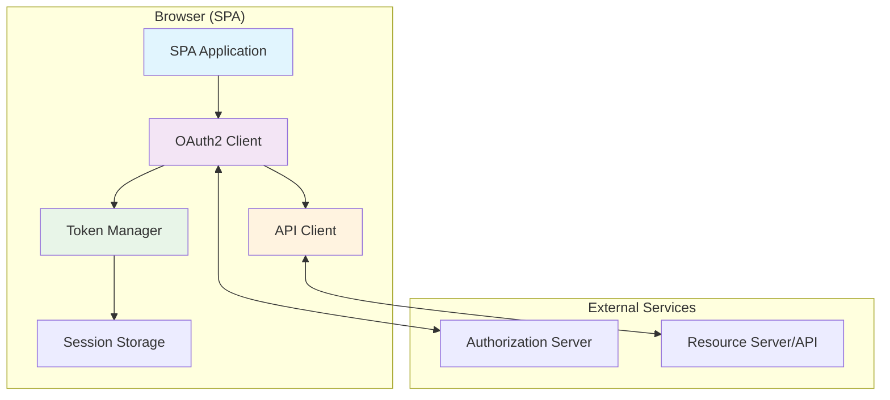

# JavaScript SPA OAuth2 Implementation Guide

## 🎯 Overview

This guide provides a complete, production-ready OAuth2 implementation for Single Page Applications (SPAs) using vanilla JavaScript. It follows RFC 9700 security best practices and includes real-world patterns for React, Vue, and Angular applications.

**What You'll Build:**
- Secure OAuth2 client with PKCE
- Automatic token refresh
- Robust error handling
- Production-ready security measures
- Framework integration examples

**Estimated Time:** 3-4 hours  
**Prerequisites:** [Modern Security Patterns](../02-intermediate/01-modern-security-patterns.md)

---

## 🏗️ Architecture Overview

### SPA OAuth2 Architecture



### Security Considerations for SPAs

| Aspect | Challenge | Solution |
|--------|-----------|----------|
| **Client Secrets** | Cannot store securely | Use public client with PKCE |
| **Token Storage** | XSS vulnerability | Memory + sessionStorage, never localStorage |
| **Token Refresh** | Background refresh needed | Automatic refresh with retry logic |
| **CSRF Protection** | State parameter validation | Cryptographically secure state |
| **Code Interception** | Authorization code theft | PKCE with S256 challenge |

---

## 🔧 Core Implementation

### 1. OAuth2 Client Class

```javascript
/**
 * Production-ready OAuth2 client for SPAs
 * Implements RFC 9700 security best practices
 */
class SPAOAuth2Client {
  constructor(config) {
    this.config = this.validateConfig(config);
    this.tokenManager = new SPATokenManager(this.config.storage);
    this.state = new StateManager();
    this.pkce = new PKCEManager();
    
    // Event emitter for application integration
    this.eventTarget = new EventTarget();
    
    // Setup automatic token refresh
    this.setupTokenRefresh();
  }

  validateConfig(config) {
    const required = ['authServerUrl', 'clientId', 'redirectUri', 'scope'];
    const missing = required.filter(key => !config[key]);
    
    if (missing.length > 0) {
      throw new Error(`Missing required config: ${missing.join(', ')}`);
    }

    // Validate URLs
    if (!config.authServerUrl.startsWith('https://')) {
      throw new Error('Authorization server must use HTTPS');
    }

    if (!config.redirectUri.startsWith('https://') && 
        !config.redirectUri.startsWith('http://localhost')) {
      throw new Error('Redirect URI must use HTTPS (except localhost)');
    }

    return {
      ...config,
      endpoints: {
        authorization: '/authorize',
        token: '/token',
        revocation: '/revoke',
        ...config.endpoints
      },
      storage: {
        prefix: 'oauth2_',
        ...config.storage
      }
    };
  }

  /**
   * Start OAuth2 authorization flow
   */
  async authorize(options = {}) {
    try {
      this.emit('authStart', { options });

      // Generate PKCE parameters
      const { codeVerifier, codeChallenge } = await this.pkce.generate();
      
      // Generate state for CSRF protection
      const state = this.state.generate({
        timestamp: Date.now(),
        ...options.stateData
      });

      // Store PKCE and state
      this.pkce.store(codeVerifier);
      this.state.store(state);

      // Build authorization URL
      const authUrl = this.buildAuthorizationUrl({
        codeChallenge,
        state,
        ...options
      });

      this.emit('authRedirect', { url: authUrl });

      // Redirect to authorization server
      window.location.href = authUrl;

    } catch (error) {
      this.emit('authError', { error });
      throw error;
    }
  }

  buildAuthorizationUrl(params) {
    const url = new URL(
      this.config.authServerUrl + this.config.endpoints.authorization
    );

    const searchParams = {
      response_type: 'code',
      client_id: this.config.clientId,
      redirect_uri: this.config.redirectUri,
      scope: this.config.scope,
      code_challenge: params.codeChallenge,
      code_challenge_method: 'S256',
      state: params.state,
      ...params.additionalParams
    };

    Object.entries(searchParams).forEach(([key, value]) => {
      if (value !== undefined && value !== null) {
        url.searchParams.set(key, value);
      }
    });

    return url.toString();
  }

  /**
   * Handle authorization callback
   */
  async handleCallback(callbackUrl = window.location.href) {
    try {
      this.emit('callbackStart', { url: callbackUrl });

      const params = this.parseCallbackUrl(callbackUrl);
      
      // Handle authorization errors
      if (params.error) {
        const error = new OAuth2Error(params.error, params.error_description);
        this.emit('callbackError', { error });
        throw error;
      }

      if (!params.code) {
        throw new OAuth2Error('invalid_request', 'No authorization code received');
      }

      // Validate state (CSRF protection)
      const stateData = this.state.validate(params.state);
      
      // Get PKCE verifier
      const codeVerifier = this.pkce.retrieve();

      // Exchange code for tokens
      const tokens = await this.exchangeCodeForTokens(params.code, codeVerifier);

      // Store tokens
      this.tokenManager.setTokens(tokens);

      // Clean up
      this.pkce.clear();
      this.state.clear();

      // Clear URL parameters
      this.clearCallbackUrl();

      this.emit('authComplete', { tokens, stateData });

      return { tokens, stateData };

    } catch (error) {
      // Clean up on error
      this.pkce.clear();
      this.state.clear();
      
      this.emit('callbackError', { error });
      throw error;
    }
  }

  parseCallbackUrl(url) {
    const urlObj = new URL(url);
    return {
      code: urlObj.searchParams.get('code'),
      state: urlObj.searchParams.get('state'),
      error: urlObj.searchParams.get('error'),
      error_description: urlObj.searchParams.get('error_description')
    };
  }

  async exchangeCodeForTokens(code, codeVerifier) {
    const response = await fetch(
      this.config.authServerUrl + this.config.endpoints.token,
      {
        method: 'POST',
        headers: {
          'Content-Type': 'application/x-www-form-urlencoded',
          'Accept': 'application/json'
        },
        body: new URLSearchParams({
          grant_type: 'authorization_code',
          code: code,
          client_id: this.config.clientId,
          code_verifier: codeVerifier,
          redirect_uri: this.config.redirectUri
        })
      }
    );

    if (!response.ok) {
      const errorData = await response.json().catch(() => ({}));
      throw new OAuth2Error(
        errorData.error || 'token_exchange_failed',
        errorData.error_description || `HTTP ${response.status}`
      );
    }

    const tokens = await response.json();
    this.validateTokenResponse(tokens);
    
    return tokens;
  }

  validateTokenResponse(tokens) {
    if (!tokens.access_token) {
      throw new OAuth2Error('invalid_token_response', 'Missing access_token');
    }

    if (!tokens.expires_in || tokens.expires_in <= 0) {
      throw new OAuth2Error('invalid_token_response', 'Invalid expires_in');
    }

    // Validate token format if JWT
    if (tokens.access_token.includes('.')) {
      this.validateJWTStructure(tokens.access_token);
    }
  }

  validateJWTStructure(token) {
    const parts = token.split('.');
    if (parts.length !== 3) {
      throw new OAuth2Error('invalid_token', 'Invalid JWT structure');
    }

    try {
      const header = JSON.parse(atob(parts[0].replace(/-/g, '+').replace(/_/g, '/')));
      if (!header.alg || header.alg === 'none') {
        throw new OAuth2Error('invalid_token', 'JWT must have valid algorithm');
      }
    } catch (error) {
      throw new OAuth2Error('invalid_token', 'Invalid JWT header');
    }
  }

  clearCallbackUrl() {
    if (window.history && window.history.replaceState) {
      window.history.replaceState(
        {},
        document.title,
        window.location.pathname + window.location.hash
      );
    }
  }

  /**
   * Get valid access token (with automatic refresh)
   */
  async getAccessToken() {
    try {
      let token = this.tokenManager.getAccessToken();
      
      if (!token) {
        return null; // Not authenticated
      }

      // Check if token needs refresh
      if (this.tokenManager.needsRefresh()) {
        token = await this.refreshToken();
      }

      return token;
    } catch (error) {
      if (error.message === 'REFRESH_TOKEN_INVALID') {
        this.emit('authExpired', { error });
        return null;
      }
      throw error;
    }
  }

  /**
   * Refresh access token
   */
  async refreshToken() {
    const refreshToken = this.tokenManager.getRefreshToken();
    if (!refreshToken) {
      throw new OAuth2Error('no_refresh_token', 'No refresh token available');
    }

    try {
      this.emit('tokenRefreshStart');

      const response = await fetch(
        this.config.authServerUrl + this.config.endpoints.token,
        {
          method: 'POST',
          headers: {
            'Content-Type': 'application/x-www-form-urlencoded',
            'Accept': 'application/json'
          },
          body: new URLSearchParams({
            grant_type: 'refresh_token',
            refresh_token: refreshToken,
            client_id: this.config.clientId
          })
        }
      );

      if (!response.ok) {
        const errorData = await response.json().catch(() => ({}));
        
        if (response.status === 400 || response.status === 401) {
          this.tokenManager.clearTokens();
          throw new OAuth2Error('REFRESH_TOKEN_INVALID', 'Refresh token is invalid');
        }
        
        throw new OAuth2Error(
          errorData.error || 'token_refresh_failed',
          errorData.error_description || `HTTP ${response.status}`
        );
      }

      const tokens = await response.json();
      this.validateTokenResponse(tokens);
      
      this.tokenManager.setTokens(tokens);
      this.emit('tokenRefreshComplete', { tokens });
      
      return tokens.access_token;

    } catch (error) {
      this.emit('tokenRefreshError', { error });
      throw error;
    }
  }

  /**
   * Logout user
   */
  async logout(options = {}) {
    try {
      this.emit('logoutStart');

      const refreshToken = this.tokenManager.getRefreshToken();
      
      // Revoke tokens if endpoint available
      if (refreshToken && this.config.endpoints.revocation && options.revokeTokens !== false) {
        await this.revokeToken(refreshToken);
      }

    } catch (error) {
      console.warn('Token revocation failed:', error);
    } finally {
      // Always clear local tokens
      this.tokenManager.clearTokens();
      this.pkce.clear();
      this.state.clear();
      
      this.emit('logoutComplete');
    }
  }

  async revokeToken(token) {
    await fetch(
      this.config.authServerUrl + this.config.endpoints.revocation,
      {
        method: 'POST',
        headers: {
          'Content-Type': 'application/x-www-form-urlencoded'
        },
        body: new URLSearchParams({
          token: token,
          client_id: this.config.clientId
        })
      }
    );
  }

  /**
   * Check if user is authenticated
   */
  isAuthenticated() {
    return this.tokenManager.hasValidTokens();
  }

  /**
   * Setup automatic token refresh
   */
  setupTokenRefresh() {
    // Listen for token events to schedule refresh
    this.addEventListener('authComplete', () => {
      this.scheduleTokenRefresh();
    });

    this.addEventListener('tokenRefreshComplete', () => {
      this.scheduleTokenRefresh();
    });
  }

  scheduleTokenRefresh() {
    const tokens = this.tokenManager.getTokens();
    if (!tokens?.expires_at) return;

    const refreshTime = tokens.expires_at - Date.now() - (5 * 60 * 1000); // 5 minutes before expiry
    
    if (refreshTime > 0) {
      setTimeout(async () => {
        try {
          await this.refreshToken();
        } catch (error) {
          this.emit('autoRefreshError', { error });
        }
      }, refreshTime);
    }
  }

  // Event handling
  addEventListener(type, listener) {
    this.eventTarget.addEventListener(type, listener);
  }

  removeEventListener(type, listener) {
    this.eventTarget.removeEventListener(type, listener);
  }

  emit(type, detail = {}) {
    this.eventTarget.dispatchEvent(new CustomEvent(type, { detail }));
  }
}
```

### 2. Token Manager for SPAs

```javascript
/**
 * Secure token management for SPAs
 * Uses sessionStorage with memory fallback
 */
class SPATokenManager {
  constructor(config = {}) {
    this.config = {
      storageKey: 'oauth2_tokens',
      useMemoryFallback: true,
      maxTokenLifetime: 3600, // 1 hour
      refreshThreshold: 300,   // 5 minutes
      ...config
    };
    
    this.memoryStorage = new Map();
    this.tokens = this.loadTokens();
  }

  setTokens(tokens) {
    // Validate and normalize tokens
    const normalizedTokens = this.normalizeTokens(tokens);
    
    this.tokens = normalizedTokens;
    this.storeTokens(normalizedTokens);
  }

  normalizeTokens(tokens) {
    const expiresIn = Math.min(
      tokens.expires_in || this.config.maxTokenLifetime,
      this.config.maxTokenLifetime
    );

    return {
      access_token: tokens.access_token,
      refresh_token: tokens.refresh_token,
      token_type: tokens.token_type || 'Bearer',
      expires_in: expiresIn,
      scope: tokens.scope,
      expires_at: Date.now() + (expiresIn * 1000),
      stored_at: Date.now()
    };
  }

  getAccessToken() {
    return this.tokens?.access_token || null;
  }

  getRefreshToken() {
    return this.tokens?.refresh_token || null;
  }

  getTokens() {
    return this.tokens;
  }

  hasValidTokens() {
    return !!(this.tokens?.access_token && !this.isExpired());
  }

  isExpired() {
    if (!this.tokens?.expires_at) return true;
    return Date.now() >= this.tokens.expires_at;
  }

  needsRefresh() {
    if (!this.tokens?.expires_at) return false;
    const refreshTime = this.tokens.expires_at - (this.config.refreshThreshold * 1000);
    return Date.now() >= refreshTime;
  }

  getTimeUntilExpiry() {
    if (!this.tokens?.expires_at) return 0;
    return Math.max(0, Math.floor((this.tokens.expires_at - Date.now()) / 1000));
  }

  clearTokens() {
    this.tokens = null;
    this.clearStoredTokens();
  }

  // Storage methods
  storeTokens(tokens) {
    const tokenData = {
      ...tokens,
      checksum: this.calculateChecksum(tokens)
    };

    // Try sessionStorage first
    try {
      sessionStorage.setItem(this.config.storageKey, JSON.stringify(tokenData));
    } catch (error) {
      console.warn('SessionStorage failed, using memory storage:', error);
      if (this.config.useMemoryFallback) {
        this.memoryStorage.set(this.config.storageKey, tokenData);
      }
    }
  }

  loadTokens() {
    // Try sessionStorage first
    try {
      const stored = sessionStorage.getItem(this.config.storageKey);
      if (stored) {
        const tokenData = JSON.parse(stored);
        if (this.validateStoredTokens(tokenData)) {
          return tokenData;
        }
      }
    } catch (error) {
      console.warn('Failed to load from sessionStorage:', error);
    }

    // Try memory fallback
    if (this.config.useMemoryFallback) {
      const memoryData = this.memoryStorage.get(this.config.storageKey);
      if (memoryData && this.validateStoredTokens(memoryData)) {
        return memoryData;
      }
    }

    return null;
  }

  validateStoredTokens(tokenData) {
    if (!tokenData || !tokenData.access_token) {
      return false;
    }

    // Check expiration
    if (tokenData.expires_at && Date.now() >= tokenData.expires_at) {
      this.clearStoredTokens();
      return false;
    }

    // Verify checksum
    const expectedChecksum = this.calculateChecksum({
      access_token: tokenData.access_token,
      refresh_token: tokenData.refresh_token,
      expires_at: tokenData.expires_at
    });

    if (tokenData.checksum !== expectedChecksum) {
      console.warn('Token checksum mismatch - possible tampering');
      this.clearStoredTokens();
      return false;
    }

    return true;
  }

  clearStoredTokens() {
    try {
      sessionStorage.removeItem(this.config.storageKey);
    } catch (error) {
      console.warn('Failed to clear sessionStorage:', error);
    }

    if (this.config.useMemoryFallback) {
      this.memoryStorage.delete(this.config.storageKey);
    }
  }

  calculateChecksum(tokens) {
    const data = `${tokens.access_token}:${tokens.refresh_token}:${tokens.expires_at}`;
    // Simple checksum - in production, consider using a proper hash
    return btoa(data).slice(0, 16);
  }
}
```

### 3. PKCE Manager

```javascript
/**
 * PKCE (Proof Key for Code Exchange) implementation
 * RFC 7636 compliant with S256 challenge method
 */
class PKCEManager {
  constructor() {
    this.storageKey = 'oauth2_pkce';
    this.challengeMethod = 'S256';
  }

  async generate() {
    const codeVerifier = this.generateCodeVerifier();
    const codeChallenge = await this.generateCodeChallenge(codeVerifier);
    
    return { codeVerifier, codeChallenge };
  }

  generateCodeVerifier() {
    // Generate 128 character base64url string (maximum length for security)
    const array = new Uint8Array(96); // 96 bytes = 128 base64url chars
    crypto.getRandomValues(array);
    return this.base64URLEncode(array);
  }

  async generateCodeChallenge(verifier) {
    const encoder = new TextEncoder();
    const data = encoder.encode(verifier);
    const digest = await crypto.subtle.digest('SHA-256', data);
    return this.base64URLEncode(new Uint8Array(digest));
  }

  base64URLEncode(buffer) {
    return btoa(String.fromCharCode(...buffer))
      .replace(/\+/g, '-')
      .replace(/\//g, '_')
      .replace(/=/g, '');
  }

  store(codeVerifier) {
    const pkceData = {
      codeVerifier,
      createdAt: Date.now()
    };

    try {
      sessionStorage.setItem(this.storageKey, JSON.stringify(pkceData));
    } catch (error) {
      throw new OAuth2Error('storage_failed', 'Cannot store PKCE parameters');
    }
  }

  retrieve() {
    try {
      const stored = sessionStorage.getItem(this.storageKey);
      if (!stored) {
        throw new OAuth2Error('pkce_not_found', 'PKCE code verifier not found');
      }

      const pkceData = JSON.parse(stored);
      
      // Check if PKCE data is too old (10 minutes max)
      if (Date.now() - pkceData.createdAt > 600000) {
        this.clear();
        throw new OAuth2Error('pkce_expired', 'PKCE parameters expired');
      }

      return pkceData.codeVerifier;
    } catch (error) {
      if (error instanceof OAuth2Error) {
        throw error;
      }
      throw new OAuth2Error('pkce_retrieval_failed', 'Failed to retrieve PKCE parameters');
    }
  }

  clear() {
    try {
      sessionStorage.removeItem(this.storageKey);
    } catch (error) {
      console.warn('Failed to clear PKCE parameters:', error);
    }
  }

  // Validation helper for testing
  async validatePKCE(codeVerifier, codeChallenge) {
    if (!codeVerifier || codeVerifier.length < 43 || codeVerifier.length > 128) {
      return false;
    }

    const expectedChallenge = await this.generateCodeChallenge(codeVerifier);
    return expectedChallenge === codeChallenge;
  }
}
```

### 4. State Manager for CSRF Protection

```javascript
/**
 * Enhanced state management for CSRF protection
 * Supports additional state data and automatic cleanup
 */
class StateManager {
  constructor() {
    this.storageKey = 'oauth2_state';
    this.maxAge = 600000; // 10 minutes
  }

  generate(additionalData = {}) {
    const state = {
      value: this.generateSecureRandomString(32),
      createdAt: Date.now(),
      data: additionalData
    };

    this.store(state);
    return state.value;
  }

  generateSecureRandomString(length) {
    const array = new Uint8Array(length);
    crypto.getRandomValues(array);
    return Array.from(array, byte => byte.toString(16).padStart(2, '0')).join('');
  }

  store(state) {
    try {
      sessionStorage.setItem(this.storageKey, JSON.stringify(state));
    } catch (error) {
      throw new OAuth2Error('storage_failed', 'Cannot store state parameter');
    }
  }

  validate(stateValue) {
    try {
      const stored = sessionStorage.getItem(this.storageKey);
      if (!stored) {
        throw new OAuth2Error('state_not_found', 'State parameter not found');
      }

      const state = JSON.parse(stored);
      
      // Validate state value
      if (!stateValue || stateValue !== state.value) {
        throw new OAuth2Error('invalid_state', 'Invalid state parameter - possible CSRF attack');
      }

      // Check expiration
      if (Date.now() - state.createdAt > this.maxAge) {
        this.clear();
        throw new OAuth2Error('state_expired', 'State parameter expired');
      }

      return state.data;
    } catch (error) {
      if (error instanceof OAuth2Error) {
        throw error;
      }
      throw new OAuth2Error('state_validation_failed', 'Failed to validate state parameter');
    }
  }

  clear() {
    try {
      sessionStorage.removeItem(this.storageKey);
    } catch (error) {
      console.warn('Failed to clear state parameter:', error);
    }
  }
}
```

### 5. Custom Error Class

```javascript
/**
 * OAuth2-specific error class
 */
class OAuth2Error extends Error {
  constructor(code, description, cause = null) {
    super(description || code);
    this.name = 'OAuth2Error';
    this.code = code;
    this.description = description;
    this.cause = cause;
    this.timestamp = new Date().toISOString();
  }

  toJSON() {
    return {
      name: this.name,
      code: this.code,
      description: this.description,
      message: this.message,
      timestamp: this.timestamp,
      cause: this.cause
    };
  }

  static fromResponse(response) {
    return new OAuth2Error(
      response.error || 'unknown_error',
      response.error_description || 'Unknown OAuth2 error',
      response
    );
  }
}
```

---

## 🌐 API Client Integration

### Authenticated API Client

```javascript
/**
 * API client that automatically handles OAuth2 authentication
 */
class AuthenticatedAPIClient {
  constructor(oauth2Client, baseURL, options = {}) {
    this.oauth2Client = oauth2Client;
    this.baseURL = baseURL;
    this.options = {
      timeout: 30000,
      retryAttempts: 3,
      retryDelay: 1000,
      ...options
    };
  }

  async request(endpoint, options = {}) {
    const url = `${this.baseURL}${endpoint}`;
    let attempt = 1;
    let lastError;

    while (attempt <= this.options.retryAttempts) {
      try {
        return await this.makeAuthenticatedRequest(url, options);
      } catch (error) {
        lastError = error;

        // Don't retry on client errors (4xx) except 401
        if (error.status >= 400 && error.status < 500 && error.status !== 401) {
          throw error;
        }

        if (attempt < this.options.retryAttempts) {
          console.warn(`Request failed (attempt ${attempt}), retrying...`, error);
          await this.delay(this.options.retryDelay * attempt);
          attempt++;
        } else {
          throw lastError;
        }
      }
    }
  }

  async makeAuthenticatedRequest(url, options) {
    // Get valid access token
    const accessToken = await this.oauth2Client.getAccessToken();
    
    if (!accessToken) {
      throw new OAuth2Error('not_authenticated', 'User not authenticated');
    }

    // Setup request with timeout
    const controller = new AbortController();
    const timeoutId = setTimeout(() => controller.abort(), this.options.timeout);

    try {
      const response = await fetch(url, {
        ...options,
        signal: controller.signal,
        headers: {
          'Authorization': `Bearer ${accessToken}`,
          'Content-Type': 'application/json',
          'Accept': 'application/json',
          ...options.headers
        }
      });

      clearTimeout(timeoutId);

      // Handle 401 - token might be expired
      if (response.status === 401) {
        // Try to refresh token and retry once
        try {
          const newToken = await this.oauth2Client.refreshToken();
          if (newToken) {
            // Retry with new token
            return await fetch(url, {
              ...options,
              headers: {
                'Authorization': `Bearer ${newToken}`,
                'Content-Type': 'application/json',
                'Accept': 'application/json',
                ...options.headers
              }
            });
          }
        } catch (refreshError) {
          throw new OAuth2Error('authentication_failed', 'Token refresh failed');
        }
      }

      if (!response.ok) {
        const error = new Error(`HTTP ${response.status}: ${response.statusText}`);
        error.status = response.status;
        error.response = response;
        throw error;
      }

      // Parse response
      const contentType = response.headers.get('content-type');
      if (contentType && contentType.includes('application/json')) {
        return await response.json();
      } else {
        return await response.text();
      }

    } catch (error) {
      clearTimeout(timeoutId);

      if (error.name === 'AbortError') {
        throw new Error('Request timeout');
      }

      throw error;
    }
  }

  delay(ms) {
    return new Promise(resolve => setTimeout(resolve, ms));
  }

  // Convenience methods
  async get(endpoint, options = {}) {
    return this.request(endpoint, { ...options, method: 'GET' });
  }

  async post(endpoint, data, options = {}) {
    return this.request(endpoint, {
      ...options,
      method: 'POST',
      body: JSON.stringify(data)
    });
  }

  async put(endpoint, data, options = {}) {
    return this.request(endpoint, {
      ...options,
      method: 'PUT',
      body: JSON.stringify(data)
    });
  }

  async delete(endpoint, options = {}) {
    return this.request(endpoint, { ...options, method: 'DELETE' });
  }
}
```

---

## ⚛️ Framework Integration Examples

### React Integration

```jsx
// hooks/useOAuth2.js
import { useState, useEffect, useCallback, useContext, createContext } from 'react';

const OAuth2Context = createContext();

export function OAuth2Provider({ children, config }) {
  const [oauth2Client] = useState(() => new SPAOAuth2Client(config));
  const [isAuthenticated, setIsAuthenticated] = useState(false);
  const [isLoading, setIsLoading] = useState(true);
  const [user, setUser] = useState(null);
  const [error, setError] = useState(null);

  useEffect(() => {
    // Setup event listeners
    const handleAuthComplete = (event) => {
      setIsAuthenticated(true);
      setIsLoading(false);
      setError(null);
    };

    const handleAuthExpired = () => {
      setIsAuthenticated(false);
      setUser(null);
      setError(new Error('Authentication expired'));
    };

    const handleAuthError = (event) => {
      setError(event.detail.error);
      setIsLoading(false);
    };

    oauth2Client.addEventListener('authComplete', handleAuthComplete);
    oauth2Client.addEventListener('authExpired', handleAuthExpired);
    oauth2Client.addEventListener('authError', handleAuthError);
    oauth2Client.addEventListener('callbackError', handleAuthError);

    // Check initial authentication state
    const checkAuth = async () => {
      try {
        const token = await oauth2Client.getAccessToken();
        if (token) {
          setIsAuthenticated(true);
          // Optionally fetch user info
          await fetchUserInfo();
        }
      } catch (error) {
        console.error('Auth check failed:', error);
      } finally {
        setIsLoading(false);
      }
    };

    // Handle callback if present
    const handleInitialCallback = async () => {
      const urlParams = new URLSearchParams(window.location.search);
      if (urlParams.has('code') || urlParams.has('error')) {
        try {
          await oauth2Client.handleCallback();
        } catch (error) {
          setError(error);
        }
      } else {
        await checkAuth();
      }
    };

    handleInitialCallback();

    return () => {
      oauth2Client.removeEventListener('authComplete', handleAuthComplete);
      oauth2Client.removeEventListener('authExpired', handleAuthExpired);
      oauth2Client.removeEventListener('authError', handleAuthError);
      oauth2Client.removeEventListener('callbackError', handleAuthError);
    };
  }, [oauth2Client]);

  const fetchUserInfo = async () => {
    try {
      const apiClient = new AuthenticatedAPIClient(oauth2Client, config.apiBaseUrl);
      const userInfo = await apiClient.get('/user');
      setUser(userInfo);
    } catch (error) {
      console.error('Failed to fetch user info:', error);
    }
  };

  const login = useCallback(async (options) => {
    setIsLoading(true);
    setError(null);
    try {
      await oauth2Client.authorize(options);
    } catch (error) {
      setError(error);
      setIsLoading(false);
    }
  }, [oauth2Client]);

  const logout = useCallback(async () => {
    setIsLoading(true);
    try {
      await oauth2Client.logout();
      setIsAuthenticated(false);
      setUser(null);
    } catch (error) {
      setError(error);
    } finally {
      setIsLoading(false);
    }
  }, [oauth2Client]);

  const value = {
    oauth2Client,
    isAuthenticated,
    isLoading,
    user,
    error,
    login,
    logout
  };

  return (
    <OAuth2Context.Provider value={value}>
      {children}
    </OAuth2Context.Provider>
  );
}

export function useOAuth2() {
  const context = useContext(OAuth2Context);
  if (!context) {
    throw new Error('useOAuth2 must be used within OAuth2Provider');
  }
  return context;
}

// Component usage
function App() {
  return (
    <OAuth2Provider config={oauth2Config}>
      <Router>
        <Routes>
          <Route path="/login" element={<LoginPage />} />
          <Route path="/dashboard" element={<ProtectedRoute><Dashboard /></ProtectedRoute>} />
        </Routes>
      </Router>
    </OAuth2Provider>
  );
}

function ProtectedRoute({ children }) {
  const { isAuthenticated, isLoading } = useOAuth2();
  
  if (isLoading) {
    return <div>Loading...</div>;
  }
  
  if (!isAuthenticated) {
    return <Navigate to="/login" />;
  }
  
  return children;
}

function LoginPage() {
  const { login, isLoading, error } = useOAuth2();
  
  return (
    <div>
      <h1>Login</h1>
      {error && <div className="error">{error.message}</div>}
      <button onClick={() => login()} disabled={isLoading}>
        {isLoading ? 'Logging in...' : 'Login with OAuth2'}
      </button>
    </div>
  );
}
```

### Vue 3 Integration

```javascript
// composables/useOAuth2.js
import { ref, reactive, onMounted, onUnmounted } from 'vue';

export function useOAuth2(config) {
  const oauth2Client = new SPAOAuth2Client(config);
  const state = reactive({
    isAuthenticated: false,
    isLoading: true,
    user: null,
    error: null
  });

  const eventListeners = [];

  const setupEventListeners = () => {
    const handleAuthComplete = () => {
      state.isAuthenticated = true;
      state.isLoading = false;
      state.error = null;
    };

    const handleAuthExpired = () => {
      state.isAuthenticated = false;
      state.user = null;
      state.error = new Error('Authentication expired');
    };

    const handleAuthError = (event) => {
      state.error = event.detail.error;
      state.isLoading = false;
    };

    oauth2Client.addEventListener('authComplete', handleAuthComplete);
    oauth2Client.addEventListener('authExpired', handleAuthExpired);
    oauth2Client.addEventListener('authError', handleAuthError);

    eventListeners.push(
      () => oauth2Client.removeEventListener('authComplete', handleAuthComplete),
      () => oauth2Client.removeEventListener('authExpired', handleAuthExpired),
      () => oauth2Client.removeEventListener('authError', handleAuthError)
    );
  };

  const login = async (options) => {
    state.isLoading = true;
    state.error = null;
    try {
      await oauth2Client.authorize(options);
    } catch (error) {
      state.error = error;
      state.isLoading = false;
    }
  };

  const logout = async () => {
    state.isLoading = true;
    try {
      await oauth2Client.logout();
      state.isAuthenticated = false;
      state.user = null;
    } catch (error) {
      state.error = error;
    } finally {
      state.isLoading = false;
    }
  };

  onMounted(async () => {
    setupEventListeners();
    
    // Handle callback or check auth
    const urlParams = new URLSearchParams(window.location.search);
    if (urlParams.has('code') || urlParams.has('error')) {
      try {
        await oauth2Client.handleCallback();
      } catch (error) {
        state.error = error;
      }
    } else {
      try {
        const token = await oauth2Client.getAccessToken();
        if (token) {
          state.isAuthenticated = true;
        }
      } catch (error) {
        console.error('Auth check failed:', error);
      } finally {
        state.isLoading = false;
      }
    }
  });

  onUnmounted(() => {
    eventListeners.forEach(cleanup => cleanup());
  });

  return {
    oauth2Client,
    ...toRefs(state),
    login,
    logout
  };
}

// Plugin
export default {
  install(app, config) {
    const oauth2 = useOAuth2(config);
    app.config.globalProperties.$oauth2 = oauth2;
    app.provide('oauth2', oauth2);
  }
};
```

### Angular Integration

```typescript
// services/oauth2.service.ts
import { Injectable } from '@angular/core';
import { BehaviorSubject, Observable } from 'rxjs';

@Injectable({
  providedIn: 'root'
})
export class OAuth2Service {
  private oauth2Client: SPAOAuth2Client;
  private isAuthenticatedSubject = new BehaviorSubject<boolean>(false);
  private isLoadingSubject = new BehaviorSubject<boolean>(true);
  private userSubject = new BehaviorSubject<any>(null);
  private errorSubject = new BehaviorSubject<Error | null>(null);

  public isAuthenticated$ = this.isAuthenticatedSubject.asObservable();
  public isLoading$ = this.isLoadingSubject.asObservable();
  public user$ = this.userSubject.asObservable();
  public error$ = this.errorSubject.asObservable();

  constructor() {
    this.oauth2Client = new SPAOAuth2Client({
      authServerUrl: environment.authServerUrl,
      clientId: environment.clientId,
      redirectUri: environment.redirectUri,
      scope: environment.scope
    });

    this.setupEventListeners();
    this.initialize();
  }

  private setupEventListeners(): void {
    this.oauth2Client.addEventListener('authComplete', () => {
      this.isAuthenticatedSubject.next(true);
      this.isLoadingSubject.next(false);
      this.errorSubject.next(null);
    });

    this.oauth2Client.addEventListener('authExpired', () => {
      this.isAuthenticatedSubject.next(false);
      this.userSubject.next(null);
      this.errorSubject.next(new Error('Authentication expired'));
    });

    this.oauth2Client.addEventListener('authError', (event: any) => {
      this.errorSubject.next(event.detail.error);
      this.isLoadingSubject.next(false);
    });
  }

  private async initialize(): Promise<void> {
    // Handle callback or check auth
    const urlParams = new URLSearchParams(window.location.search);
    if (urlParams.has('code') || urlParams.has('error')) {
      try {
        await this.oauth2Client.handleCallback();
      } catch (error) {
        this.errorSubject.next(error as Error);
      }
    } else {
      try {
        const token = await this.oauth2Client.getAccessToken();
        if (token) {
          this.isAuthenticatedSubject.next(true);
        }
      } catch (error) {
        console.error('Auth check failed:', error);
      } finally {
        this.isLoadingSubject.next(false);
      }
    }
  }

  async login(options?: any): Promise<void> {
    this.isLoadingSubject.next(true);
    this.errorSubject.next(null);
    try {
      await this.oauth2Client.authorize(options);
    } catch (error) {
      this.errorSubject.next(error as Error);
      this.isLoadingSubject.next(false);
    }
  }

  async logout(): Promise<void> {
    this.isLoadingSubject.next(true);
    try {
      await this.oauth2Client.logout();
      this.isAuthenticatedSubject.next(false);
      this.userSubject.next(null);
    } catch (error) {
      this.errorSubject.next(error as Error);
    } finally {
      this.isLoadingSubject.next(false);
    }
  }

  getAccessToken(): Promise<string | null> {
    return this.oauth2Client.getAccessToken();
  }
}

// Guard
@Injectable({
  providedIn: 'root'
})
export class AuthGuard implements CanActivate {
  constructor(private oauth2Service: OAuth2Service, private router: Router) {}

  canActivate(): Observable<boolean> {
    return this.oauth2Service.isAuthenticated$.pipe(
      tap(isAuthenticated => {
        if (!isAuthenticated) {
          this.router.navigate(['/login']);
        }
      })
    );
  }
}
```

---

## 🧪 Testing Your Implementation

### Unit Tests

```javascript
// tests/oauth2-client.test.js
describe('SPAOAuth2Client', () => {
  let oauth2Client;
  let mockFetch;

  beforeEach(() => {
    mockFetch = jest.fn();
    global.fetch = mockFetch;
    global.crypto = {
      getRandomValues: jest.fn().mockReturnValue(new Uint8Array(32)),
      subtle: {
        digest: jest.fn().mockResolvedValue(new ArrayBuffer(32))
      }
    };

    oauth2Client = new SPAOAuth2Client({
      authServerUrl: 'https://auth.example.com',
      clientId: 'test-client',
      redirectUri: 'https://app.example.com/callback',
      scope: 'openid profile email'
    });
  });

  describe('authorize', () => {
    test('should generate PKCE parameters', async () => {
      const authorizeSpy = jest.spyOn(oauth2Client, 'buildAuthorizationUrl');
      
      await oauth2Client.authorize();
      
      expect(authorizeSpy).toHaveBeenCalledWith(
        expect.objectContaining({
          codeChallenge: expect.any(String),
          state: expect.any(String)
        })
      );
    });

    test('should store PKCE and state parameters', async () => {
      const setItemSpy = jest.spyOn(Storage.prototype, 'setItem');
      
      await oauth2Client.authorize();
      
      expect(setItemSpy).toHaveBeenCalledWith('oauth2_pkce', expect.any(String));
      expect(setItemSpy).toHaveBeenCalledWith('oauth2_state', expect.any(String));
    });
  });

  describe('handleCallback', () => {
    test('should handle successful callback', async () => {
      // Setup stored PKCE and state
      sessionStorage.setItem('oauth2_pkce', JSON.stringify({
        codeVerifier: 'test-verifier',
        createdAt: Date.now()
      }));
      sessionStorage.setItem('oauth2_state', JSON.stringify({
        value: 'test-state',
        createdAt: Date.now(),
        data: {}
      }));

      // Mock token response
      mockFetch.mockResolvedValueOnce({
        ok: true,
        json: () => Promise.resolve({
          access_token: 'test-access-token',
          refresh_token: 'test-refresh-token',
          expires_in: 3600,
          token_type: 'Bearer'
        })
      });

      const result = await oauth2Client.handleCallback(
        'https://app.example.com/callback?code=test-code&state=test-state'
      );

      expect(result.tokens.access_token).toBe('test-access-token');
      expect(oauth2Client.isAuthenticated()).toBe(true);
    });

    test('should handle authorization error', async () => {
      await expect(
        oauth2Client.handleCallback(
          'https://app.example.com/callback?error=access_denied&error_description=User%20denied%20access'
        )
      ).rejects.toThrow('User denied access');
    });

    test('should validate state parameter', async () => {
      sessionStorage.setItem('oauth2_state', JSON.stringify({
        value: 'correct-state',
        createdAt: Date.now(),
        data: {}
      }));

      await expect(
        oauth2Client.handleCallback(
          'https://app.example.com/callback?code=test-code&state=wrong-state'
        )
      ).rejects.toThrow('Invalid state parameter');
    });
  });

  describe('token refresh', () => {
    test('should refresh expired tokens', async () => {
      // Setup tokens that need refresh
      oauth2Client.tokenManager.setTokens({
        access_token: 'old-token',
        refresh_token: 'refresh-token',
        expires_in: 1, // Expires in 1 second
        token_type: 'Bearer'
      });

      // Wait for token to expire
      await new Promise(resolve => setTimeout(resolve, 1100));

      // Mock refresh response
      mockFetch.mockResolvedValueOnce({
        ok: true,
        json: () => Promise.resolve({
          access_token: 'new-access-token',
          refresh_token: 'new-refresh-token',
          expires_in: 3600,
          token_type: 'Bearer'
        })
      });

      const token = await oauth2Client.getAccessToken();
      expect(token).toBe('new-access-token');
    });
  });
});
```

### Integration Tests

```javascript
// tests/integration.test.js
describe('OAuth2 Integration', () => {
  let oauth2Client;
  let apiClient;

  beforeEach(() => {
    oauth2Client = new SPAOAuth2Client({
      authServerUrl: process.env.TEST_AUTH_SERVER_URL,
      clientId: process.env.TEST_CLIENT_ID,
      redirectUri: 'http://localhost:3000/test-callback',
      scope: 'openid profile email'
    });

    apiClient = new AuthenticatedAPIClient(
      oauth2Client,
      process.env.TEST_API_BASE_URL
    );
  });

  test('should complete full OAuth2 flow', async () => {
    // This test would require a test OAuth2 server
    // or mock server setup
    
    // 1. Start authorization
    const authUrl = oauth2Client.buildAuthorizationUrl({
      codeChallenge: 'test-challenge',
      state: 'test-state'
    });
    
    expect(authUrl).toContain('response_type=code');
    expect(authUrl).toContain('code_challenge=test-challenge');
    
    // 2. Simulate callback
    // (In real test, this would involve browser automation)
    
    // 3. Test API calls
    // (Would require valid tokens)
  });
});
```

---

## 🚀 Production Deployment

### Security Checklist

- [ ] **HTTPS Everywhere**: All URLs use HTTPS
- [ ] **PKCE Implemented**: S256 challenge method used
- [ ] **State Validation**: CSRF protection active
- [ ] **Token Storage**: sessionStorage only, never localStorage
- [ ] **Content Security Policy**: CSP headers configured
- [ ] **Redirect URI Validation**: Exact string matching
- [ ] **Token Expiration**: Short-lived access tokens
- [ ] **Error Handling**: Graceful error handling implemented
- [ ] **Logging**: Security events logged (without sensitive data)

### Performance Optimization

```javascript
// Lazy loading for OAuth2 client
const loadOAuth2Client = () => {
  return import('./oauth2-client.js').then(module => {
    return new module.SPAOAuth2Client(config);
  });
};

// Service worker for token refresh
// sw.js
self.addEventListener('message', async (event) => {
  if (event.data.type === 'REFRESH_TOKEN') {
    try {
      const response = await fetch('/oauth/token', {
        method: 'POST',
        headers: { 'Content-Type': 'application/x-www-form-urlencoded' },
        body: new URLSearchParams({
          grant_type: 'refresh_token',
          refresh_token: event.data.refreshToken,
          client_id: event.data.clientId
        })
      });
      
      const tokens = await response.json();
      event.ports[0].postMessage({ success: true, tokens });
    } catch (error) {
      event.ports[0].postMessage({ success: false, error: error.message });
    }
  }
});
```

### Monitoring and Analytics

```javascript
// OAuth2 analytics
class OAuth2Analytics {
  constructor(oauth2Client) {
    this.oauth2Client = oauth2Client;
    this.setupEventTracking();
  }

  setupEventTracking() {
    this.oauth2Client.addEventListener('authStart', () => {
      this.track('oauth2_auth_start');
    });

    this.oauth2Client.addEventListener('authComplete', () => {
      this.track('oauth2_auth_complete');
    });

    this.oauth2Client.addEventListener('authError', (event) => {
      this.track('oauth2_auth_error', {
        error_code: event.detail.error.code
      });
    });

    this.oauth2Client.addEventListener('tokenRefreshComplete', () => {
      this.track('oauth2_token_refresh');
    });
  }

  track(event, properties = {}) {
    // Send to your analytics service
    if (window.gtag) {
      window.gtag('event', event, properties);
    }
    
    if (window.analytics) {
      window.analytics.track(event, properties);
    }
  }
}
```

---

## 🎯 Summary

You've now implemented a production-ready OAuth2 client for SPAs that includes:

✅ **Security Best Practices**: PKCE, state validation, secure token storage  
✅ **Robust Error Handling**: Comprehensive error scenarios covered  
✅ **Framework Integration**: React, Vue, and Angular examples  
✅ **Testing Strategy**: Unit and integration test patterns  
✅ **Production Ready**: Performance optimization and monitoring  

### Key Takeaways

1. **Always use PKCE** for SPA OAuth2 implementations
2. **Never store tokens in localStorage** - use sessionStorage or memory
3. **Implement automatic token refresh** for better UX
4. **Validate state parameters** to prevent CSRF attacks
5. **Handle errors gracefully** with proper user feedback
6. **Test thoroughly** including edge cases and error scenarios

### Next Steps

- **Advanced Security**: [Advanced Security Patterns](../03-advanced/03-advanced-security.md)
- **Enterprise Patterns**: [Enterprise OAuth2 Architectures](../03-advanced/02-enterprise-patterns.md)
- **Security Testing**: [Security Assessment Guide](../03-advanced/04-security-assessment.md)

---

*This implementation provides a solid foundation for OAuth2 in SPAs. Customize it based on your specific requirements while maintaining the security principles outlined here.*