# OAuth2 Cheat Sheet - Essential Quick Reference

## 🎯 OAuth2 in 30 Seconds

- **Purpose**: Authorization framework for secure API access
- **Key Principle**: Authorization (what you can do), not authentication (who you are)
- **Modern Standard**: Always use Authorization Code + PKCE
- **Security Rule**: HTTPS everywhere, short-lived tokens, validate everything

---

## 👥 The Four Roles

| Role | What It Does | Example |
|------|--------------|---------|
| **Resource Owner** | Owns the data | End user |
| **Client** | Wants access to data | Your app |
| **Authorization Server** | Issues tokens | Auth0, Google |
| **Resource Server** | Hosts the data | Your API |

---

## 🔄 Flow Selection Guide

```mermaid
graph TD
    A[What type of client?] --> B[Server-side web app]
    A --> C[Single Page App SPA]
    A --> D[Mobile app]
    A --> E[Machine-to-machine]
    
    B --> F[Authorization Code + PKCE]
    C --> G[Authorization Code + PKCE]
    D --> H[Authorization Code + PKCE]
    E --> I[Client Credentials]
    
    F --> J[✅ Can store secrets securely]
    G --> K[⚠️ Cannot store secrets]
    H --> L[⚠️ Cannot store secrets]
    I --> M[✅ Service account authentication]
```



### Quick Flow Decision

| Application Type | Flow | Client Type | Can Store Secret? |
|------------------|------|-------------|-------------------|
| Server-side web app | Authorization Code + PKCE | Confidential | ✅ Yes |
| Single Page App (SPA) | Authorization Code + PKCE | Public | ❌ No |
| Mobile app | Authorization Code + PKCE | Public | ❌ No |
| Desktop app | Authorization Code + PKCE | Public | ❌ No |
| Microservice | Client Credentials | Confidential | ✅ Yes |
| CLI tool | Client Credentials | Confidential | ✅ Yes |

---

## 🛡️ Security Checklist

### ✅ Must-Have Security Features

#### For All Implementations
- [ ] **HTTPS Only**: All OAuth2 endpoints use TLS
- [ ] **PKCE Required**: Implement for all public clients
- [ ] **State Parameter**: Prevent CSRF attacks
- [ ] **Redirect URI Validation**: Exact string matching
- [ ] **Short Token Lifetimes**: Access tokens ≤ 1 hour

#### For Production Systems
- [ ] **Refresh Token Rotation**: New refresh token on each use
- [ ] **Token Revocation**: Support token revocation endpoint
- [ ] **Scope Validation**: Enforce least privilege principle
- [ ] **Audit Logging**: Log all authorization events
- [ ] **Rate Limiting**: Prevent brute force attacks

---

## 💻 Essential Code Patterns

### PKCE Implementation (Required for SPAs/Mobile)

```javascript
// 1. Generate PKCE parameters
function generatePKCE() {
  const codeVerifier = base64URLEncode(crypto.getRandomValues(new Uint8Array(32)));
  const codeChallenge = base64URLEncode(sha256(codeVerifier));
  return { codeVerifier, codeChallenge };
}

// 2. Authorization request
const { codeVerifier, codeChallenge } = generatePKCE();
sessionStorage.setItem('code_verifier', codeVerifier);

const authUrl = `${AUTH_SERVER}/authorize?` +
  `response_type=code&` +
  `client_id=${CLIENT_ID}&` +
  `redirect_uri=${REDIRECT_URI}&` +
  `code_challenge=${codeChallenge}&` +
  `code_challenge_method=S256&` +
  `state=${generateState()}`;

// 3. Token exchange
const tokenResponse = await fetch(`${AUTH_SERVER}/token`, {
  method: 'POST',
  headers: { 'Content-Type': 'application/x-www-form-urlencoded' },
  body: new URLSearchParams({
    grant_type: 'authorization_code',
    code: authorizationCode,
    client_id: CLIENT_ID,
    code_verifier: sessionStorage.getItem('code_verifier'),
    redirect_uri: REDIRECT_URI
  })
});
```

### Token Refresh Pattern

```javascript
async function refreshAccessToken(refreshToken) {
  try {
    const response = await fetch(`${AUTH_SERVER}/token`, {
      method: 'POST',
      headers: { 'Content-Type': 'application/x-www-form-urlencoded' },
      body: new URLSearchParams({
        grant_type: 'refresh_token',
        refresh_token: refreshToken,
        client_id: CLIENT_ID
      })
    });
    
    if (!response.ok) {
      if (response.status === 400) {
        // Refresh token invalid - redirect to login
        redirectToLogin();
        return null;
      }
      throw new Error('Token refresh failed');
    }
    
    return await response.json();
  } catch (error) {
    console.error('Token refresh error:', error);
    redirectToLogin();
    return null;
  }
}
```

### Secure Token Storage

```javascript
// ✅ Good: Memory storage for SPAs
class TokenManager {
  constructor() {
    this.accessToken = null;  // Memory only
    this.refreshToken = null; // Memory only
  }
  
  setTokens(tokens) {
    this.accessToken = tokens.access_token;
    this.refreshToken = tokens.refresh_token;
    
    // Set automatic refresh before expiration
    setTimeout(() => {
      this.refreshAccessToken();
    }, (tokens.expires_in - 60) * 1000);
  }
}

// ❌ Bad: localStorage storage
localStorage.setItem('access_token', token); // Vulnerable to XSS
```

### Client Credentials Flow

```javascript
async function getClientCredentialsToken() {
  const response = await fetch(`${AUTH_SERVER}/token`, {
    method: 'POST',
    headers: {
      'Content-Type': 'application/x-www-form-urlencoded',
      'Authorization': `Basic ${btoa(`${CLIENT_ID}:${CLIENT_SECRET}`)}`
    },
    body: new URLSearchParams({
      grant_type: 'client_credentials',
      scope: 'api:read api:write'
    })
  });
  
  const tokens = await response.json();
  return tokens.access_token;
}
```

---

## 🔍 Common Error Codes

| Error | Cause | Solution |
|-------|-------|----------|
| `invalid_grant` | Code expired/used | Generate new authorization request |
| `invalid_client` | Client auth failed | Check client ID/secret |
| `invalid_scope` | Scope not available | Request valid scopes only |
| `access_denied` | User denied access | Handle gracefully, retry if appropriate |
| `unsupported_grant_type` | Wrong grant type | Use correct grant type for flow |
| `invalid_request` | Malformed request | Check required parameters |

---

## 🚨 Security Anti-Patterns

### ❌ What NOT to Do

```javascript
// DON'T: Use Implicit Flow
const authUrl = `${AUTH_SERVER}/authorize?response_type=token&...`;

// DON'T: Store tokens in localStorage
localStorage.setItem('access_token', token);

// DON'T: Skip state parameter
const authUrl = `${AUTH_SERVER}/authorize?response_type=code&...`;
// Missing state parameter

// DON'T: Use wildcards in redirect URIs
const redirectUri = 'https://myapp.com/*';

// DON'T: Ignore token expiration
const token = getStoredToken();
// Missing expiration check
```

### ✅ What TO Do

```javascript
// DO: Use Authorization Code + PKCE
const authUrl = `${AUTH_SERVER}/authorize?response_type=code&code_challenge=${challenge}&...`;

// DO: Store tokens in memory or sessionStorage
sessionStorage.setItem('tokens', JSON.stringify(tokens));

// DO: Always validate state parameter
if (state !== sessionStorage.getItem('oauth_state')) {
  throw new Error('CSRF attack detected');
}

// DO: Use exact redirect URI matching
const redirectUri = 'https://myapp.com/callback';

// DO: Check token expiration
if (Date.now() >= token.expires_at) {
  await refreshToken();
}
```

---

## 📊 Token Lifecycle Management

### Token Lifetimes (RFC 9700 Recommendations)

| Token Type | Recommended Lifetime | Maximum Lifetime |
|------------|---------------------|------------------|
| Authorization Code | 10 minutes | 10 minutes |
| Access Token | 15-60 minutes | 1 hour |
| Refresh Token | 24 hours - 30 days | 90 days |
| ID Token (OIDC) | 15-60 minutes | 1 hour |

### Token States


---

## 🔧 Debugging Checklist

### Authorization Issues
- [ ] Check redirect URI exact match
- [ ] Verify client ID is correct
- [ ] Ensure HTTPS for all endpoints
- [ ] Validate state parameter
- [ ] Check authorization server logs

### Token Issues
- [ ] Verify token hasn't expired
- [ ] Check token format (JWT vs opaque)
- [ ] Validate audience claim
- [ ] Ensure proper scope permissions
- [ ] Check for token revocation

### PKCE Issues
- [ ] Verify code_challenge generation
- [ ] Check code_verifier storage/retrieval
- [ ] Ensure S256 challenge method
- [ ] Validate base64URL encoding

---

## 📱 Platform-Specific Notes

### Single Page Applications (SPAs)
- **Flow**: Authorization Code + PKCE
- **Storage**: sessionStorage or memory only
- **Security**: CSP headers, XSS protection
- **Refresh**: Automatic background refresh

### Mobile Applications
- **Flow**: Authorization Code + PKCE
- **Redirect**: Custom URL schemes or universal links
- **Storage**: Secure keychain/keystore
- **Security**: Certificate pinning, app attestation

### Server-Side Applications
- **Flow**: Authorization Code (+ PKCE recommended)
- **Storage**: Encrypted server-side sessions
- **Security**: Client secret protection, CSRF tokens
- **Refresh**: Server-side token management

### Microservices
- **Flow**: Client Credentials
- **Authentication**: mTLS or client secrets
- **Storage**: Environment variables or secret management
- **Security**: Service mesh, network policies

---

## 🌐 Popular OAuth2 Providers

### Configuration Examples

#### Google OAuth2
```javascript
const config = {
  authServerUrl: 'https://accounts.google.com',
  clientId: 'your-google-client-id',
  scope: 'openid profile email',
  endpoints: {
    authorization: '/o/oauth2/v2/auth',
    token: '/o/oauth2/token',
    userinfo: '/oauth2/v2/userinfo'
  }
};
```

#### Auth0
```javascript
const config = {
  authServerUrl: 'https://your-domain.auth0.com',
  clientId: 'your-auth0-client-id',
  scope: 'openid profile email',
  endpoints: {
    authorization: '/authorize',
    token: '/oauth/token',
    userinfo: '/userinfo'
  }
};
```

#### GitHub
```javascript
const config = {
  authServerUrl: 'https://github.com',
  clientId: 'your-github-client-id',
  scope: 'user:email',
  endpoints: {
    authorization: '/login/oauth/authorize',
    token: '/login/oauth/access_token'
  }
};
```

---

## 🔗 Essential URLs and Resources

### Specifications
- **RFC 6749**: [OAuth 2.0 Authorization Framework](https://tools.ietf.org/html/rfc6749)
- **RFC 7636**: [PKCE](https://tools.ietf.org/html/rfc7636)
- **RFC 9700**: [OAuth 2.0 Security Best Practices](https://tools.ietf.org/html/rfc9700)

### Tools
- **OAuth2 Debugger**: [oauthdebugger.com](https://oauthdebugger.com/)
- **JWT Decoder**: [jwt.io](https://jwt.io/)
- **Base64URL Encoder**: [base64url.com](https://base64url.com/)

### Libraries
- **JavaScript**: `@auth0/auth0-spa-js`, `oidc-client-ts`
- **Python**: `authlib`, `requests-oauthlib`
- **Java**: `Spring Security OAuth2`, `Nimbus OAuth2`
- **C#**: `IdentityModel`, `Microsoft.AspNetCore.Authentication`

---

## 🚨 Emergency Procedures

### Security Incident Response
1. **Immediate**: Revoke compromised tokens
2. **Short-term**: Rotate client secrets
3. **Medium-term**: Review and update security measures
4. **Long-term**: Conduct security assessment

### Token Compromise
```javascript
// Immediate token revocation
async function emergencyTokenRevocation(token) {
  await fetch(`${AUTH_SERVER}/revoke`, {
    method: 'POST',
    headers: { 'Content-Type': 'application/x-www-form-urlencoded' },
    body: new URLSearchParams({
      token: token,
      client_id: CLIENT_ID
    })
  });
  
  // Clear all local tokens
  sessionStorage.clear();
  
  // Force re-authentication
  window.location.href = '/login';
}
```

---

*This cheat sheet covers the essential OAuth2 patterns you'll use daily. Keep it handy for quick reference during development and troubleshooting.*