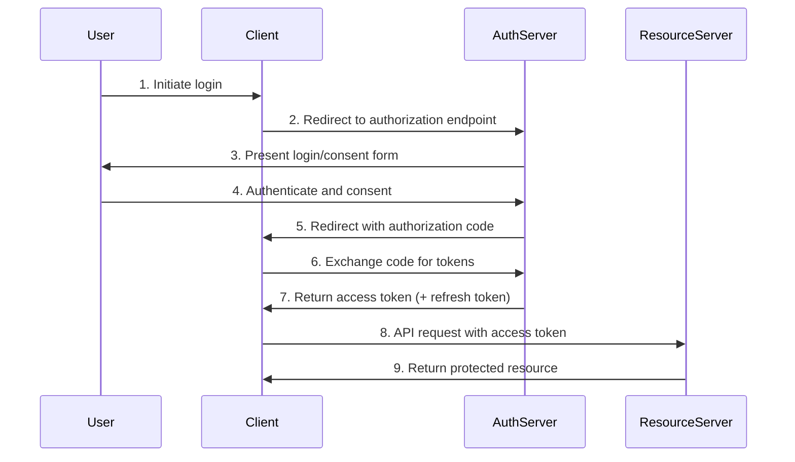
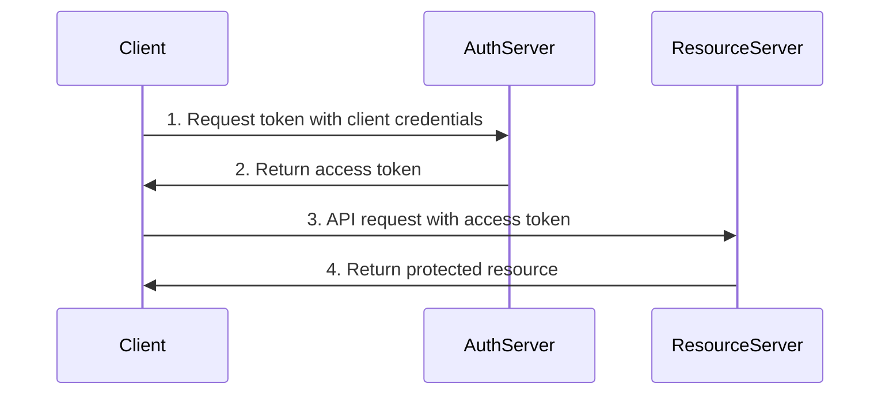
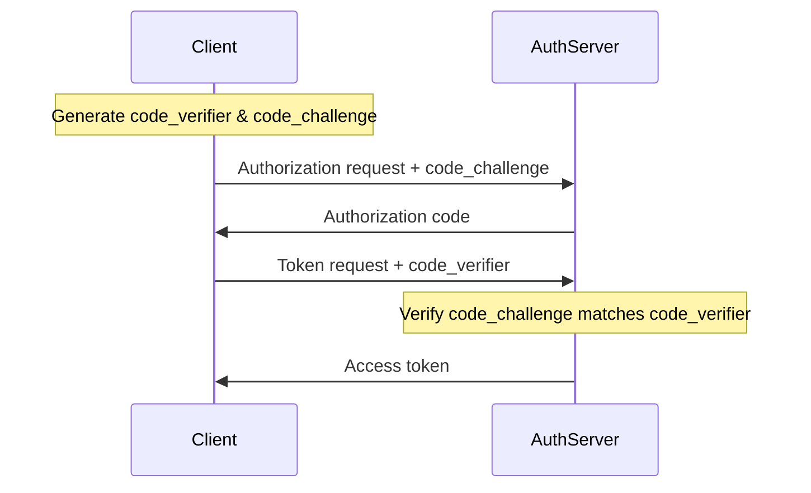
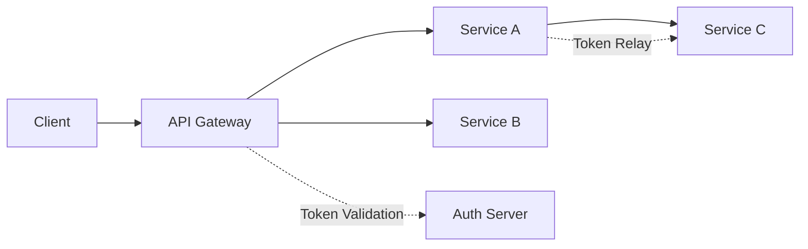
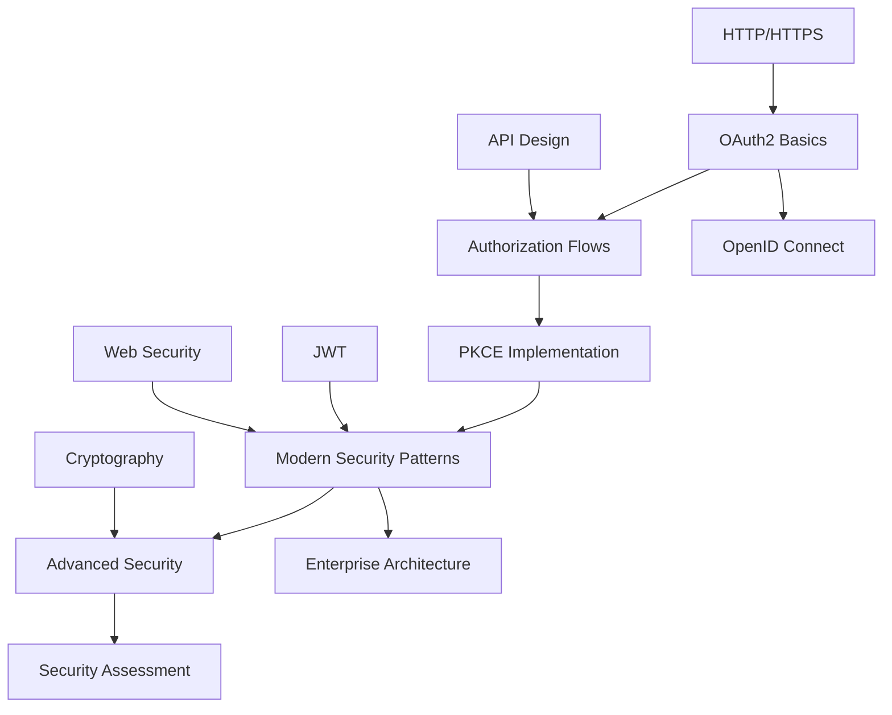

# OAuth2 Knowledge Base - Structured Learning Framework

## Knowledge Base Overview

This knowledge base organizes OAuth2 concepts into a progressive learning framework designed for institutional knowledge management. It provides structured learning paths from beginner to advanced levels, with clear dependencies and cross-references.

### Knowledge Architecture

```
OAuth2 Knowledge Taxonomy
├── Fundamentals (Beginner)
│   ├── Core Concepts
│   ├── Terminology
│   └── Basic Flows
├── Implementation (Intermediate)
│   ├── Security Patterns
│   ├── Modern Practices
│   └── Integration Patterns
└── Advanced (Expert)
    ├── Security Hardening
    ├── Attack Vectors & Mitigations
    └── Enterprise Patterns
```

## Learning Path Structure

### 🎯 Learning Objectives by Level

#### **Beginner Level** - Foundation Knowledge
- **Duration**: 2-3 weeks
- **Prerequisites**: Basic understanding of HTTP and web applications
- **Outcome**: Understand OAuth2 fundamentals and can implement basic flows

#### **Intermediate Level** - Practical Implementation
- **Duration**: 3-4 weeks  
- **Prerequisites**: Completed beginner level
- **Outcome**: Can implement secure OAuth2 solutions following modern best practices

#### **Advanced Level** - Security Expertise
- **Duration**: 4-6 weeks
- **Prerequisites**: Completed intermediate level
- **Outcome**: Can design enterprise-grade OAuth2 architectures and handle complex security scenarios

---

## 📚 BEGINNER LEVEL - OAuth2 Fundamentals

### Learning Objectives
- [ ] Understand the OAuth2 authorization framework purpose and scope
- [ ] Identify the four main OAuth2 roles and their responsibilities
- [ ] Explain the difference between authentication and authorization
- [ ] Describe the basic OAuth2 authorization code flow
- [ ] Recognize when to use OAuth2 vs other authentication methods

### 1. Core Concepts & Terminology

#### 1.1 What is OAuth2?
**Definition**: OAuth2 is an authorization framework that enables applications to obtain limited access to user accounts on an HTTP service.

**Key Principle**: OAuth2 is about **authorization** (what you can do), not **authentication** (who you are).

#### 1.2 The Four OAuth2 Roles

| Role | Description | Examples |
|------|-------------|----------|
| **Resource Owner** | Entity that can grant access to a protected resource | End user, system account |
| **Client** | Application requesting access to protected resources | Web app, mobile app, SPA |
| **Authorization Server** | Server that authenticates the resource owner and issues access tokens | Auth0, Okta, Google OAuth |
| **Resource Server** | Server hosting protected resources, accepts access tokens | API server, microservice |

#### 1.3 Essential Terminology

- **Access Token**: Credential used to access protected resources
- **Refresh Token**: Credential used to obtain new access tokens
- **Authorization Code**: Temporary code exchanged for tokens
- **Scope**: Defines the level of access requested/granted
- **Redirect URI**: Where the authorization server sends the user after authorization
- **Client ID**: Public identifier for the client application
- **Client Secret**: Confidential credential known only to the client and authorization server

### 2. Basic OAuth2 Flows

#### 2.1 Authorization Code Flow (Most Common)
**Use Case**: Server-side web applications that can securely store client secrets



**Key Security Features**:
- Authorization code is short-lived (typically 10 minutes)
- Client authentication required for token exchange
- Tokens never exposed to user agent

#### 2.2 Implicit Flow (Legacy - Not Recommended)
**Status**: ⚠️ **DEPRECATED** - Use Authorization Code + PKCE instead
**Historical Use**: Single-page applications (SPAs)
**Security Issues**: Tokens exposed in URL fragments, no client authentication

#### 2.3 Client Credentials Flow
**Use Case**: Machine-to-machine communication, no user involvement



### 3. Knowledge Dependencies

#### Prerequisites for Next Level
- [ ] Can explain OAuth2 roles and their interactions
- [ ] Understands authorization code flow step-by-step
- [ ] Knows the difference between access and refresh tokens
- [ ] Can identify appropriate OAuth2 flow for different application types

#### Related Concepts to Explore
- **OpenID Connect**: Authentication layer built on OAuth2
- **JWT (JSON Web Tokens)**: Common token format
- **HTTPS/TLS**: Essential transport security
- **CORS**: Cross-origin resource sharing considerations

---

## 🔧 INTERMEDIATE LEVEL - Modern Implementation

### Learning Objectives
- [ ] Implement OAuth2 with PKCE for enhanced security
- [ ] Apply RFC 9700 security best practices
- [ ] Handle token lifecycle management properly
- [ ] Implement proper error handling and edge cases
- [ ] Design secure client configurations

### 1. Modern Security Patterns

#### 1.1 PKCE (Proof Key for Code Exchange) - RFC 7636
**Purpose**: Prevents authorization code interception attacks
**Required For**: All public clients (SPAs, mobile apps)
**Recommended For**: All clients (including confidential clients)

**PKCE Flow Enhancement**:


**Implementation Details**:
- `code_verifier`: Cryptographically random string (43-128 characters)
- `code_challenge`: Base64URL-encoded SHA256 hash of code_verifier
- `code_challenge_method`: "S256" (SHA256) - always use this

#### 1.2 RFC 9700 Security Best Practices

**Key Requirements**:

1. **Always Use HTTPS**: All OAuth2 endpoints must use TLS
2. **Validate Redirect URIs**: Exact string matching, no wildcards
3. **Short-Lived Authorization Codes**: Maximum 10 minutes
4. **Secure Token Storage**: Never store tokens in localStorage
5. **Implement Token Binding**: Bind tokens to specific clients/sessions

**Token Lifecycle Management**:
```yaml
token_configuration:
  access_token:
    lifetime: 3600  # 1 hour maximum
    format: "JWT"   # Recommended for stateless validation
    binding: "client_certificate"  # Optional but recommended
  
  refresh_token:
    lifetime: 2592000  # 30 days maximum
    rotation: true     # Issue new refresh token on each use
    revocation: true   # Support token revocation
```

#### 1.3 Client Types and Security Profiles

| Client Type | Description | Security Requirements |
|-------------|-------------|----------------------|
| **Confidential** | Can securely store credentials | Client secret required |
| **Public** | Cannot securely store credentials | PKCE required, no client secret |
| **Credentialed** | Has client credentials but may be compromised | PKCE recommended |

### 2. Implementation Patterns

#### 2.1 Single Page Applications (SPAs)
**Recommended Flow**: Authorization Code + PKCE
**Token Storage**: Memory only, use refresh token rotation

```javascript
// Modern SPA OAuth2 Implementation Pattern
class OAuth2Client {
  constructor(config) {
    this.clientId = config.clientId;
    this.redirectUri = config.redirectUri;
    this.authServerUrl = config.authServerUrl;
    this.accessToken = null; // Memory only
  }
  
  async authorize() {
    const { codeVerifier, codeChallenge } = this.generatePKCE();
    sessionStorage.setItem('code_verifier', codeVerifier);
    
    const authUrl = new URL(`${this.authServerUrl}/authorize`);
    authUrl.searchParams.set('response_type', 'code');
    authUrl.searchParams.set('client_id', this.clientId);
    authUrl.searchParams.set('redirect_uri', this.redirectUri);
    authUrl.searchParams.set('code_challenge', codeChallenge);
    authUrl.searchParams.set('code_challenge_method', 'S256');
    
    window.location.href = authUrl.toString();
  }
}
```

#### 2.2 Server-Side Web Applications
**Recommended Flow**: Authorization Code (with optional PKCE)
**Token Storage**: Secure server-side session storage

#### 2.3 Mobile Applications
**Recommended Flow**: Authorization Code + PKCE
**Additional Security**: App-to-app redirect schemes, certificate pinning

### 3. Error Handling and Edge Cases

#### 3.1 Common Error Scenarios
- **invalid_grant**: Authorization code expired or already used
- **invalid_client**: Client authentication failed
- **invalid_scope**: Requested scope not available
- **access_denied**: User denied authorization

#### 3.2 Token Refresh Patterns
```javascript
// Automatic token refresh with retry logic
async function refreshTokenWithRetry(refreshToken, maxRetries = 3) {
  for (let attempt = 1; attempt <= maxRetries; attempt++) {
    try {
      const response = await fetch('/oauth/token', {
        method: 'POST',
        headers: { 'Content-Type': 'application/x-www-form-urlencoded' },
        body: new URLSearchParams({
          grant_type: 'refresh_token',
          refresh_token: refreshToken,
          client_id: CLIENT_ID
        })
      });
      
      if (response.ok) {
        return await response.json();
      }
      
      if (response.status === 400) {
        // Refresh token invalid, redirect to login
        throw new Error('REFRESH_TOKEN_INVALID');
      }
      
    } catch (error) {
      if (attempt === maxRetries) throw error;
      await new Promise(resolve => setTimeout(resolve, 1000 * attempt));
    }
  }
}
```

### 4. Knowledge Dependencies

#### Prerequisites for Next Level
- [ ] Can implement PKCE correctly
- [ ] Understands token lifecycle management
- [ ] Can handle OAuth2 errors appropriately
- [ ] Knows security requirements for different client types

#### Integration Knowledge
- **JWT Validation**: Understanding token structure and validation
- **Session Management**: Secure session handling patterns
- **API Security**: Protecting resource servers
- **CORS Configuration**: Cross-origin considerations

---

## 🛡️ ADVANCED LEVEL - Security Expertise

### Learning Objectives
- [ ] Identify and mitigate OAuth2 attack vectors
- [ ] Design enterprise-grade OAuth2 architectures
- [ ] Implement advanced security patterns (mTLS, DPoP)
- [ ] Handle complex multi-tenant scenarios
- [ ] Perform security assessments of OAuth2 implementations

### 1. Attack Vectors and Mitigations

#### 1.1 Authorization Code Interception
**Attack**: Malicious app intercepts authorization code
**Mitigation**: PKCE implementation

#### 1.2 Cross-Site Request Forgery (CSRF)
**Attack**: Malicious site tricks user into authorizing access
**Mitigation**: State parameter validation

```javascript
// CSRF Protection Implementation
function generateAuthUrl() {
  const state = crypto.randomUUID();
  sessionStorage.setItem('oauth_state', state);
  
  const authUrl = new URL('/authorize', AUTH_SERVER);
  authUrl.searchParams.set('state', state);
  // ... other parameters
  
  return authUrl.toString();
}

function validateCallback(urlParams) {
  const receivedState = urlParams.get('state');
  const storedState = sessionStorage.getItem('oauth_state');
  
  if (!receivedState || receivedState !== storedState) {
    throw new Error('CSRF attack detected');
  }
  
  sessionStorage.removeItem('oauth_state');
}
```

#### 1.3 Token Replay Attacks
**Attack**: Stolen tokens used by unauthorized parties
**Mitigations**:
- Short token lifetimes
- Token binding (DPoP, mTLS)
- Audience validation

#### 1.4 Redirect URI Manipulation
**Attack**: Attacker redirects authorization to malicious endpoint
**Mitigations**:
- Exact string matching for redirect URIs
- No wildcard or pattern matching
- HTTPS-only redirect URIs

### 2. Advanced Security Patterns

#### 2.1 Mutual TLS (mTLS) - RFC 8705
**Purpose**: Bind tokens to specific client certificates
**Use Case**: High-security environments, B2B integrations

```yaml
mtls_configuration:
  client_certificate:
    required: true
    validation: "full_chain"
    revocation_check: true
  
  token_binding:
    method: "certificate_thumbprint"
    algorithm: "SHA256"
```

#### 2.2 Demonstrating Proof of Possession (DPoP) - RFC 9449
**Purpose**: Bind tokens to cryptographic keys
**Advantage**: Works without client certificates

```javascript
// DPoP Implementation Example
async function createDPoPProof(httpMethod, url, accessToken) {
  const header = {
    typ: 'dpop+jwt',
    alg: 'ES256',
    jwk: publicKey
  };
  
  const payload = {
    jti: crypto.randomUUID(),
    htm: httpMethod,
    htu: url,
    iat: Math.floor(Date.now() / 1000),
    ath: accessToken ? await sha256(accessToken) : undefined
  };
  
  return await signJWT(header, payload, privateKey);
}
```

#### 2.3 Rich Authorization Requests (RAR) - RFC 9396
**Purpose**: Fine-grained authorization beyond simple scopes

```json
{
  "authorization_details": [
    {
      "type": "payment_initiation",
      "actions": ["initiate", "status", "cancel"],
      "creditor_account": {
        "iban": "DE02100100109307118603"
      },
      "instructed_amount": {
        "currency": "EUR",
        "amount": "123.50"
      }
    }
  ]
}
```

### 3. Enterprise Architecture Patterns

#### 3.1 Multi-Tenant OAuth2 Architecture

```yaml
enterprise_oauth_architecture:
  authorization_server:
    type: "multi_tenant"
    tenant_isolation: "database_per_tenant"
    custom_domains: true
    
  client_management:
    registration: "dynamic"  # RFC 7591
    metadata: "discoverable"  # RFC 8414
    
  token_management:
    introspection: true      # RFC 7662
    revocation: true         # RFC 7009
    
  security_features:
    - "pkce_required"
    - "mtls_support"
    - "dpop_support"
    - "par_support"          # RFC 9126
```

#### 3.2 Microservices OAuth2 Patterns

**Token Relay Pattern**:


**Token Exchange Pattern** (RFC 8693):
```javascript
// Service-to-service token exchange
async function exchangeToken(subjectToken, audience) {
  const response = await fetch('/oauth/token', {
    method: 'POST',
    headers: { 'Content-Type': 'application/x-www-form-urlencoded' },
    body: new URLSearchParams({
      grant_type: 'urn:ietf:params:oauth:grant-type:token-exchange',
      subject_token: subjectToken,
      subject_token_type: 'urn:ietf:params:oauth:token-type:access_token',
      audience: audience,
      scope: 'read write'
    })
  });
  
  return await response.json();
}
```

### 4. Security Assessment Framework

#### 4.1 OAuth2 Security Checklist

**Authorization Server Security**:
- [ ] HTTPS enforced for all endpoints
- [ ] Authorization codes expire within 10 minutes
- [ ] Refresh token rotation implemented
- [ ] Rate limiting on token endpoints
- [ ] Comprehensive audit logging

**Client Security**:
- [ ] PKCE implemented for all flows
- [ ] Redirect URI validation (exact match)
- [ ] State parameter used and validated
- [ ] Tokens stored securely (not in localStorage)
- [ ] Token refresh implemented with proper error handling

**Resource Server Security**:
- [ ] Token validation on every request
- [ ] Scope-based authorization implemented
- [ ] Audience validation performed
- [ ] Token introspection for opaque tokens
- [ ] Proper error responses (no token leakage)

#### 4.2 Penetration Testing Scenarios

1. **Authorization Code Interception**
2. **CSRF Attack Simulation**
3. **Token Replay Testing**
4. **Redirect URI Manipulation**
5. **Scope Escalation Attempts**

### 5. Knowledge Dependencies

#### Mastery Indicators
- [ ] Can design secure OAuth2 architectures for enterprise environments
- [ ] Understands and can implement advanced security patterns (mTLS, DPoP)
- [ ] Can identify and mitigate OAuth2 attack vectors
- [ ] Can perform security assessments of OAuth2 implementations
- [ ] Understands OAuth2 extensions and when to apply them

#### Related Advanced Topics
- **OpenID Connect**: Authentication layer and advanced features
- **FAPI (Financial API)**: High-security OAuth2 profiles
- **OAuth 2.1**: Simplified and more secure OAuth2 specification
- **Zero Trust Architecture**: OAuth2 in zero trust environments

---

## 🔗 Knowledge Relationships and Cross-References

### Concept Dependencies Map



### Learning Path Connections

| From | To | Relationship | Prerequisites |
|------|----|--------------|--------------| 
| OAuth2 Basics | PKCE | Enhancement | Understand authorization code flow |
| PKCE | DPoP | Alternative | Cryptographic key concepts |
| Authorization Flows | Token Management | Implementation | HTTP/REST APIs |
| Security Patterns | Enterprise Architecture | Application | System design principles |

### Quality Standards for Documentation

#### Content Quality Criteria
- **Accuracy**: All technical details verified against current RFCs
- **Completeness**: Covers all essential aspects of each topic
- **Currency**: Updated within 6 months of RFC changes
- **Clarity**: Accessible to target audience level
- **Practical**: Includes working code examples

#### Maintenance Standards
- **Review Cycle**: Quarterly review of all content
- **Update Triggers**: New RFC publications, security advisories
- **Version Control**: All changes tracked with rationale
- **Expert Validation**: Technical review by OAuth2 specialists

#### Learning Effectiveness Metrics
- **Completion Rates**: Track learner progression through levels
- **Assessment Scores**: Validate knowledge retention
- **Implementation Success**: Monitor real-world application
- **Feedback Integration**: Continuous improvement based on learner feedback

---

## 📋 Assessment and Validation

### Beginner Level Assessment
1. Explain the four OAuth2 roles and their responsibilities
2. Diagram the authorization code flow
3. Identify appropriate OAuth2 flows for different application types
4. Define key OAuth2 terminology

### Intermediate Level Assessment
1. Implement PKCE in a sample application
2. Design token lifecycle management strategy
3. Handle OAuth2 error scenarios appropriately
4. Configure secure client settings

### Advanced Level Assessment
1. Conduct security assessment of OAuth2 implementation
2. Design enterprise OAuth2 architecture
3. Implement advanced security patterns (mTLS or DPoP)
4. Mitigate identified attack vectors

---

## 🔄 Knowledge Evolution and Maintenance

### Update Triggers
- **RFC Publications**: New or updated OAuth2 specifications
- **Security Advisories**: Newly discovered vulnerabilities
- **Industry Best Practices**: Evolving security recommendations
- **Technology Changes**: New platforms or frameworks

### Maintenance Schedule
- **Monthly**: Review for security updates and advisories
- **Quarterly**: Comprehensive content review and updates
- **Annually**: Complete learning path effectiveness assessment
- **As Needed**: Emergency updates for critical security issues

### Community Contributions
- **Expert Reviews**: Regular validation by OAuth2 specialists
- **Learner Feedback**: Continuous improvement based on user experience
- **Industry Input**: Integration of real-world implementation lessons
- **Academic Research**: Incorporation of latest security research

This knowledge base serves as a living document that evolves with the OAuth2 ecosystem while maintaining structured learning paths and institutional knowledge preservation.