# OAuth2 Quick Reference Guide

## 🎯 At-a-Glance Overview

### OAuth2 in 30 Seconds
- **Purpose**: Authorization framework for secure API access
- **Key Principle**: Authorization (what you can do), not authentication (who you are)
- **Modern Standard**: Always use Authorization Code + PKCE
- **Security Rule**: HTTPS everywhere, short-lived tokens, validate everything

### The Four Roles
| Role | What It Does | Example |
|------|--------------|---------|
| **Resource Owner** | Owns the data | End user |
| **Client** | Wants access to data | Your app |
| **Authorization Server** | Issues tokens | Auth0, Google |
| **Resource Server** | Hosts the data | Your API |

---

## 🔄 Flow Selection Guide

### Choose Your Flow

```mermaid
graph TD
    A[What type of client?] --> B[Server-side web app]
    A --> C[Single Page App SPA]
    A --> D[Mobile app]
    A --> E[Machine-to-machine]
    
    B --> F[Authorization Code + PKCE]
    C --> G[Authorization Code + PKCE]
    D --> H[Authorization Code + PKCE]
    E --> I[Client Credentials]
    
    F --> J[✅ Can store secrets securely]
    G --> K[⚠️ Cannot store secrets]
    H --> L[⚠️ Cannot store secrets]
    I --> M[✅ Service account authentication]
```



### Flow Comparison

| Flow | Use Case | Security Level | Complexity |
|------|----------|----------------|------------|
| **Authorization Code + PKCE** | Web apps, SPAs, Mobile | 🔒🔒🔒 High | Medium |
| **Client Credentials** | Service-to-service | 🔒🔒 Medium | Low |
| **Implicit** | ❌ DEPRECATED | 🔒 Low | Low |

---

## 🛡️ Security Checklist

### ✅ Must-Have Security Features

#### For All Implementations
- [ ] **HTTPS Only**: All OAuth2 endpoints use TLS
- [ ] **PKCE Required**: Implement for all public clients
- [ ] **State Parameter**: Prevent CSRF attacks
- [ ] **Redirect URI Validation**: Exact string matching
- [ ] **Short Token Lifetimes**: Access tokens ≤ 1 hour

#### For Production Systems
- [ ] **Refresh Token Rotation**: New refresh token on each use
- [ ] **Token Revocation**: Support token revocation endpoint
- [ ] **Scope Validation**: Enforce least privilege principle
- [ ] **Audit Logging**: Log all authorization events
- [ ] **Rate Limiting**: Prevent brute force attacks

### ⚠️ Common Security Pitfalls

| Pitfall | Risk | Solution |
|---------|------|----------|
| Storing tokens in localStorage | XSS attacks | Use memory or secure cookies |
| Long-lived access tokens | Token theft impact | Max 1 hour lifetime |
| Wildcard redirect URIs | Open redirect attacks | Exact string matching |
| Missing PKCE | Code interception | Always implement PKCE |
| No state parameter | CSRF attacks | Generate and validate state |

---

## 💻 Implementation Patterns

### PKCE Implementation (Required for SPAs/Mobile)

```javascript
// 1. Generate PKCE parameters
function generatePKCE() {
  const codeVerifier = base64URLEncode(crypto.getRandomValues(new Uint8Array(32)));
  const codeChallenge = base64URLEncode(sha256(codeVerifier));
  return { codeVerifier, codeChallenge };
}

// 2. Authorization request
const { codeVerifier, codeChallenge } = generatePKCE();
sessionStorage.setItem('code_verifier', codeVerifier);

const authUrl = `${AUTH_SERVER}/authorize?` +
  `response_type=code&` +
  `client_id=${CLIENT_ID}&` +
  `redirect_uri=${REDIRECT_URI}&` +
  `code_challenge=${codeChallenge}&` +
  `code_challenge_method=S256&` +
  `state=${generateState()}`;

// 3. Token exchange
const tokenResponse = await fetch(`${AUTH_SERVER}/token`, {
  method: 'POST',
  headers: { 'Content-Type': 'application/x-www-form-urlencoded' },
  body: new URLSearchParams({
    grant_type: 'authorization_code',
    code: authorizationCode,
    client_id: CLIENT_ID,
    code_verifier: sessionStorage.getItem('code_verifier'),
    redirect_uri: REDIRECT_URI
  })
});
```

### Token Refresh Pattern

```javascript
async function refreshAccessToken(refreshToken) {
  try {
    const response = await fetch(`${AUTH_SERVER}/token`, {
      method: 'POST',
      headers: { 'Content-Type': 'application/x-www-form-urlencoded' },
      body: new URLSearchParams({
        grant_type: 'refresh_token',
        refresh_token: refreshToken,
        client_id: CLIENT_ID
      })
    });
    
    if (!response.ok) {
      if (response.status === 400) {
        // Refresh token invalid - redirect to login
        redirectToLogin();
        return null;
      }
      throw new Error('Token refresh failed');
    }
    
    return await response.json();
  } catch (error) {
    console.error('Token refresh error:', error);
    redirectToLogin();
    return null;
  }
}
```

### Secure Token Storage

```javascript
// ✅ Good: Memory storage for SPAs
class TokenManager {
  constructor() {
    this.accessToken = null;  // Memory only
    this.refreshToken = null; // Memory only
  }
  
  setTokens(tokens) {
    this.accessToken = tokens.access_token;
    this.refreshToken = tokens.refresh_token;
    
    // Set automatic refresh before expiration
    setTimeout(() => {
      this.refreshAccessToken();
    }, (tokens.expires_in - 60) * 1000);
  }
}

// ❌ Bad: localStorage storage
localStorage.setItem('access_token', token); // Vulnerable to XSS
```

---

## 🔍 Troubleshooting Guide

### Common Error Codes

| Error | Cause | Solution |
|-------|-------|----------|
| `invalid_grant` | Code expired/used | Generate new authorization request |
| `invalid_client` | Client auth failed | Check client ID/secret |
| `invalid_scope` | Scope not available | Request valid scopes only |
| `access_denied` | User denied access | Handle gracefully, retry if appropriate |
| `unsupported_grant_type` | Wrong grant type | Use correct grant type for flow |

### Debugging Checklist

#### Authorization Issues
- [ ] Check redirect URI exact match
- [ ] Verify client ID is correct
- [ ] Ensure HTTPS for all endpoints
- [ ] Validate state parameter
- [ ] Check authorization server logs

#### Token Issues
- [ ] Verify token hasn't expired
- [ ] Check token format (JWT vs opaque)
- [ ] Validate audience claim
- [ ] Ensure proper scope permissions
- [ ] Check for token revocation

#### PKCE Issues
- [ ] Verify code_challenge generation
- [ ] Check code_verifier storage/retrieval
- [ ] Ensure S256 challenge method
- [ ] Validate base64URL encoding

---

## 📚 Learning Path Quick Navigation

### 🌱 Beginner (Start Here)
1. **OAuth2 Basics** → Understanding roles and flows
2. **Authorization Code Flow** → Most common implementation
3. **Token Management** → Lifecycle and security

### 🔧 Intermediate (Build Skills)
1. **PKCE Implementation** → Enhanced security
2. **Error Handling** → Robust applications
3. **Client Patterns** → SPA, mobile, server-side

### 🛡️ Advanced (Master Security)
1. **Attack Mitigation** → Security vulnerabilities
2. **Enterprise Patterns** → Scalable architectures
3. **Security Assessment** → Validation and testing

---

## 🔗 Essential Resources

### Official Specifications
- **RFC 6749**: OAuth 2.0 Authorization Framework
- **RFC 7636**: PKCE (Proof Key for Code Exchange)
- **RFC 9700**: OAuth 2.0 Security Best Current Practice

### Security Guidelines
- **OWASP OAuth2 Security**: Common vulnerabilities
- **NIST Guidelines**: Government security standards
- **Industry Best Practices**: Current recommendations

### Implementation Libraries
- **JavaScript**: `@auth0/auth0-spa-js`, `oidc-client-ts`
- **Python**: `authlib`, `requests-oauthlib`
- **Java**: `Spring Security OAuth2`, `Nimbus OAuth2`
- **C#**: `IdentityModel`, `Microsoft.AspNetCore.Authentication`

---

## 🚨 Emergency Procedures

### Security Incident Response
1. **Immediate**: Revoke compromised tokens
2. **Short-term**: Rotate client secrets
3. **Medium-term**: Review and update security measures
4. **Long-term**: Conduct security assessment

### Critical Updates
- Monitor security advisories
- Update dependencies regularly
- Test security patches thoroughly
- Communicate changes to stakeholders

---

*This quick reference is part of the comprehensive OAuth2 Knowledge Base. For detailed implementation guides and advanced topics, see the full knowledge base documentation.*